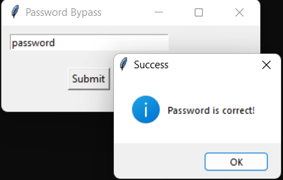
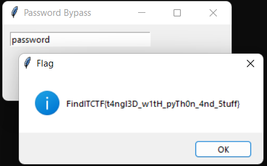

# Bypass the Py

## Problem

Description

An adventurer found this when he fought the great beast named Python. It seems to be locked by something no locksmith has ever opened, wrapped by something that's called a "PyInstaller". Can you find a way to get around this?

## Solution

Since I have little to no experience when it comes to dealing with window's PE executable, my initial thought is to run it and see what I'm dealing with. Running it will prompt us with a password input.

<figure><figcaption>
Chall.exe Prompt
</figcaption></figure>

I try to give the most common password and the first that passes through my mind was `password`

<figure><figcaption>
???
</figcaption></figure>

<figure><figcaption></figcaption></figure>

Welp I guess I'm just lucky :P

## Flag

> _**FindITCTF{t4ngl3D\_w1tH\_pyTh0n\_4nd\_5stuff}**_
