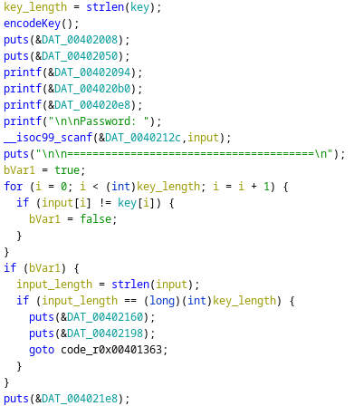
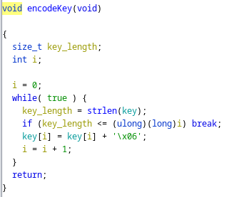
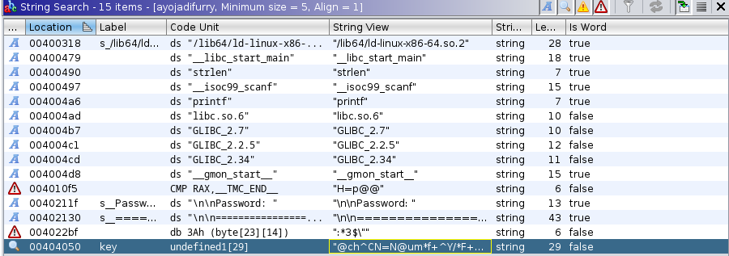

# Furr(y)verse

## Problem

<details>

<summary>Description</summary>

Sebuah pertemuan rahasia diadakan oleh perkumpulan Furry Indonesia di Land of Dawn. Sebagai anggota intelijen, kamu ditugaskan untuk mengikuti pertemuan tersebut untuk menguak rencana apa yang sedang mereka buat. Namun, untuk dapat mengikuti pertemuan itu, kamu harus mencari flag yang tepat agar bisa diijinkan masuk ke Land of Dawn. Bisakah kamu mencari flag itu?

</details>

## Solution

Let's decompile the man function, and I'll point what's relevant

<figure><figcaption><p>Decompiled main</p></figcaption></figure>

First the program will run `encodeKey()` which will take a look in a second. Then the program will ask for our input, and its gonna loop to check whether our input matches the `key`. If it is the same and the length also the same it will print out a confirmation that your Flag is correct, if not it will tell you otherwise. Now let's take a look at the `encodeKey()` function

<figure><figcaption><p>Decompiled encodeKey()</p></figcaption></figure>

Here, each index of the key is incremented by 0x06. Noticed that this gone through before the checking with our input so we have to adapt to its value. Now lets take a look what they key is (before its encoded)

<figure><figcaption><p>strings table</p></figcaption></figure>

Seems like we found the Key, now we just have to increment all of its character by 0x06 and we should get our flag


```python
key = '@ch^CN=N@um*f+^Y/*F+^Y/If+>w' 
flag = []

for i in key: 
    flag.append(chr(ord(i) + 0x6))
    
print(''.join([i for i in flag]))
```


## Flag

> _**FindITCTF{s0l1d\_50L1d\_5Ol1D}**_
