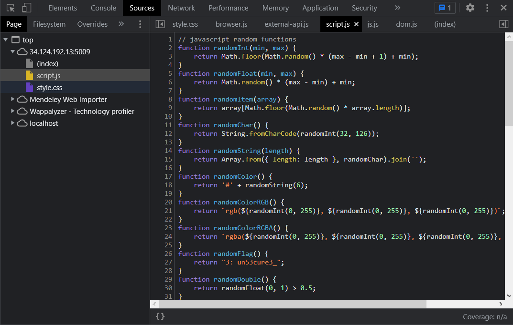

# Web-Find IT

## Problem

Description

Ada Find IT coyyyyy. Absen trio file web kayak biasa dulu bang, sambil makan biskuit. Btw, tadi ada robot di sekitar **sini**. Beneran di sini.

`34.124.192.13:5009`

## Solution

We basically need to inspect the elements of the web of given address. The trio web file refers to html, javascript and css. biscuit refers to cookies and robots refers to robots.txt. All of the flag can be found on the given address however the last part which is the robot.txt can be found on the platform's web by accessing [`https://ctf.find-it.id/robots.txt`](https://ctf.find-it.id/robots.txt)`.`

<figure><figcaption>
1st part of the flag
</figcaption></figure>

<figure><figcaption>
2nd part of the flag
</figcaption></figure>

<figure><figcaption>
3rd part of the flag
</figcaption></figure>

<figure><figcaption>
4th part of the flag
</figcaption></figure>

<figure><figcaption>
last part of the flag
</figcaption></figure>

## Flag

> _**FindITCTF{f1nd\_tH3\_c0mM0n\_un53cure3\_Pl4C35\_t0\_h1d3\_5tuFf\_r16ht}**_
