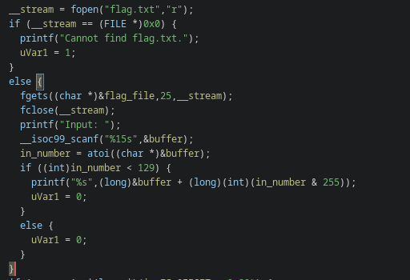
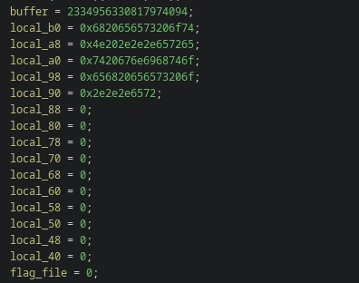

# flip out

## Problem

<details>

<summary>Description</summary>

My friend made this app with a flag in it...

`nc tjc.tf 31601`

</details>

## Solution

the program is simple, saves the flag into a variable within the program then it ask us for an input and converts it into an integer. It then going to output somewhat index the buffer we given. Since there's no check to that index we can provide an index beyond that buffer's size/location/

<figure><figcaption><p>Segment of Main Decompiled</p></figcaption></figure>

Here we can see the variables allignment. The flag is located down at the 16th element. Since this is a 64 bit ELF we can calculate that the index we should give in order the program to outputs the `flag_file` is 16 \* 8 = 128

<figure><figcaption><p>Main stack alignment</p></figcaption></figure>


```python
#!usr/bin/python3
from pwn import *

io = remote("tjc.tf", 31601)

io.sendlineafter(b'Input: ', b'128')
io.interactive()
```


## Flag

> _**tjctf{chop-c4st-7bndbji}**_
